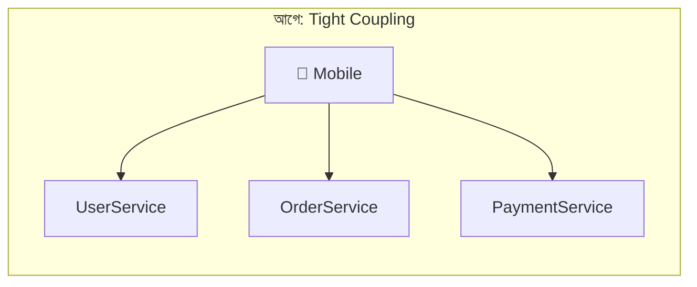
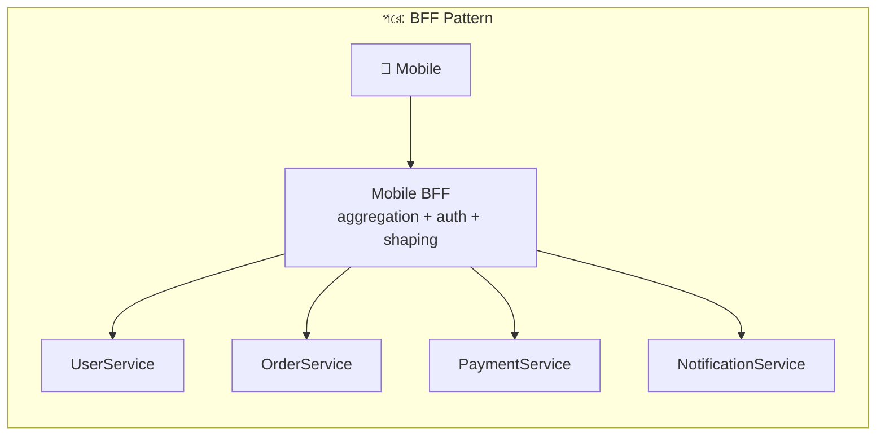

# Day 01 — Mobile থেকে Backend Decoupling (API Gateway vs BFF)

## 🎯 সমস্যা

Mobile app যখন সরাসরি অনেকগুলো backend service-এর সাথে কথা বলে, তখন প্রতিটা নতুন service মানে client-side-এ নতুন যন্ত্রণা — নতুন domain, নতুন auth wiring, নতুন error format। Service বাড়ার সাথে সাথে mobile টিমের বোঝা linear-ভাবে বাড়ে। Routing আর aggregation-এর কাজটা আসলে backend-এর, client-এর নয়।

## 🖼️ Architecture

## 💡 মূল ধারণা

**API Gateway** — সব service-এর সামনে একটা single entry point। Routing, auth, rate limiting, TLS termination — এসব cross-cutting কাজ করে। কিন্তু এটা মূলত একটা *generic proxy* — response গুলোকে mobile-এর সুবিধামতো reshape করে না।

**BFF (Backend for Frontend)** — প্রতিটা client type-এর (mobile, web) জন্য আলাদা একটা dedicated backend layer। এটা শুধু route করে না — একাধিক service call করে data **aggregate** করে, mobile-এর দরকারমতো **shape** করে, একটা consistent error format দেয়। এক screen render করতে mobile-এর ৩টা call লাগত, BFF থাকলে ১টা।

**Load Balancer** — এটা এই সমস্যার সমাধানই না। LB traffic distribute করে, কিন্তু coupling (multiple domain, multiple auth scheme, multiple error shape) একটুও কমায় না।

**GraphQL Federation** — শক্তিশালী, কিন্তু ভারী সমাধান। সব service-কে GraphQL schema expose করতে হয়, টিমে GraphQL expertise লাগে। "৪টা REST service-এর coupling কমাও" — এই সমস্যার জন্য oversized।

## ⚖️ কখন কোনটা

| পরিস্থিতি | বাছাই |
|-----------|-------|
| শুধু routing/auth/rate-limit centralize করতে চান | API Gateway |
| Client-specific aggregation ও response shaping দরকার | BFF |
| একাধিক client type (mobile + web + TV), প্রত্যেকের ভিন্ন চাহিদা | প্রতি client-এ একটা BFF |
| Organization-wide unified data graph, বহু টিম | GraphQL Federation |

বাস্তবে অনেক কোম্পানি দুটোই রাখে: Gateway (edge concerns) → BFF (client-specific logic) → services।

## ⚠️ Common Mistakes

- BFF-কে "mini monolith" বানিয়ে ফেলা — business logic BFF-এ ঢুকতে দেবেন না, ওটা service-এর কাজ। BFF শুধু orchestration/shaping করবে।
- একটাই BFF দিয়ে mobile + web দুটোই serve করা — তাহলে আবার সেই generic layer-এ ফিরে গেলেন, BFF-এর পয়েন্টটাই হারালেন।

## 🎤 Interview Tip

"Gateway না BFF?" প্রশ্নে সেরা উত্তর: **সমস্যাটা কী ধরনের সেটা আগে আলাদা করুন** — cross-cutting concern (auth, rate limit) হলে Gateway, client-specific data shaping হলে BFF। দুটো mutually exclusive না, layered হতে পারে — এটা বললে depth বোঝা যায়।
