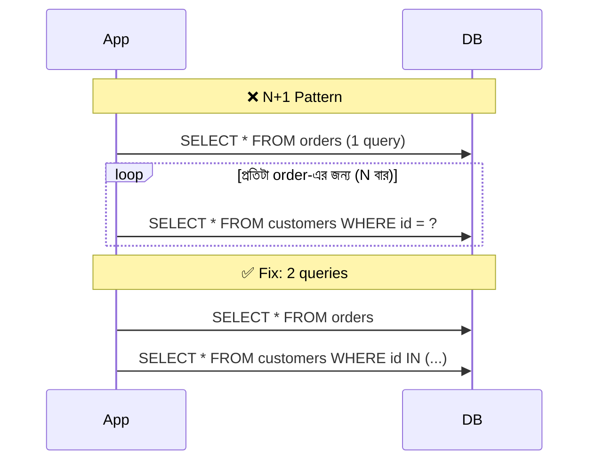

# Day 02 — N+1 Query Problem

## 🎯 সমস্যা

একটা list পেতে ১টা query, তারপর list-এর *প্রতিটা* item-এর related data পেতে আরও N-টা query — মোট N+1। ১০০টা order-এর list দেখাতে গিয়ে ১০১টা query চললে database-এর round-trip latency-তেই request মরে যায়। ORM (EF Core, Sequelize, TypeORM) lazy loading-এ এটা নিঃশব্দে ঘটে — কোডে দেখতে নিরীহ একটা loop, ভেতরে query-র বন্যা।

## 🖼️ Diagram

## 💡 সমাধানের উপায়

1. **Eager loading / JOIN** — ORM-কে আগেই বলে দিন কোন relation লাগবে। EF Core-এ `.Include()`, Sequelize-এ `include`, SQL-এ সরাসরি `JOIN`। ১টা query-তেই সব।
2. **Batch loading (`IN` query)** — আগে parent list আনুন, তারপর সব child এক `WHERE id IN (...)` query-তে। মোট ২টা query, N+1 নয়। GraphQL জগতে এটাই **DataLoader** pattern — এক tick-এর সব lookup জমিয়ে এক batch-এ পাঠায়।
3. **Denormalization / precomputed view** — read খুবই ঘন ঘন হলে দরকারি field parent টেবিলেই copy রাখা (trade-off: write-এ sync করার দায়)।

## ⚖️ Trade-offs

| উপায় | সুবিধা | অসুবিধা |
|-------|--------|---------|
| JOIN | ১ query, সহজ | বড় JOIN-এ row duplication, wide result set |
| Batch (`IN`) | Clean, cache-friendly | ২টা round-trip; `IN` list খুব বড় হলে সমস্যা |
| DataLoader | GraphQL-এ standard | Setup জটিলতা, request-scoped cache বুঝতে হয় |
| Denormalization | Read সবচেয়ে দ্রুত | Write জটিল, consistency-র দায় |

## ⚠️ Common Mistakes

- Caching দিয়ে N+1 ঢাকা — cache miss হলেই আবার সেই বন্যা। এটা fix না, ব্যথানাশক।
- "সব জায়গায় eager loading" — যেখানে relation লাগেই না সেখানেও `Include()` দিলে অকারণে ভারী query হয়। যেটা লাগবে সেটাই আনুন।
- Production-এ ধরা না পড়া — query logging / APM (যেমন slow query log, MiniProfiler) ছাড়া N+1 চোখেই পড়ে না। Dev-এ ১০ row-তে সব fast লাগে।

## 🎤 Interview Tip

N+1 প্রশ্নে শুধু "eager loading করব" বললে অর্ধেক নম্বর। পুরো নম্বরের উত্তর: **কীভাবে detect করবেন** (query count monitoring), **কেন হয়** (ORM lazy loading), আর **কোন fix কখন** — small relation হলে JOIN, বড় fan-out হলে batch/`IN`, GraphQL resolver হলে DataLoader।
