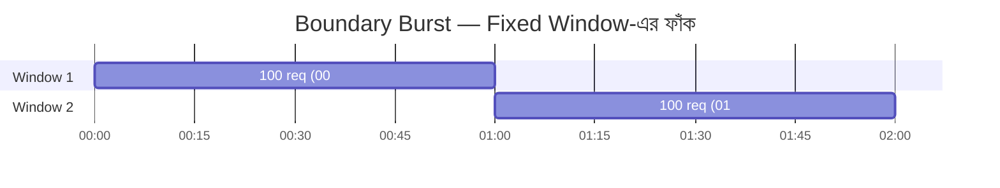

# Day 03 — Rate Limiting ও Boundary Burst

## 🎯 সমস্যা

"প্রতি মিনিটে ১০০ request" — শুনতে সহজ, কিন্তু **fixed window** দিয়ে implement করলে একটা ফাঁক থেকে যায়: window-এর শেষ সেকেন্ডে ১০০টা + পরের window-এর প্রথম সেকেন্ডে ১০০টা = ২ সেকেন্ডে ২০০ request, তবু limit-এর ভেতরে! এটাই **boundary burst** — limit থাকা সত্ত্বেও downstream system-এ spike ঢুকে যায়।

## 🖼️ Diagram

> ⚡ ০০:৫৯ থেকে ০১:০১ — মাত্র ২ সেকেন্ডে ২০০ request পার হয়ে গেল।

## 💡 Algorithm গুলো

1. **Fixed Window Counter** — প্রতি window-এ একটা counter। সস্তা, সহজ, কিন্তু boundary burst-এ ফাঁকা।
2. **Sliding Window Log** — প্রতিটা request-এর timestamp রাখা, গত ৬০ সেকেন্ডের count গোনা। নিখুঁত, কিন্তু memory-hungry (প্রতি user-এ timestamp list)।
3. **Sliding Window Counter** — দুই window-এর counter-এর weighted average। প্রায় নিখুঁত, memory সস্তা। বেশিরভাগ production system-এর sweet spot।
4. **Token Bucket** — bucket-এ fixed rate-এ token জমে, প্রতি request-এ ১টা খরচ। Steady rate enforce করে *কিন্তু* সীমিত burst allow করে (bucket size পর্যন্ত)। API gateway-গুলোর প্রিয়।
5. **Leaky Bucket** — request queue হয়ে fixed rate-এ বের হয়। Output rate একদম মসৃণ, কিন্তু burst-এ latency বাড়ে।

## ⚖️ কখন কোনটা

| দরকার | Algorithm |
|--------|-----------|
| সস্তা, মোটামুটি হলেই চলে | Fixed window |
| Boundary burst চলবেই না, memory কম | Sliding window counter |
| Burst allow করতে চান কিন্তু নিয়ন্ত্রিতভাবে | Token bucket |
| Downstream-এ একদম smooth rate পাঠাতে হবে | Leaky bucket |

**Distributed setup-এ:** counter টা Redis-এ রাখুন (atomic `INCR` + `EXPIRE`, বা Lua script)। প্রতিটা app instance নিজের memory-তে গুনলে instance সংখ্যা × limit হয়ে যাবে।

## ⚠️ Common Mistakes

- 429 response-এ `Retry-After` header না দেওয়া — client জানবে কখন আবার চেষ্টা করবে, নাহলে retry storm হয়।
- সব endpoint-এ একই limit — login endpoint আর image upload-এর cost এক না।
- Redis round-trip প্রতি request-এ — local cache + periodic sync (কিছুটা accuracy ছেড়ে) বিবেচনা করুন high-throughput-এ।

## 🎤 Interview Tip

"Rate limiting design করুন" প্রশ্নে প্রথমেই জিজ্ঞেস করুন: **burst allow করা যাবে কি না?** এই একটা প্রশ্নেই token bucket vs sliding window-এর সিদ্ধান্ত হয়ে যায়, আর interviewer বুঝে যায় আপনি requirement আগে ভাবেন।
