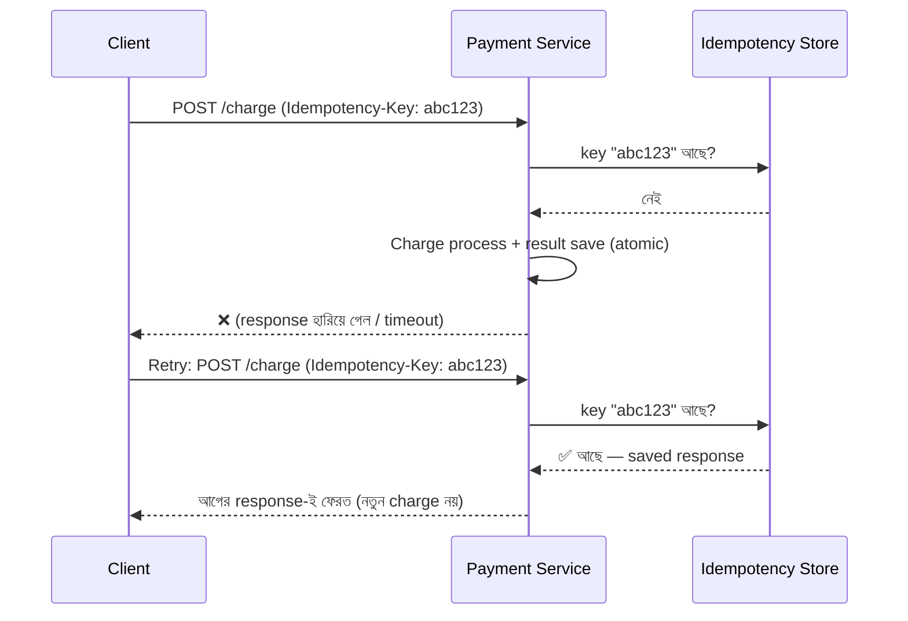

# Day 04 — Duplicate Payment ঠেকানো (Idempotency)

## 🎯 সমস্যা

User "Pay" বাটনে ক্লিক করল, network timeout হলো — payment কি হয়েছে? User জানে না, তাই আবার ক্লিক করল। অথবা client library নিজেই retry করল। ফলাফল: একই order-এ দুইবার charge। Network unreliable — retry হবেই। প্রশ্ন হলো, retry হলেও যেন effect **একবারই** হয়। এটাই idempotency।

## 🖼️ Flow

## 💡 মূল ধারণা

**Idempotency Key** — client প্রতিটা *logical* operation-এর জন্য একটা unique key generate করে (যেমন UUID), retry-তে **একই key** পাঠায়। Server:

1. Key দেখে আগের record খোঁজে
2. পেলে → saved response ফেরত দেয়, কাজ আবার করে না
3. না পেলে → কাজ করে, key + response **atomic-ভাবে** save করে (একই DB transaction-এ, নাহলে race)

**গুরুত্বপূর্ণ সূক্ষ্মতা:**
- Key-র উপর **unique constraint** দিন DB-তে — দুটো concurrent request একসাথে এলে একটাই জিতবে, অন্যটা constraint violation পেয়ে saved result পড়বে।
- **In-flight state** রাখুন — প্রথম request এখনও processing-এ থাকা অবস্থায় retry এলে "processing" ফেরত দিন (409/425), নতুন করে শুরু করবেন না।
- Key-র সাথে **request payload-এর hash** রাখুন — same key ভিন্ন amount-এ এলে reject করুন (client bug ধরা পড়বে)।
- Key-র TTL দিন (২৪ ঘণ্টা common) — store চিরকাল বাড়তে দেবেন না।

## ⚖️ বিকল্পগুলো কেন যথেষ্ট না

| উপায় | সমস্যা |
|-------|--------|
| Frontend-এ button disable | Network retry, একাধিক tab, API client — কিছুই আটকায় না |
| DB-তে "এই order-এ recent charge আছে?" চেক | চেক আর insert-এর মাঝে race condition |
| শুধু distributed lock | Lock পাওয়ার পরও দ্বিতীয় request কাজটা *আবার* করবে — আগের result ফেরত দেওয়ার ব্যবস্থা নেই |

## ⚠️ Common Mistakes

- Key server-side generate করা — তাহলে retry-তে নতুন key হবে, পুরো পয়েন্ট নষ্ট। **Client**-ই key বানাবে।
- Response save না করে শুধু "done" flag রাখা — retry-তে client কে কী ফেরত দেবেন?
- Payment gateway-র নিজস্ব idempotency (যেমন Stripe-এর `Idempotency-Key`) ব্যবহার না করা — নিজের layer + gateway-র layer, দুটোই রাখুন।

## 🎤 Interview Tip

"Exactly-once delivery সম্ভব না, কিন্তু **at-least-once delivery + idempotent processing = effectively exactly-once**" — এই এক লাইন distributed systems-এর সবচেয়ে দামি বাক্যগুলোর একটা। Payment ছাড়াও webhook, message consumer — সব জায়গায় একই নীতি।
