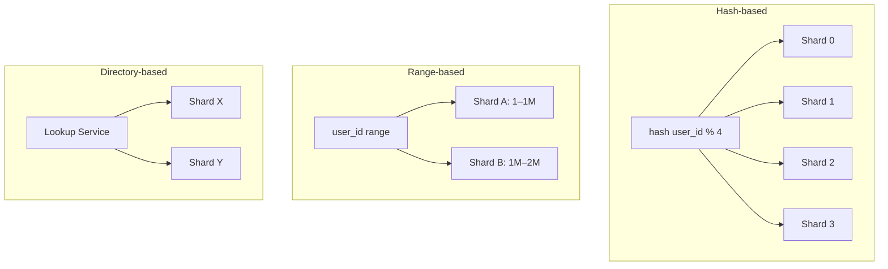

# Day 05 — Database Sharding Strategy

## 🎯 সমস্যা

একটা database server-এ data আর ধরছে না, বা write throughput সীমায় পৌঁছে গেছে। Vertical scaling (বড় মেশিন) এর একটা ছাদ আছে। তখন data-কে একাধিক server-এ **ভাগ** করতে হয় — sharding। প্রশ্ন হলো: **কোন নিয়মে ভাগ করবেন?** ভুল shard key বাছলে পরে বদলানো অসম্ভব-এর কাছাকাছি কষ্টের।

## 🖼️ Strategies

## 💡 তিনটি প্রধান কৌশল

**1. Hash-based** — `hash(key) % N`। Data সমানভাবে ছড়ায়, hot spot কম। কিন্তু range query (যেমন "গত সপ্তাহের সব order") সব shard-এ যেতে হয় (scatter-gather)। আর `% N` হলে shard বাড়ালে প্রায় সব data move হয় — তাই production-এ **consistent hashing** ব্যবহার হয় (shard বাড়ালে শুধু 1/N data move)।

**2. Range-based** — key-র range অনুযায়ী ভাগ। Range query চমৎকার, কিন্তু **hot spot-এর ঝুঁকি**: timestamp বা sequential ID দিয়ে range করলে সব নতুন write সর্বশেষ shard-এ পড়ে — বাকিরা বসে থাকে।

**3. Directory / Lookup-based** — একটা mapping service বলে দেয় কোন key কোন shard-এ। সবচেয়ে flexible (tenant-কে ইচ্ছামতো move করা যায়), কিন্তু lookup service নিজেই single point of failure + প্রতি query-তে বাড়তি hop।

## 🔑 Shard Key বাছাইয়ের নিয়ম

1. **Query pattern দেখুন আগে** — সবচেয়ে ঘন ঘন query কোন field দিয়ে filter করে? সেটাই shard key-র প্রথম candidate। Shard key query-তে না থাকলে scatter-gather — সব shard-এ জিজ্ঞেস করতে হবে।
2. **Cardinality বেশি হতে হবে** — `country` দিয়ে shard করলে ২০০টা মাত্র bucket, আর বাংলাদেশ-shard টা বিশাল হয়ে যাবে (skew)।
3. **Write ছড়িয়ে পড়ে কি না** — monotonic key (auto-increment, timestamp) = hot shard।
4. **Cross-shard transaction এড়ানো যায় কি না** — যে data একসাথে transaction-এ লাগে, তা এক shard-এ রাখার চেষ্টা করুন (যেমন multi-tenant SaaS-এ `tenant_id` দারুণ shard key — এক tenant-এর সব data এক জায়গায়)।

## ⚠️ Common Mistakes

- খুব তাড়াতাড়ি shard করা — sharding-এর operational cost বিশাল (cross-shard join নেই, rebalancing, backup জটিলতা)। আগে read replica, caching, partitioning, বড় মেশিন — সব শেষ হলে তবেই shard।
- Resharding plan না রেখে শুরু করা — প্রথম দিনেই ভাবুন shard বাড়লে data কীভাবে move হবে।
- Cross-shard `JOIN` দরকার এমন schema — sharding-এর পরে JOIN application layer-এ করতে হয়, সেটা ডিজাইনে ধরুন।

## 🎤 Interview Tip

Sharding প্রশ্নের সেরা opening: **"আগে দেখি sharding আদৌ লাগবে কি না।"** তারপর query pattern জিজ্ঞেস করে shard key প্রস্তাব করুন। "Hash সবসময় ভালো" জাতীয় উত্তর নয় — "user-facing lookup বেশি হলে hash on user_id, analytics range scan বেশি হলে range on date" — এই conditional চিন্তাটাই আসল।
