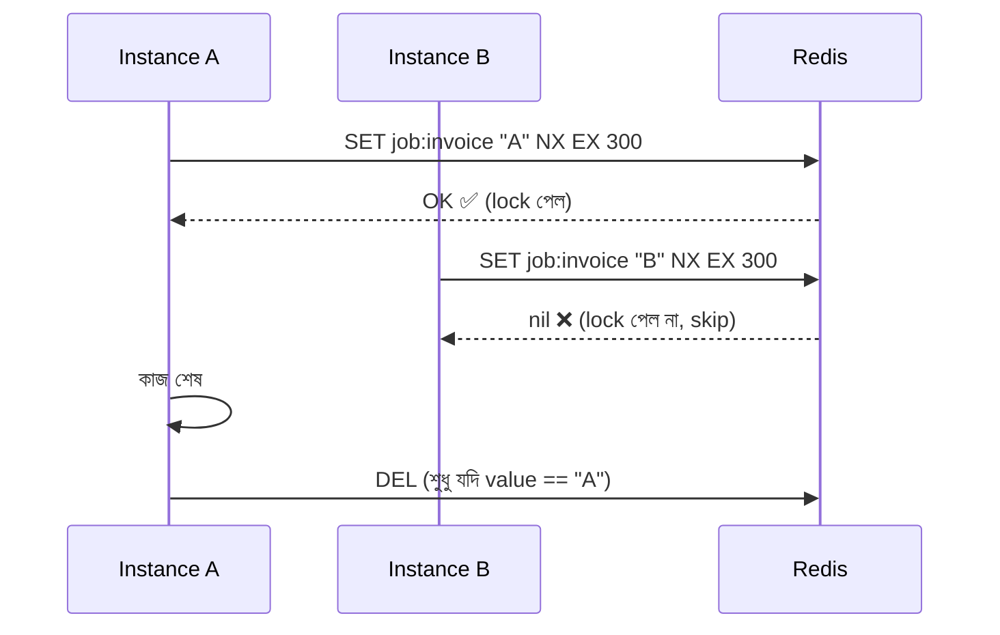

# Day 06 — Cron Job-এর জন্য Distributed Lock

## 🎯 সমস্যা

App-এর ৩টা instance চলে, প্রত্যেকটায় একই cron job schedule করা — রাত ২টায় "monthly invoice পাঠাও"। ৩টা instance একসাথে জাগবে, customer ৩টা invoice পাবে। দরকার: **একই সময়ে শুধু একজন** কাজটা করুক। Single machine-এ mutex যথেষ্ট; একাধিক machine-এ লাগে **distributed lock**।

## 🖼️ Flow

## 💡 মূল ধারণা

**Redis দিয়ে সহজ lock:** `SET key value NX EX ttl`
- `NX` — key না থাকলেই কেবল set হবে (atomic acquire)
- `EX ttl` — **TTL বাধ্যতামূলক**। Lock holder crash করলে TTL-ই মুক্তি; TTL ছাড়া lock চিরকাল আটকে থাকবে (deadlock)।
- Value-তে **unique token** রাখুন (নিজের ID)। Release করার সময় "value আমারটাই কি না" চেক করে তবেই `DEL` — Lua script-এ atomic-ভাবে। নাহলে আপনার TTL শেষ, অন্যজন lock নিয়েছে, আর আপনি *তার* lock মুছে দিলেন।

**বিপজ্জনক ফাঁক — TTL vs কাজের সময়:** কাজ TTL-এর চেয়ে বেশি সময় নিলে? Lock ছুটে যাবে, আরেক instance ঢুকবে — দুইজন একসাথে চলছে। সমাধান:
1. **Watchdog/heartbeat** — কাজ চলাকালে periodically TTL renew করা।
2. **Fencing token** — lock-এর সাথে monotonically বাড়তে থাকা number। Downstream resource (DB) পুরনো token-এর write reject করে। Stale lock holder এসে কিছু নষ্ট করতে পারে না। (Martin Kleppmann-এর বিখ্যাত argument এটাই — TTL-ভিত্তিক lock একা *correctness* guarantee দেয় না, fencing লাগে।)

**বিকল্পগুলো:**
- **DB advisory lock** (PostgreSQL `pg_advisory_lock`) — আলাদা infra লাগে না, DB তো আছেই। ছোট scale-এ চমৎকার।
- **Leader election** (ZooKeeper/etcd) — একজন leader-ই সব scheduled কাজ করে। ভারী, কিন্তু শক্ত guarantee।
- **সবচেয়ে ভালো: lock এড়িয়ে idempotent করা** — job-টাই যদি idempotent হয় (Day 04), দুইবার চললেও ক্ষতি নেই। Lock তখন efficiency-র জন্য, correctness-এর জন্য নয়।

## ⚖️ Trade-offs

| উপায় | কখন |
|-------|------|
| Redis `SET NX EX` | কাজ efficiency-র, দুইবার চললে মহাভারত অশুদ্ধ হয় না |
| Fencing token সহ lock | Correctness জরুরি (payment, invoice) |
| DB advisory lock | ছোট system, বাড়তি infra চান না |
| Idempotent job design | সবসময় চেষ্টা করুন — সবচেয়ে টেকসই |

## ⚠️ Common Mistakes

- TTL ছাড়া lock — holder মরলে system জমে যায়।
- Check-then-delete (দুই আলাদা command-এ) release — race; Lua script ব্যবহার করুন।
- Redlock-কে silver bullet ভাবা — বিতর্কিত algorithm; সত্যিকার hard guarantee লাগলে consensus-based store (etcd/ZooKeeper) ভাবুন।

## 🎤 Interview Tip

সোনার বাক্য: **"Lock দিয়ে efficiency পাওয়া যায়, correctness পেতে হলে fencing token বা idempotency লাগে।"** এটা বললে interviewer বুঝবে আপনি TTL-expiry-র corner case টা জানেন — যেটা বেশিরভাগ candidate মিস করে।
