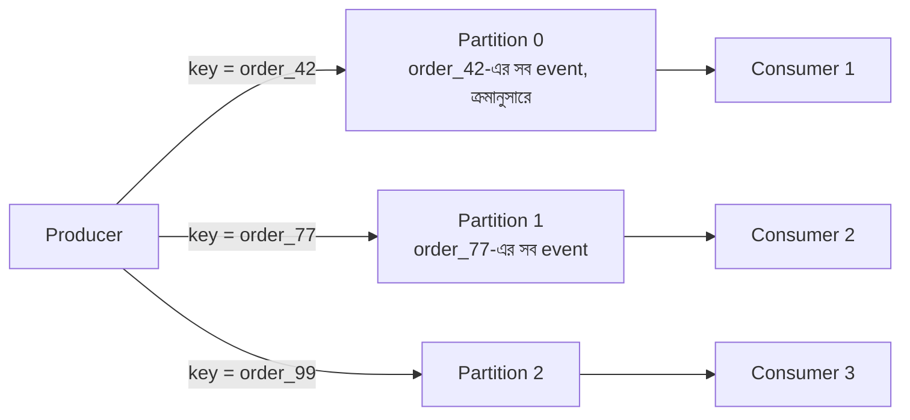

# Day 07 — Message Queue-তে Event Ordering

## 🎯 সমস্যা

`OrderCreated` → `OrderPaid` → `OrderShipped` — এই event গুলো ভুল ক্রমে process হলে বিপর্যয়: "Shipped" আগে এলো, "Created" পরে — consumer-এর state machine ভেঙে পড়ল। Distributed queue-তে global ordering দিলে throughput মরে যায় (সব কিছু এক লাইনে!)। তাহলে ordering আর parallelism — দুটো একসাথে কীভাবে?

## 🖼️ Partition Key দিয়ে সমাধান

## 💡 মূল ধারণা

**Insight: Global ordering লাগে না — লাগে *per-entity* ordering।** Order #42-এর event গুলো ক্রমে থাকলেই হলো; order #42 আর order #77-এর মধ্যে কার আগে কে, তাতে কিছু যায় আসে না।

**Kafka/Kinesis model:** message-এর **partition key** (যেমন `order_id`) দিন। একই key-র সব message একই partition-এ যায়, আর **একটা partition-এর ভেতরে ordering guaranteed**। ভিন্ন ভিন্ন order ভিন্ন partition-এ parallel চলে। এভাবে ordering + scale দুটোই মেলে।

**যা মাথায় রাখতে হবে:**
- **Consumer-ও serial হতে হবে per partition** — partition থেকে পড়ে internal thread pool-এ ছড়িয়ে দিলে ordering আবার ভাঙল।
- **Retry ordering ভাঙে** — message #2 fail করে retry queue-তে গেল, #3 process হয়ে গেল। সমাধান: fail হলে সেই key-র পরের message-ও আটকান (block per key), অথবা consumer-কে out-of-order-tolerant করুন।
- **Partition বাড়ালে** একই key ভিন্ন partition-এ পড়তে পারে (hash % N বদলায়) — transition-এর সময় সাময়িক disorder।

**Consumer-side দ্বিতীয় প্রতিরক্ষা:** event-এ **version/sequence number** রাখুন। Consumer পুরনো version পেলে ignore করে বা buffer করে। তাহলে infrastructure-এর ordering guarantee-র উপর ১০০% নির্ভর করতে হয় না।

## ⚖️ Trade-offs

| উপায় | সুবিধা | অসুবিধা |
|-------|--------|---------|
| Global single queue/partition | নিখুঁত total order | Throughput = ১ consumer-এর গতি |
| Partition key per entity | Order + parallelism | Hot key হলে এক partition-এ চাপ (Day 16) |
| Consumer-side versioning | Infra-independent | Application জটিলতা |

## ⚠️ Common Mistakes

- Random/round-robin key দিয়ে publish করে ordering আশা করা।
- SQS Standard queue-তে ordering ভাবা — Standard-এ best-effort ordering, guarantee চাইলে **FIFO queue + MessageGroupId** (group = partition key-র সমতুল্য)।
- একই entity-র event ভিন্ন topic-এ পাঠানো — দুই topic-এর মধ্যে কোনো order guarantee নেই।

## 🎤 Interview Tip

প্রথম বাক্যেই বলুন: **"Global ordering দরকার, নাকি per-entity ordering-ই যথেষ্ট?"** ৯৫% ক্ষেত্রে per-entity যথেষ্ট, আর সেটা বললেই partition key-র আলোচনা স্বাভাবিকভাবে খুলে যায়। সাথে "consumer-side sequence number রাখব defense-in-depth হিসেবে" যোগ করলে উত্তর সম্পূর্ণ।
