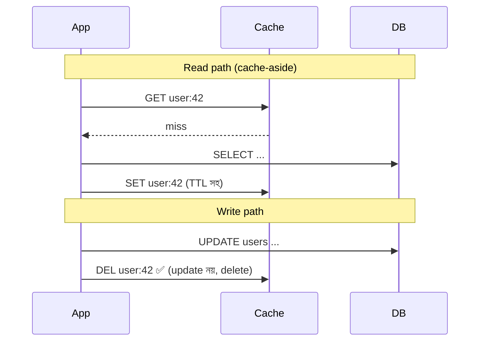

# Day 08 — Cache আর Database Sync রাখা

## 🎯 সমস্যা

Cache আর DB — দুই জায়গায় একই data, দুটো আলাদা system। Write কোথায় আগে করবেন? Update করবেন নাকি delete? ভুল ক্রমে করলে cache-এ **stale data আটকে থাকে** — user পুরনো দাম দেখে, পুরনো balance দেখে। Cache consistency-কে distributed systems-এর দুটো কঠিন সমস্যার একটা বলা হয় এমনি এমনি না।

## 🖼️ Cache-Aside + Invalidation

## 💡 মূল Pattern গুলো

**1. Cache-Aside (সবচেয়ে প্রচলিত)** — read miss হলে DB থেকে এনে cache-এ রাখা; **write-এ DB update + cache key DELETE**। 

কেন update নয়, delete? দুটো concurrent write-এর cache-set ভিন্ন ক্রমে পৌঁছালে পুরনো value জিতে যেতে পারে; delete-এ এই race নেই — পরের read fresh এনে নেবে।

**2. Write-Through** — write cache-এর মধ্য দিয়ে যায়, cache-ই DB-তে লেখে। Cache সবসময় fresh, কিন্তু write latency বাড়ে, আর যা কখনো পড়া হবে না তা-ও cache হয়।

**3. Write-Behind** — cache-এ লিখে async-এ DB-তে flush। Write খুব দ্রুত, কিন্তু cache মরলে data হারানোর ঝুঁকি। সাহসী ব্যবহার।

**4. TTL — শেষ প্রতিরক্ষা** — সব pattern-এর সাথেই TTL রাখুন। Invalidation কোনোভাবে miss হলেও stale data-র আয়ু সীমিত থাকবে।

## ⚠️ বিখ্যাত Race Condition

Cache-aside-এও একটা সূক্ষ্ম ফাঁক আছে:
1. Reader-এর cache miss → DB থেকে **পুরনো** value পড়ল
2. এর মাঝেই Writer DB update করে cache delete করল
3. Reader তার হাতের পুরনো value cache-এ **set** করল → stale data TTL পর্যন্ত আটকে গেল

বিরল (miss + concurrent write-এর জানালাটা ছোট), কিন্তু ঘটে। প্রতিকার: ছোট TTL, বা **CDC-ভিত্তিক invalidation** — DB-র change log (Debezium ইত্যাদি) থেকে event নিয়ে cache invalidate করা; তখন app code-এর ভুলে invalidation miss হয় না, ক্রমও DB-র commit order মেনে চলে।

## ⚖️ কখন কোনটা

| দরকার | Pattern |
|--------|---------|
| General-purpose, সহজ | Cache-aside + delete + TTL |
| Cache কখনোই stale চলবে না, write latency মানা যায় | Write-through |
| Write-heavy, সাময়িক loss মানা যায় (view counter) | Write-behind |
| App code-এ ভরসা নেই, বহু service একই DB লেখে | CDC-driven invalidation |

## 🎤 Interview Tip

দুটো কথা বললেই depth প্রমাণ হয়: **"Write-এ cache update না করে delete করব"** (কারণসহ), আর **"তবু TTL রাখব, কারণ invalidation কখনো না কখনো miss হবেই।"** Perfect consistency চাইলে cache ব্যবহারই প্রশ্নবিদ্ধ — এই honesty-টাও interviewer পছন্দ করে।
