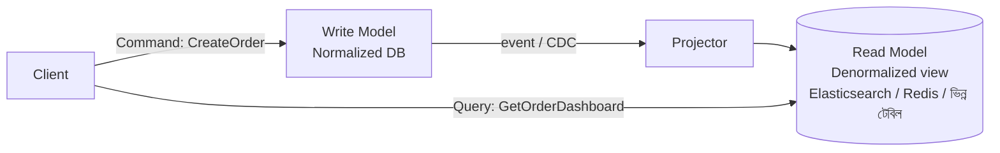

# Day 09 — Read/Write Model আলাদা করা (CQRS)

## 🎯 সমস্যা

একই data model দিয়ে write (normalized, integrity-focused) আর read (denormalized, দ্রুত, নানা রকম view) — দুটোই চালাতে গেলে দুই দিকই ভোগে। Order লেখার জন্য চাই 3NF-এর পরিচ্ছন্ন টেবিল; dashboard-এ দেখানোর জন্য চাই ৮-টেবিল JOIN-এর precomputed ফলাফল। Read traffic write-এর ১০০ গুণ হলে এই টানাটানি আরও তীব্র হয়।

## 🖼️ Architecture

## 💡 মূল ধারণা

**CQRS = Command Query Responsibility Segregation** — লেখা আর পড়ার path সম্পূর্ণ আলাদা:

- **Command side** — business rule, validation, normalized schema। "কী ঘটতে পারবে" এখানে ঠিক হয়।
- **Query side** — এক বা একাধিক **read model/projection**, প্রতিটা একটা নির্দিষ্ট screen বা query-র জন্য অপ্টিমাইজড। JOIN আগেই করা, শুধু পড়ো আর দেখাও।
- মাঝে **sync mechanism** — write হলে event publish বা CDC, projector সেটা শুনে read model update করে।

**গুরুত্বপূর্ণ সত্য: read model প্রায় সবসময় eventually consistent।** Write আর projection update-এর মাঝে কিছু milliseconds/seconds-এর lag থাকে। User নিজের লেখা comment সাথে সাথে না-ও দেখতে পারে — এটা মেনে নিয়েই ডিজাইন (প্রতিকার: নিজের write-এর ক্ষেত্রে optimistic UI, বা Day 19-এর read-your-writes কৌশল)।

**CQRS-এর মাত্রা আছে:**
1. **হালকা** — একই DB, শুধু আলাদা code path + কিছু materialized view। এখান থেকেই শুরু করুন।
2. **মাঝারি** — write DB + আলাদা read store (Elasticsearch, Redis), CDC দিয়ে sync।
3. **ভারী** — CQRS + Event Sourcing (Day 33)। দুটো আলাদা জিনিস — CQRS মানেই event sourcing **নয়**।

## ⚖️ কখন CQRS, কখন নয়

| পরিস্থিতি | সিদ্ধান্ত |
|-----------|----------|
| Read:write অনুপাত খুব বেশি, জটিল view | CQRS ভাবুন |
| Read আর write-এর scale চাহিদা ভিন্ন | CQRS — দুই দিক আলাদা scale হবে |
| সাধারণ CRUD app | **করবেন না** — অকারণ জটিলতা |
| Strong consistency সব read-এ লাগবেই | CQRS কষ্ট দেবে |

## ⚠️ Common Mistakes

- সব জায়গায় CQRS — এটা module-প্রতি সিদ্ধান্ত, system-wide ধর্ম না। Order module-এ CQRS, settings-এ সাধারণ CRUD — একসাথে থাকতেই পারে।
- Projection rebuild-এর plan না রাখা — projector-এ bug হলে পুরো read model পুনর্গঠনের উপায় (replay) প্রথম দিনেই ভাবুন।
- Eventual consistency-র কথা product টিমকে না বলা — "save করলাম কিন্তু list-এ নেই!" bug report আসবেই।

## 🎤 Interview Tip

CQRS বললেই interviewer জিজ্ঞেস করবে: **"consistency lag কীভাবে handle করবেন?"** তৈরি রাখুন: optimistic UI update, version-aware read, বা critical read গুলো write model থেকে পড়া। আর নিজে থেকে বলুন "CQRS ≠ Event Sourcing" — এই confusion টা এত common যে আলাদা করে দিলেই নম্বর।
