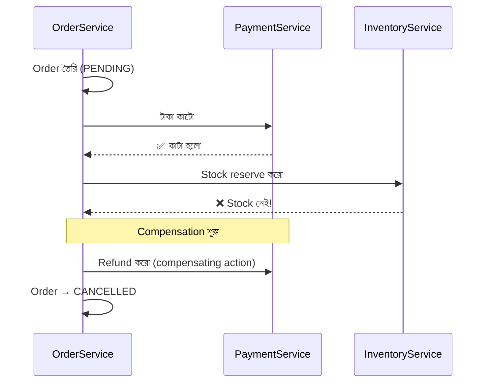

# Day 10 — Distributed Transactions (Saga Pattern)

## 🎯 সমস্যা

Order place করতে ৩টা service লাগে: OrderService (order তৈরি), PaymentService (টাকা কাটা), InventoryService (stock কমানো)। ৩টার আলাদা database — এক `BEGIN TRANSACTION` দিয়ে ঘেরা যায় না। Payment হলো কিন্তু inventory fail করল — এখন টাকা কাটা, stock নেই। Microservices-এ atomicity-র এই সমস্যাই distributed transaction।

## 🖼️ Saga with Compensation

## 💡 মূল ধারণা

**2PC (Two-Phase Commit)** — classical সমাধান: coordinator সবাইকে "prepare" বলে, সবাই রাজি হলে "commit"। সমস্যা: prepare আর commit-এর মাঝে সবাই **lock ধরে বসে থাকে**; coordinator মরলে participant-রা আটকে যায়। Slow, blocking, availability-র শত্রু — আধুনিক microservices-এ প্রায় ব্যবহারই হয় না।

**Saga** — বড় transaction-কে ভাঙা হয় **local transaction-এর chain**-এ। প্রতিটা step নিজের DB-তে commit করে ফেলে (lock ধরে রাখে না)। কোনো step fail করলে আগের step গুলোর **compensating action** চালানো হয় — টাকা কাটা হয়েছিল? refund করো। Rollback নয়, **উল্টো ব্যবসায়িক কাজ**।

**Saga-র দুই ধরন:**

1. **Choreography** — কোনো central boss নেই; প্রতিটা service event শুনে নিজের কাজ করে ও পরের event ছাড়ে। কম coupling, কিন্তু ৪–৫ step পার হলে "flow-টা আসলে কী" কেউ জানে না — debugging দুঃস্বপ্ন।
2. **Orchestration** — একটা orchestrator (নিজস্ব state machine, বা Temporal/AWS Step Functions-এর মতো engine) পুরো flow চালায়: কাকে কখন ডাকবে, fail হলে কোন compensation। Flow এক জায়গায় দৃশ্যমান, কিন্তু orchestrator একটা central dependency।

**Saga-র শর্তগুলো:**
- প্রতিটা step **idempotent** হতে হবে (Day 04) — retry আসবেই।
- Compensation-ও fail করতে পারে — retry + alerting লাগবে।
- মাঝের অবস্থা বাইরে থেকে দেখা যায় (টাকা কাটা কিন্তু order pending) — একে বলে **semantic lock**; UI-তে "processing" state দেখান।
- Event publish আর DB write একসাথে atomic করতে **Outbox pattern** (Day 22) লাগবে — নাহলে "DB-তে লিখলাম কিন্তু event গেল না" গর্ত থেকে যায়।

## ⚖️ কখন কোনটা

| পরিস্থিতি | বাছাই |
|-----------|-------|
| ২–৩ step, সহজ flow | Choreography |
| ৪+ step, জটিল branching, দৃশ্যমানতা চাই | Orchestration |
| সত্যিই atomic লাগবে, availability ছাড় দেওয়া যায় (বিরল) | 2PC / এক DB-তেই রাখুন |
| সবচেয়ে ভালো প্রশ্ন | "এই data গুলো আদৌ আলাদা service-এ কেন?" |

## ⚠️ Common Mistakes

- Compensation-কে technical rollback ভাবা — email পাঠানো হয়ে গেলে "un-send" হয় না; compensation হলো "দুঃখিত, বাতিল হয়েছে" email।
- Saga state persist না করা — orchestrator restart হলে কোথায় ছিলাম জানা যাবে না।
- সব জায়গায় saga — যে data-র মধ্যে শক্ত consistency লাগে, তাদের এক service/DB-তে রাখাই আসল সমাধান। Saga হলো boundary পার হতেই হলে তবে।

## 🎤 Interview Tip

Saga বলার সাথে সাথে নিজে থেকে যোগ করুন: **"প্রতিটা step idempotent করব আর event publish-এ outbox pattern নেব"** — এই দুটো না বললে saga-র উত্তর অসম্পূর্ণ। আর 2PC কেন নয়, সেটা এক লাইনে: "lock ধরে রাখে, coordinator SPOF — microservices-এর availability model-এর সাথে যায় না।"
