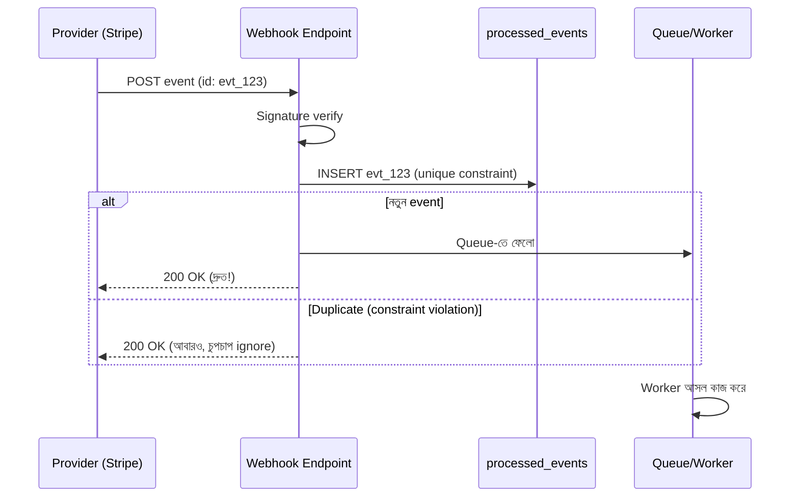

# Day 11 — Webhook Retry Idempotently হ্যান্ডেল করা

## 🎯 সমস্যা

Stripe/PayPal-এর মতো provider webhook পাঠায় **at-least-once** guarantee-তে — আপনার server ২০০ OK না দিলে (বা দিতে দেরি করলে) তারা আবার পাঠাবে। মানে: একই event **একাধিকবার আসবেই**। `payment.succeeded` দুইবার process করলে order দুইবার fulfil হবে। আর webhook handler ভারী কাজ করলে timeout → provider ভাবল fail → আরও retry — নিজের পায়ে কুড়াল।

## 🖼️ Flow

## 💡 মূল ধারণা

**তিনটি নিয়ম, ক্রমানুসারে:**

1. **Signature verify করুন সবার আগে** — provider-এর দেওয়া HMAC signature (Stripe-এর `Stripe-Signature` header) চেক না করলে যে কেউ আপনার endpoint-এ ভুয়া "payment succeeded" পাঠাতে পারে।

2. **Event ID দিয়ে dedupe করুন** — provider প্রতিটা event-এ unique ID দেয় (`evt_...`)। একটা `processed_events` টেবিলে **unique constraint**-সহ insert করুন। Duplicate এলে constraint violation → চুপচাপ 200 দিয়ে ফেরত। "আগে SELECT করে দেখি আছে কি না, তারপর INSERT" — এটা race-prone; constraint-ই আসল পাহারাদার।

3. **তাড়াতাড়ি 200 দিন, কাজ পরে করুন** — handler-এ শুধু verify + dedupe + queue-তে ফেলা। ভারী processing worker-এ। Provider-দের timeout সাধারণত কয়েক সেকেন্ড; sync-এ ভারী কাজ করলে timeout → অপ্রয়োজনীয় retry ঝড়।

**আরও দুটো বাস্তবতা:**
- **Out-of-order আসতে পারে** — `invoice.paid` আগে, `invoice.created` পরে! Timestamp/state check করুন; আপনার state machine-এ অচল transition হলে ignore বা পরে process করুন। সবচেয়ে শক্ত উপায়: webhook-কে শুধু "কিছু বদলেছে" signal ধরে **provider-এর API থেকে fresh state fetch** করা — তখন order-ই আর matter করে না।
- **Failed event-এর জন্য নিজের retry/DLQ** — worker-এ fail হলে queue-র retry + dead letter queue; provider-এর retry window পেরিয়ে গেলে event হারাবেন।

## ⚖️ Dedupe storage

| উপায় | সুবিধা | অসুবিধা |
|-------|--------|---------|
| DB টেবিল + unique constraint | Durable, transaction-এ কাজের সাথে বাঁধা যায় | প্রতি event-এ DB write |
| Redis `SET NX` + TTL | দ্রুত | Redis হারালে dedupe হারালেন; TTL-এর পরে পুরনো retry এলে ফাঁক |

Payment-এর মতো critical জিনিসে DB constraint-ই নিন।

## ⚠️ Common Mistakes

- Business error-তে 4xx/5xx দেওয়া — "এই order তো নেই" হলে 200 দিয়ে log করুন; 500 দিলে provider অনন্তকাল retry করবে।
- Dedupe insert আর business effect আলাদা transaction-এ — মাঝে crash হলে "processed মার্ক হলো কিন্তু কাজ হলো না"। একই DB transaction-এ রাখুন, নয়তো idempotent worker।
- Webhook payload-কে সত্যের উৎস ধরা — payload পুরনো হতে পারে; সন্দেহ হলে API থেকে re-fetch।

## 🎤 Interview Tip

এক লাইনে সারমর্ম: **"Webhook = at-least-once + unordered. তাই আমার দিকে লাগবে dedupe (unique constraint) + fast-ack-then-queue + state-aware processing."** এই তিনটা শব্দবন্ধ বললে webhook প্রশ্ন শেষ।
