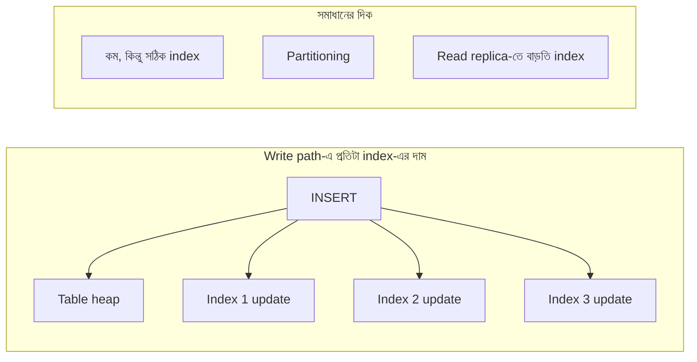

# Day 12 — High-Ingest Table-এ Indexing

## 🎯 সমস্যা

প্রতি সেকেন্ডে হাজার হাজার row ঢুকছে (IoT reading, clickstream, log)। Query দ্রুত করতে index লাগবে — কিন্তু **প্রতিটা index প্রতিটা INSERT-এ tax বসায়**: B-tree-তে entry ঢোকানো, page split, WAL বেড়ে যাওয়া। ৫–৬টা index দিলে ingest rate ধসে পড়ে। আবার index ছাড়া query full scan — উভয় সংকট।

## 🖼️ Trade-off

## 💡 কৌশলগুলো

**1. Index ছাঁটাই — প্রতিটা index-কে কাজ দিয়ে justify করতে হবে।** `pg_stat_user_indexes` (Postgres) বা `sys.dm_db_index_usage_stats` (SQL Server) দেখে unused index মুছুন। Composite index দিয়ে ২–৩টা single-column index-কে এক করা যায় কি না দেখুন (leftmost prefix rule মনে রেখে)।

**2. Monotonic key-তে append-only রাখুন।** Primary key যদি random (UUIDv4) হয়, প্রতিটা insert B-tree-র এলোমেলো জায়গায় পড়ে — page split আর cache miss-এর মহোৎসব। **Sequential key** (identity, বা time-ordered UUIDv7/ULID) দিলে insert সবসময় ডান প্রান্তে — অনেক সস্তা। SQL Server-এ clustered index-এ এটা আরও তীব্রভাবে সত্য।

**3. Partitioning (time-based)** — টেবিলকে দিন/সপ্তাহ অনুযায়ী partition করুন। লাভ তিনটা: (ক) index গুলো ছোট ছোট per-partition → insert সস্তা; (খ) পুরনো data মোছা = `DROP PARTITION`, million-row `DELETE` নয়; (গ) time-range query শুধু দরকারি partition ছোঁয় (partition pruning)।

**4. কাজ ভাগ করুন: hot vs cold।** Ingest টেবিল রাখুন প্রায় index-শূন্য (শুধু PK); analytics query চালান read replica-তে (যেখানে বাড়তি index রাখা যায়), বা data পাঠান আলাদা analytical store-এ (columnstore, ClickHouse, warehouse)। HTAP চাপ এক টেবিলে নেওয়ার চেষ্টা করবেন না।

**5. Batch insert** — এক row-এক insert-এর বদলে multi-row `INSERT`/`COPY`/bulk API — per-statement overhead আর WAL flush ভাগাভাগি হয়।

## ⚖️ কখন কী

| পরিস্থিতি | কৌশল |
|-----------|-------|
| Insert rate পড়ে যাচ্ছে, index অনেকগুলো | Unused index মুছুন, composite-এ merge |
| PK random UUID | UUIDv7/ULID বা sequence-এ যান |
| Time-series data, retention আছে | Time partitioning |
| ভারী analytics query একই টেবিলে | Replica/warehouse-এ সরান |

## ⚠️ Common Mistakes

- "Query slow? আরেকটা index!" — প্রতিটা index-এর ভাড়া write path দেয়, এটা ভুলে যাওয়া।
- বিশাল টেবিলে সরাসরি `CREATE INDEX` — production লক হয়ে যাবে; Postgres-এ `CONCURRENTLY`, SQL Server-এ `ONLINE = ON` ব্যবহার করুন।
- Partition key query-তে না থাকা — তাহলে pruning হবে না, সব partition scan।

## 🎤 Interview Tip

মূল বাক্য: **"Index হলো read-এর জন্য write path-এ নেওয়া ঋণ — high-ingest টেবিলে ঋণ কম রাখতে হয়।"** তারপর তিনটা lever বলুন: সঠিক index-ই শুধু, sequential key, আর partitioning। এতে write-path internals বোঝা প্রমাণ হয়।
