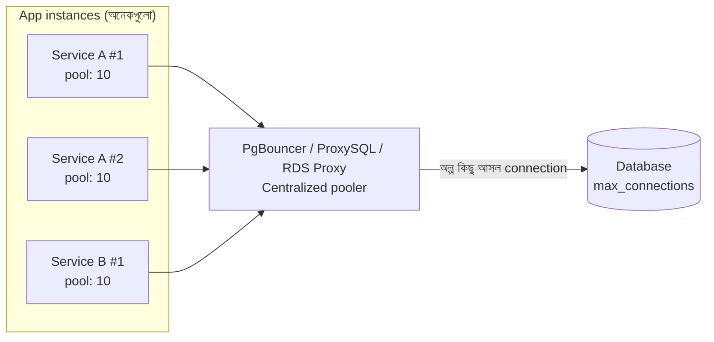

# Day 13 — Shared Connection Pool ম্যানেজ করা

## 🎯 সমস্যা

Database connection সস্তা জিনিস না — প্রতিটার জন্য server-এ memory, TLS handshake, process/thread। তাই connection pool। কিন্তু microservices যুগে হিসাবটা গুণিতক: ২০টা service × ১০ instance × pool size ৫০ = **১০,০০০ connection** — Postgres এতে হাঁপিয়ে ওঠে (per-connection process model)। উল্টো দিকে pool ছোট হলে peak-এ request গুলো pool-এর অপেক্ষায় লাইন — timeout ঝড়।

## 🖼️ Architecture

## 💡 মূল ধারণা

**1. Pool size বড় ≠ ভালো।** DB একসাথে কাজ করতে পারে মোটামুটি (CPU core × 2) + disk-এর সামর্থ্য পর্যন্ত। এর বেশি connection মানে DB-র ভেতরে context switching আর lock contention — throughput **কমে**। HikariCP টিমের বিখ্যাত পরামর্শ: pool ছোট রাখুন, প্রায়ই ১০–২০-ই যথেষ্ট। বড় pool দিয়ে slow query ঢাকা যায় না।

**2. হিসাবটা fleet-wide করুন।** সূত্র সহজ: `(instances × pool_size) ≤ DB max_connections-এর নিরাপদ অংশ` (admin/migration-এর জন্য কিছু রেখে)। Autoscaling থাকলে **max instance count** ধরে হিসাব করুন — নাহলে scale-out-এর দিনই DB "too many connections" দেবে।

**3. External pooler (PgBouncer/RDS Proxy/ProxySQL)** — instance অনেক হলে app-side pool যথেষ্ট না। মাঝখানে pooler বসান: হাজার client connection নেয়, DB-তে রাখে অল্প কয়েকটা। PgBouncer-এর **transaction mode** সবচেয়ে কার্যকর (transaction শেষ হলেই connection ফেরত pool-এ) — তবে session-level feature (prepared statement-এর পুরনো ধরন, session variable, advisory lock) ভাঙতে পারে, জেনে নিন।

**4. Timeout-এর তিন স্তর আলাদা করুন:**
- **Connection acquisition timeout** — pool থেকে connection পেতে কতক্ষণ অপেক্ষা (ছোট রাখুন, fail fast)
- **Query/command timeout** — এক query কতক্ষণ চলতে পারবে
- **Idle timeout / max lifetime** — অলস connection কখন ছাড়বে (network middlebox-এর অদৃশ্য kill এড়াতে max lifetime দরকারি)

**5. Leak ধরুন** — connection নিয়ে ফেরত না দেওয়া (dispose/close miss) হলে pool ধীরে ধীরে শুকিয়ে যায়। Pool-এর leak detection (HikariCP `leakDetectionThreshold`, .NET-এ `using`-এর শৃঙ্খলা) চালু রাখুন; "pool exhausted" alert-এর প্রথম সন্দেহভাজন সবসময় leak আর slow query।

## ⚖️ কখন কী

| পরিস্থিতি | সমাধান |
|-----------|--------|
| Instance অল্প, DB সামলাচ্ছে | App-side pool-ই যথেষ্ট, সাইজ ছোট |
| Instance অনেক / serverless (Lambda) | External pooler বাধ্যতামূলক |
| Pool wait বাড়ছে কিন্তু DB idle | Pool একটু বাড়ান |
| Pool wait বাড়ছে আর DB-ও busy | Pool বাড়াবেন **না** — query optimize করুন |

## ⚠️ Common Mistakes

- "Timeout হচ্ছে? pool দ্বিগুণ!" — রোগ slow query হলে বড় pool রোগ আরও বাড়ায়।
- Lambda/serverless থেকে সরাসরি DB — প্রতি invocation-এ connection; RDS Proxy-জাতীয় কিছু ছাড়া চলবেই না।
- Read আর write একই pool-এ — replica-য় read পাঠালে আলাদা pool রাখুন, নাহলে ভারী read write-দের connection খেয়ে ফেলে।

## 🎤 Interview Tip

Counter-intuitive কথাটা বলুন: **"Pool ছোট রাখাই প্রায়ই দ্রুততর — DB-র সত্যিকার concurrency সীমিত, বাকি সব লাইন-ই।"** তারপর fleet-wide অঙ্ক আর PgBouncer। "বড় pool = বেশি performance" ভুলটা ভাঙতে পারা-ই এই টপিকের দামি অংশ।
