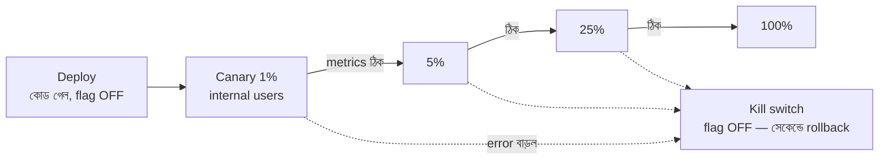

# Day 14 — Risky Change নিরাপদে Rollout করা

## 🎯 সমস্যা

একটা বড়/ঝুঁকিপূর্ণ change (নতুন pricing engine, rewritten checkout) production-এ যাচ্ছে। এক ধাক্কায় ১০০% traffic-এ ছাড়লে bug থাকলে **সবাই** আক্রান্ত, আর rollback মানে আরেকটা ঝুঁকিপূর্ণ deploy। দরকার: ছোট blast radius, দ্রুত ফেরার পথ, আর "ভালো চলছে কি না" মাপার উপায়।

## 🖼️ Progressive Delivery

## 💡 মূল অস্ত্রগুলো

**1. Deploy আর Release আলাদা করুন — feature flag।** কোড production-এ যাক flag-এর পেছনে বন্ধ অবস্থায়। "Release" হলো flag on করা — deploy নয়। লাভ: rollback = flag off (সেকেন্ড), redeploy নয় (মিনিট/ঘণ্টা)। ঝুঁকিপূর্ণ change-এর এক নম্বর নিয়ম এটাই।

**2. Canary release** — flag/router দিয়ে অল্প % traffic নতুন path-এ (আগে internal user, তারপর ১% → ৫% → ২৫%...)। প্রতি ধাপে **আগে থেকে ঠিক করা metric** দেখুন: error rate, p99 latency, আর business metric (conversion, order success)। Technical metric ঠিক কিন্তু conversion পড়ে গেছে — এটাও fail।

**3. Blue-Green** — দুটো পূর্ণ environment; switch এক ঝটকায়, rollback-ও। সহজ, কিন্তু এক মুহূর্তে ০→১০০% — gradual নয়, আর দ্বিগুণ infra। Canary-র সাথে মিলিয়েও ব্যবহার হয়।

**4. Shadow/Mirror traffic** — নতুন system-এ আসল traffic-এর **কপি** পাঠান, response ফেলে দিন, শুধু তুলনা করুন (দুই pricing engine-এর ফল মেলে কি না)। User-এ শূন্য ঝুঁকিতে আসল load-এ যাচাই — rewrite-এর জন্য সোনার কৌশল। সাবধান: side-effect-ওয়ালা call (payment!) shadow-তে mock করতে হবে।

**5. Data change হলে বাড়তি সাবধানতা** — schema migration হলে expand–migrate–contract (Day 53); দুই version পাশাপাশি চলার সময় দুটোই যেন data বুঝতে পারে (backward + forward compatible)।

## ⚖️ কখন কোনটা

| পরিস্থিতি | কৌশল |
|-----------|-------|
| Business logic change, ব্যর্থতা মাপা যায় metric-এ | Feature flag + canary |
| পুরো নতুন version/platform | Blue-green (+canary) |
| Rewrite — আচরণ হুবহু মিলতে হবে | Shadow traffic দিয়ে তুলনা, তারপর canary |
| DB schema জড়িত | Expand–contract + flag |

## ⚠️ Common Mistakes

- Rollback plan "দরকার হলে ভাবব" — rollout শুরুর **আগে** লিখিত: কোন metric কত খারাপ হলে, কে, কীভাবে ফেরাবে।
- Canary-কে যথেষ্ট সময় না দেওয়া — কিছু bug ধরা পড়ে কেবল peak hour-এ বা daily batch-এ; ৫ মিনিট সবুজ দেখে ১০০% নয়।
- Flag-এর কবরস্থান — পুরনো flag পরিষ্কার না করলে কোড if-else-এর জঙ্গল; flag-এর expiry/owner রাখুন।
- Sticky না করা — একই user কখনো নতুন কখনো পুরনো experience পেলে (বিশেষত checkout-এ) নিজেই bug তৈরি করলেন; user-ID-based bucketing নিন।

## 🎤 Interview Tip

কাঠামোটা এক নিঃশ্বাসে: **"Deploy ≠ release — flag-এর পেছনে deploy, canary দিয়ে ধাপে ধাপে release, আগে-ঠিক-করা metric-এ পাহারা, আর kill switch-এ সেকেন্ডের rollback।"** সাথে business metric monitor করার কথা বললে আলাদা হয়ে যাবেন — বেশিরভাগ candidate শুধু error rate বলে।
