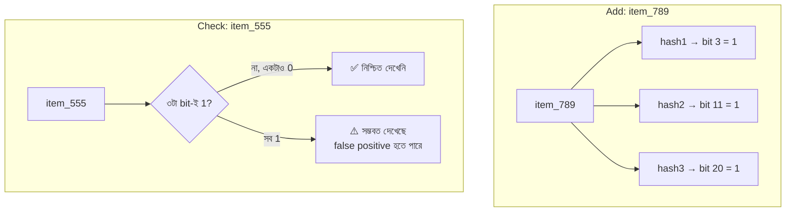

# Day 15 — দ্রুত "User কি এটা দেখেছে?" চেক (Bloom Filter)

## 🎯 সমস্যা

Feed/recommendation system-এ প্রতিটা candidate item-এর জন্য জিজ্ঞেস করতে হয়: "এই user কি এটা আগে দেখেছে?" — কোটি user × হাজার হাজার seen-item। প্রতিবার DB lookup? অসম্ভব খরচ। সব seen-ID Redis set-এ? Memory-তে টেরাবাইট। দরকার: **অতি অল্প memory-তে অতি দ্রুত membership check** — সামান্য ভুলের বিনিময়ে হলেও।

## 🖼️ Bloom Filter

## 💡 মূল ধারণা

**Bloom filter** = একটা bit array + k-টা hash function। Item add করতে k-টা hash-এর নির্দেশিত bit গুলো 1 করা হয়; check করতে দেখা হয় সব bit 1 কি না।

**এর asymmetric guarantee-টাই আসল কথা:**
- **"না" মানে নিশ্চিত না** — false negative অসম্ভব। যা add করেছেন, filter কখনো "নেই" বলবে না।
- **"হ্যাঁ" মানে সম্ভবত হ্যাঁ** — অন্য item-দের bit-এ ভাগ বসিয়ে false positive হতে পারে (tunable, ধরুন ১%)।

**Feed use case-এ এই asymmetry সোনার মতো মেলে:** false positive মানে দেখেনি এমন একটা item-ও filter হয়ে গেল — user একটা কম post দেখল, কেউ টেরও পাবে না। False negative (দেখা জিনিস আবার দেখানো) হতো বিরক্তিকর — আর সেটা হয়-ই না।

**খরচের অঙ্কটা চমকপ্রদ:** ১% error-এ প্রতি item লাগে মাত্র **~9.6 bit** — item-এর আকার যা-ই হোক। ১ কোটি seen-item ≈ ১২ MB। Set হিসেবে রাখলে যেখানে GB লাগত।

**Practical দিক:**
- Redis-এ `RedisBloom` module (`BF.ADD`, `BF.EXISTS`) — নিজে বানাতে হয় না।
- **Delete করা যায় না** — bit মুছলে অন্য item-এরও ক্ষতি। Delete লাগলে **Counting Bloom filter** বা **Cuckoo filter** (delete পারে, প্রায়ই বেশি space-efficient)।
- ভরাট হয়ে গেলে false positive rate বাড়ে — expected size আগে থেকে ধরে বানান, বা scalable bloom filter নিন।
- Rebuild-এর পথ রাখুন — source of truth DB-তেই থাকবে (seen events টেবিল), filter টা তার থেকে বানানো যায় এমন derived জিনিস।

## ⚖️ বিকল্পদের সাথে তুলনা

| উপায় | Memory | ভুল | Delete |
|-------|--------|-----|--------|
| Redis Set (সব ID) | বিশাল | নেই | পারে |
| Bloom filter | ক্ষুদ্র | False positive (tunable) | পারে না |
| Cuckoo filter | ক্ষুদ্র | False positive | পারে ✅ |
| DB lookup প্রতিবার | কম RAM, বেশি latency | নেই | — |

## ⚠️ Common Mistakes

- যেখানে false positive-এর দাম চড়া (যেমন "এই টাকা কি already transfer হয়েছে?") সেখানে Bloom filter — **না**। ওখানে exact check লাগবে; Bloom বড়জোর সামনে বসানো সস্তা pre-filter।
- Asymmetry উল্টো বোঝা — কোন দিকের ভুল সম্ভব সেটাই এই structure-এর সারকথা।
- এক বিশাল global filter — per-user filter রাখুন, নাহলে সবার seen সবার সাথে মিশে যাবে।

## 🎤 Interview Tip

দুটো সংখ্যা মুখস্থ রাখুন: **"~10 bit per item-এ ১% false positive, false negative শূন্য।"** তারপর বলুন কোন দিকের ভুল আপনার use case সহ্য করে — এই mapping-টা দেখানোই probabilistic data structure প্রশ্নের আসল উত্তর।
