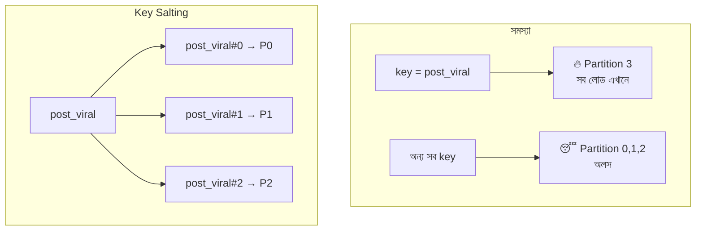

# Day 16 — Hot Partition Key সামলানো

## 🎯 সমস্যা

Data সুন্দরভাবে partition করা (Day 05, 07) — কিন্তু traffic সমান না। একটা celebrity user, একটা viral post, একটা বড় tenant — তার সব read/write **একটাই** partition-এ পড়ছে। বাকি ৯৯টা partition অলস, একটা জ্বলছে: throttling (DynamoDB-র hot partition error), latency spike, timeouts। Scale-out করেও লাভ নেই — চাপটা তো এক key-তে।

## 🖼️ সমস্যা ও প্রতিকার

## 💡 প্রতিকারগুলো (আগে diagnose, পরে ওষুধ)

**প্রথমে জানুন hot টা read-hot নাকি write-hot** — ওষুধ ভিন্ন।

**Read-hot হলে:**
1. **Cache-ই প্রথম উত্তর** — viral post-এর content তো সবার জন্য একই; Redis/CDN-এ রাখুন, partition-এ request পৌঁছাকই না। Hot-key detection সহ local (in-process) cache আরও ভালো — নাহলে Redis-এর সেই key-টাই hot হয়ে যায়!
2. **Read replica / follower read** — এক partition-এর কপি কয়েক জায়গায়, read ভাগ হয়ে যায়।

**Write-hot হলে:**
1. **Key salting / sharded key** — hot key-র পেছনে random suffix: `post_viral#0` … `post_viral#N`। Write N-টা partition-এ ছড়াল। **দাম:** পড়ার সময় N-টা key-ই পড়ে merge করতে হবে (scatter-gather)। Counter-জাতীয় জিনিসে দারুণ (N-টা sub-counter, পড়ার সময় যোগ)।
2. **Write buffering/aggregation** — প্রতিটা like আলাদা write না করে app layer-এ কয়েক সেকেন্ড জমিয়ে এক batch write। Loss-tolerance লাগবে।
3. **Queue দিয়ে সমতল করা** — write গুলো queue-তে, consumer নিজের গতিতে partition-এ লিখবে; spike শোষিত হয়।

**গোড়ার সমাধান — key design:** low-cardinality বা প্রাকৃতিকভাবে-বাঁকা key (যেমন `date` — আজকের partition সবসময় hot!) এড়িয়ে composite key নিন: `date#user_id`। DynamoDB-তে এটা প্রায় ধর্মীয় নিয়ম।

**Detection-ও design-এর অংশ:** per-key/per-partition metric রাখুন (DynamoDB CloudWatch-এর partition metrics, Redis-এ `--hotkeys`)। Hot key প্রায়ই আসে হুট করে — viral হওয়ার পরে জানলে দেরি।

## ⚖️ কখন কোনটা

| পরিস্থিতি | প্রতিকার |
|-----------|----------|
| Viral content-এর read ঝড় | Cache (in-process + distributed), CDN |
| Celebrity-র write ঝড় (like/comment counter) | Key salting + read-time merge |
| Spiky কিন্তু গড়ে সামলানো যায় | Queue-buffered write |
| নকশাতেই বাঁকা key | Composite key-তে redesign |

## ⚠️ Common Mistakes

- Partition/node বাড়িয়ে সমাধান খোঁজা — এক key এক partition-এই থাকবে; টাকা গেল, সমস্যা রইল।
- সব key-তে salting — শুধু hot key-দের জন্য (dynamic-ভাবে চিনে), নাহলে সব read-ই scatter-gather হয়ে গেল।
- Cache বসিয়ে নিশ্চিন্ত, কিন্তু cache expiry-র মুহূর্তে সবাই একসাথে DB-তে — এটা Day 18-এর stampede; একসাথেই ভাবুন।

## 🎤 Interview Tip

উত্তর সাজান এই ক্রমে: **detect → read-hot না write-hot → read হলে cache/replica, write হলে salt/buffer → গোড়ায় key redesign।** "Salting করব" এক লাইনে বললে অর্ধেক; "salting-এর দাম হলো read-এ merge" — এই trade-off উচ্চারণ করাটাই senior-level উত্তর।
