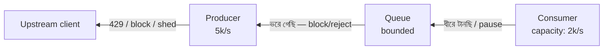

# Day 17 — Overwhelmed Consumer-এ Backpressure

## 🎯 সমস্যা

Producer পাঠাচ্ছে সেকেন্ডে ৫,০০০ message, consumer process করতে পারে ২,০০০। বাকি ৩,০০০ কোথায় যায়? Queue-তে জমে (lag পাহাড়), অথবা consumer memory-তে গিলে OOM crash — crash-এর পর restart, আবার গিলে আবার crash। **Backpressure** মানে: system-এর কোনো একটা অংশে "আমি আর পারছি না" — এই সংকেতটা উজানে (producer পর্যন্ত) পৌঁছানোর ব্যবস্থা।

## 🖼️ Signal Flow

## 💡 মূল ধারণা

**1. Pull-based consumption নিজেই backpressure।** Kafka/SQS-এ consumer নিজে **টেনে নেয়** — যতটুকু পারে ততটুকুই। Push model (কেউ আপনার handler-এ ঠেলে দিচ্ছে) হলে বিপদ বেশি; সেখানে দরকার bounded buffer + "আর দিও না" সংকেত (TCP flow control, gRPC/HTTP2 window, reactive streams-এর `request(n)`)।

**2. Buffer সবসময় bounded রাখুন।** Unbounded in-memory queue হলো বিলম্বিত OOM। Bounded buffer ভরলে তিনটা রাস্তা — এটাই আসল design সিদ্ধান্ত:
- **Block** — producer-কে দাঁড় করান (তার latency বাড়ল, কিন্তু data safe)
- **Drop/shed** — কম দামি message ফেলুন (metrics, log পারে; order পারে না)
- **Reject** — 429 + `Retry-After` দিয়ে ফিরিয়ে দিন, client backoff করবে

**3. Consumer-এর দিক থেকে সামলানো:**
- **Batch processing** — এক এক করে না, ১০০টা করে (DB insert batch হলে প্রায়ই ১০ গুণ throughput)
- **Concurrency বাড়ান, তবে হিসেবে** — Kafka-তে consumer সংখ্যা partition সংখ্যার বেশি কাজে লাগে না; আগে partition বাড়াতে হবে
- **Bottleneck টা আসলে কী** সেটা মাপুন — প্রায়ই consumer নয়, তার পেছনের DB/API-ই ধীর; তখন consumer বাড়ালে শুধু DB-র উপর ঝাঁপ বাড়ে

**4. Producer-এর দিকে:** rate limit (Day 03), spike হলে queue-ই শক শোষণ করুক (সেটাই queue-র কাজ) — কিন্তু **স্থায়ী** produce-rate > consume-rate হলে queue কোনোদিন খালি হবে না; তখন হয় capacity বাড়ান, নয় ভার কমান (sampling, aggregation)।

**5. Lag-based autoscaling** — queue depth/consumer lag দেখে consumer fleet scale করুন (KEDA, SQS depth-based ASG)। CPU দেখে নয় — I/O-bound consumer-এর CPU কম থাকতেই পারে।

## ⚖️ ভরা buffer-এ কোন নীতি

| Data-র ধরন | নীতি |
|-------------|------|
| হারানো চলবে না (order, payment) | Block বা durable queue-তে জমুক + scale |
| সাম্প্রতিকটাই দামি (location update) | পুরনো drop (drop-oldest) |
| Sample-ই যথেষ্ট (metrics) | Shed/sample |
| বাইরের client | Reject: 429 + Retry-After |

## ⚠️ Common Mistakes

- Lag alert নেই — queue নীরবে ৩ দিনের কাজ জমিয়ে ফেলেছে, কেউ জানে না। Lag + oldest-message-age দুটোই monitor করুন।
- Retry storm-এ নিজের উপর DDoS — fail হলে exponential backoff + jitter ছাড়া retry মানে চাপ আরও গুণ।
- "Queue আছে তো, চিন্তা কী" — queue বিলম্ব বেচে, capacity বেচে না।

## 🎤 Interview Tip

সংজ্ঞাটা নিজের ভাষায় দিন: **"Backpressure হলো overload-এর খবর downstream থেকে upstream-এ পৌঁছে দেওয়া — নাহলে system-এর সবচেয়ে দুর্বল অংশটা নীরবে মরে।"** তারপর তিন শব্দ: **bound, signal, policy** (buffer bounded করো, ভরলে সংকেত দাও, আর কোন data ফেলা যাবে সেই নীতি ঠিক করো)।
