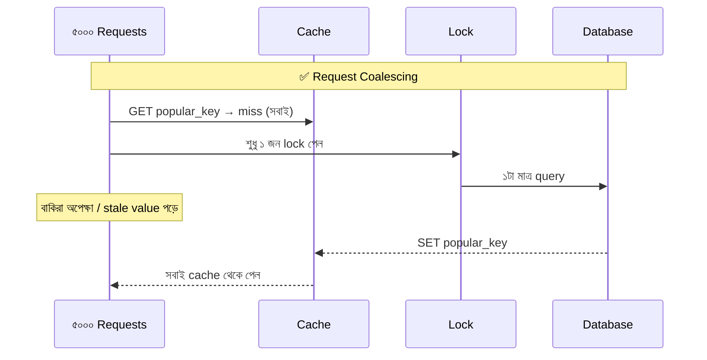

# Day 18 — Cache Stampede থেকে বাঁচা

## 🎯 সমস্যা

একটা popular key-র cache entry expire হলো। ঠিক সেই মুহূর্তে সেই key চাইছিল ৫,০০০ concurrent request — **সবাই একসাথে miss** পেল, **সবাই একসাথে DB-তে** ছুটল একই জিনিস আনতে। DB-তে হঠাৎ ৫,০০০ identical ভারী query → DB ধীর → আরও request জমে → পুরো system কাঁপছে। একে বলে **cache stampede** বা **thundering herd** — cache যত কার্যকর ছিল, তার পতন তত ভয়ংকর।

## 🖼️ সমস্যা ও প্রধান প্রতিকার

## 💡 প্রতিকারগুলো

**1. Request coalescing / single-flight** — miss হলে সেই key-র জন্য একটা lock (`SET NX`): শুধু বিজয়ী DB-তে যায়, বাকিরা অল্প অপেক্ষা করে cache-এ retry করে (বা পুরনো value পায়)। Go-র `singleflight`, .NET-এ per-key `SemaphoreSlim`/`Lazy<Task<T>>` — এক process-এর ভেতরের duplicate call এমনিতেই এক হয়ে যায়; distributed হলে Redis lock।

**2. Stale-while-revalidate** — TTL শেষ মানেই value ফেলে দেওয়া নয়। **Logical TTL** পার হলে: পুরনো value-ই serve করুন, আর background-এ **একজন** refresh করুক। User কখনো miss-এর দেয়ালে ধাক্কা খায় না। CDN জগতে এটা standard (`stale-while-revalidate` directive)।

**3. Probabilistic early refresh (XFetch)** — TTL শেষ হওয়ার *আগেই*, শেষের যত কাছে তত বেশি সম্ভাবনায়, কোনো এক request নিজে থেকে refresh করে দেয়। ফলে expiry-র মুহূর্তটাই আসে না। Lock ছাড়া, elegant।

**4. TTL jitter** — অনেক key একসাথে ভরা হলে (যেমন deploy-এর পরে cache warm) সবার TTL-ও একসাথে ফুরায় — গণ-expiry। TTL-এ random ±১০–২০% যোগ করুন, expiry ছড়িয়ে যাবে।

**5. Hot key কখনো expire-ই না হোক** — হাতে-গোনা অতি-গুরুত্বপূর্ণ key (homepage config): TTL নেই, বদলালে explicit invalidation/refresh (background job নিয়ম করে refresh করে)।

**Cold start-এর কথাও ভাবুন:** cache cluster restart = ১০০% miss = সম্মিলিত stampede। Cache warming (চালু করার আগে জনপ্রিয় key ভরে নেওয়া) আর DB-র সামনে concurrency limit — শেষ বর্মটা DB-র নিজের সামনে থাকা উচিত।

## ⚖️ কখন কোনটা

| পরিস্থিতি | প্রতিকার |
|-----------|----------|
| গুটিকয় অতি-hot key | Never-expire + background refresh |
| সাধারণ hot key, সামান্য staleness OK | Stale-while-revalidate |
| Staleness একদম নয় | Single-flight lock (অপেক্ষা মেনে) |
| গণ-expiry-র ঝুঁকি | TTL jitter (সবসময়ই দিন, সস্তা) |

## ⚠️ Common Mistakes

- Lock নিয়ে refresh করা প্রক্রিয়াটা মরে গেলে? — lock-এ TTL, আর অপেক্ষমাণদের fallback (stale value বা সরাসরি DB, তবে সীমিত concurrency-তে)।
- শুধু distributed lock, process-লোকাল coalescing নেই — এক pod-এর ১০০ thread-ই তো আগে এক হতে পারে, Redis-এ যাওয়ার আগেই।
- Jitter-কে তুচ্ছ ভাবা — এক লাইনের কোড, বহু মধ্যরাতের ঘুম বাঁচায়।

## 🎤 Interview Tip

স্তরে স্তরে বলুন: **"jitter সবসময় + hot key-তে stale-while-revalidate + miss-এ single-flight — তিন স্তরের বর্ম।"** আর মনে করিয়ে দিন: stampede শুধু expiry-তে না, cold start আর deploy-এও আসে — এই বিস্তৃতিটা অভিজ্ঞতার ছাপ।
