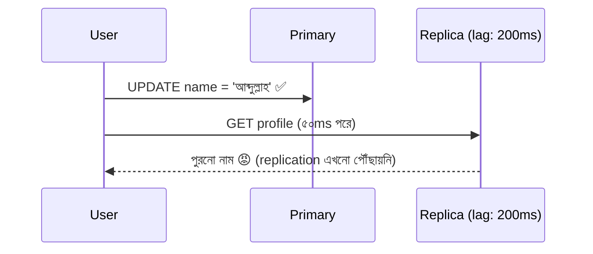

# Day 19 — Read Replica-তে Read-Your-Writes

## 🎯 সমস্যা

Read scale করতে replica যোগ করলেন — write যায় primary-তে, read যায় replica-তে। কিন্তু replication **asynchronous**: primary-তে commit আর replica-তে পৌঁছানোর মাঝে lag (মিলিসেকেন্ড থেকে, চাপে পড়লে সেকেন্ড)। User profile save করে পরের পাতাতেই পুরনো নাম দেখল — "save হয়নি!" ভেবে আবার save। এটাই read-your-writes সমস্যা: **নিজের লেখা নিজে পড়তে পারা** — এই ন্যূনতম প্রত্যাশাটুকু replica ভেঙে দেয়।

## 🖼️ সমস্যা

## 💡 প্রতিকারগুলো

**1. Sticky read-after-write (সবচেয়ে প্রচলিত)** — user write করলে **পরের কিছুক্ষণ** (যেমন ৫–১০ সেকেন্ড, সাধারণ lag-এর চেয়ে বেশ বড়) তার read গুলো primary-তে পাঠান। Session/cookie-তে `last_write_at` রাখলেই হয়। সরল, কার্যকর; দাম: write-করা user-দের read চাপ primary-তে ফেরে।

**2. নিজের লেখা resource-এর read primary থেকে** — আরও সূক্ষ্ম: শুধু *যে জিনিসটা* user বদলাতে পারে (নিজের profile, নিজের post) সেটার read primary-তে; বাকি সব (অন্যের post, feed) replica-তে। "নিজের লেখা নিজে দেখা" ঠিক এই টুকুর-ই তো guarantee দরকার।

**3. LSN/GTID tracking (নিখুঁত পদ্ধতি)** — write-এর পরে primary-র log position (Postgres LSN, MySQL GTID) client/session-এ রাখুন; read-এর সময় replica জিজ্ঞেস করুন "তুমি কি এই position পার হয়েছ?" — হ্যাঁ হলে replica-ই পড়ুন, না হলে primary বা অপেক্ষা। ProxySQL/কিছু driver এটা built-in করে। সবচেয়ে সঠিক, সবচেয়ে জটিল।

**4. Client-side মলম** — save-এর response-এই updated object ফেরত দিন, UI সেটাই দেখাক (আলাদা GET-ই না লাগুক); বা optimistic UI। আসল consistency নয়, কিন্তু এই এক ক্ষেত্রের UX সমস্যাটা প্রায়ই এতেই মিটে যায়।

**5. Synchronous replication?** — replica ack না দেওয়া পর্যন্ত commit আটকে থাকে। Lag শূন্য, কিন্তু write latency বাড়ে আর replica পড়লে availability-ও জড়িয়ে যায়। খুব দরকারি জায়গা ছাড়া দাম বেশি।

**মনে রাখুন — আরও দুটো আত্মীয় সমস্যা:** monotonic reads (পরপর দুই read ভিন্ন replica-তে গিয়ে সময় পেছনে হাঁটা — প্রতিকার: user-কে এক replica-তে sticky রাখা) আর বাকি সবার জন্য eventual consistency তো থাকছেই — অন্যরা আপনার লেখাটা ২০০ms পরে দেখবে, সেটা প্রায় সবসময় ঠিকই আছে।

## ⚖️ কখন কোনটা

| পরিস্থিতি | প্রতিকার |
|-----------|----------|
| সাধারণ web app | Sticky read-after-write (time-based) |
| শুধু নিজের data-য় সমস্যা | Own-resource read → primary |
| ভুল একেবারেই চলবে না, scale-ও লাগবে | LSN/GTID tracking |
| শুধু UX-এর অভিযোগ | Response-এ fresh object / optimistic UI |

## ⚠️ Common Mistakes

- সব read primary-তে ফিরিয়ে "সমাধান" — replica-য় টাকা ঢালার অর্থটাই গেল।
- Lag "সবসময় ১০ms" ধরা — চাপ/vacuum/long transaction-এ সেকেন্ডে চড়ে; **replication lag-এর metric + alert** না থাকলে এ রোগ ধরা-ই যায় না।
- Cache ভুলে যাওয়া — DB ঠিক করলেন, কিন্তু stale টা আসছিল cache থেকে (Day 08); পুরো read path ধরে ভাবুন।

## 🎤 Interview Tip

শুরুতেই শ্রেণিবিন্যাস: **"এটা consistency-র পুরো সমস্যা না — শুধু নিজের write নিজে দেখার guarantee লাগবে, সেটা অনেক সস্তা।"** তারপর সমাধান-সিঁড়ি: sticky (সহজ) → own-resource routing → LSN tracking (নিখুঁত)। সমস্যাকে ছোট করে সংজ্ঞায়িত করতে পারাটাই এখানে seniority।
