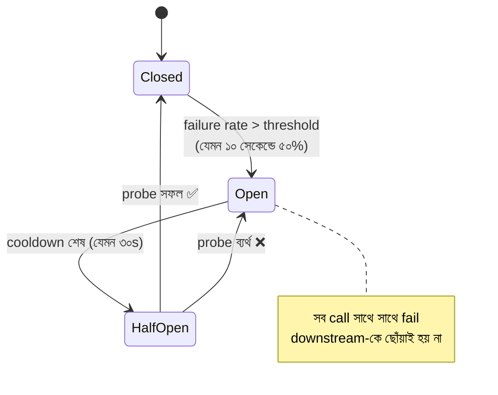

# Day 20 — Failing Downstream Dependency আটকানো (Circuit Breaker)

## 🎯 সমস্যা

আপনার service ডাকছে PaymentProvider-কে — সে ধীর/মৃত। প্রতিটা call ৩০ সেকেন্ড timeout-এ ঝুলছে, আপনার thread/connection সব সেই অপেক্ষায় আটকা, নতুন request নেওয়ার কেউ নেই — **একজনের অসুখে আপনি নিজেও মরলেন**, তারপর আপনার caller-রা। এই chain reaction-ই cascading failure। আর সুস্থ হওয়ার মুখে থাকা downstream-কে আপনার জমে থাকা retry ঝড় আবার শুইয়ে দেয়।

## 🖼️ State Machine

## 💡 মূল ধারণা

**Circuit breaker** — বাসার বিদ্যুতের ব্রেকারের মতোই: রোগ ধরা পড়লে লাইন কেটে দেয়।

- **Closed (স্বাভাবিক)** — call যাচ্ছে, ব্যর্থতা গোনা হচ্ছে (sliding window-তে rate)।
- **Open** — threshold পেরোলে সুইচ অফ: call downstream-এ **যায়-ই না**, সাথে সাথে fail/fallback। লাভ দুটো: আপনার thread গুলো ৩০s ঝুলে থাকা থেকে বাঁচল (fail fast), আর অসুস্থ downstream **সুস্থ হওয়ার নিঃশ্বাস** পেল।
- **Half-open** — cooldown-এর পরে অল্প ক'টা probe call; সফল হলে Closed-এ ফেরা, ব্যর্থ হলে আবার Open।

**Breaker একা নয় — resilience-এর পূর্ণ সেট:**
1. **Timeout (সবার আগে)** — আক্রমণাত্মক timeout না থাকলে breaker-এর "failure" গোনারই কিছু নেই; ৩০s default timeout-ই আসল ভিলেন। p99-এর একটু উপরে রাখুন।
2. **Retry — কিন্তু বুঝে** — শুধু transient error-এ (timeout, 503), সীমিত বার, **exponential backoff + jitter**-এ। 400/validation error retry করা অর্থহীন; আর breaker Open থাকলে retry-ও বন্ধ।
3. **Bulkhead** — dependency-প্রতি আলাদা connection/thread pool; Payment ডুবলে যেন তার pool-ই ডোবে, পুরো জাহাজ নয় (জাহাজের bulkhead-এর নামেই নাম)।
4. **Fallback — ব্যবসায়িক সিদ্ধান্ত** — Open অবস্থায় কী দেবেন? Cached data, degraded feature (recommendation বন্ধ, generic list), queue-তে রেখে "পরে হবে", নাকি পরিষ্কার error? এটা engineering নয়, product প্রশ্ন — আগেই ঠিক করুন।

**.NET জগতে:** Polly (এখন `Microsoft.Extensions.Resilience`) — retry, timeout, breaker, bulkhead সব declarative pipeline-এ; নিজে state machine লিখবেন না। Java-তে Resilience4j। Mesh-স্তরে Istio/Envoy-ও outlier detection দেয়।

## ⚖️ Design সিদ্ধান্তগুলো

| প্রশ্ন | পরামর্শ |
|--------|---------|
| Threshold কী দিয়ে | সংখ্যা নয়, **rate** (৫০% in 10s) + ন্যূনতম call সংখ্যা (কম traffic-এ ২টা fail-এ যেন না খোলে) |
| Breaker-এর granularity | Per-dependency, প্রায়ই per-endpoint (তার search ভাঙা, checkout সুস্থ — আলাদা breaker) |
| কোনটা failure | Timeout, 5xx, connection error — হ্যাঁ; 404/400 — না |
| Open হলে | Alert! Breaker হলো ঘটনার সংকেত, নীরব মলম নয় |

## ⚠️ Common Mistakes

- Fallback না ভেবে breaker বসানো — fail fast হলো, কিন্তু user কী দেখবে কেউ ভাবেনি।
- Breaker আছে, timeout নেই — ৩০s ঝুলন্ত call-এ window-ই ভরে না, breaker কখনো খোলে না।
- Half-open-এ পুরো traffic ছেড়ে দেওয়া — সদ্য-ওঠা রোগীর ঘাড়ে আবার পুরো ভিড়; probe সীমিত রাখুন।

## 🎤 Interview Tip

ক্রমটা মুখস্থ: **"Timeout → Retry (backoff+jitter) → Circuit breaker → Bulkhead → Fallback।"** আর এক লাইনের গভীরতা: **"Breaker নিজেকে যেমন বাঁচায়, downstream-কেও সুস্থ হওয়ার সুযোগ দেয় — এটা সৌজন্যও।"** Fallback-কে product সিদ্ধান্ত বলাটাও নম্বর তোলে।
