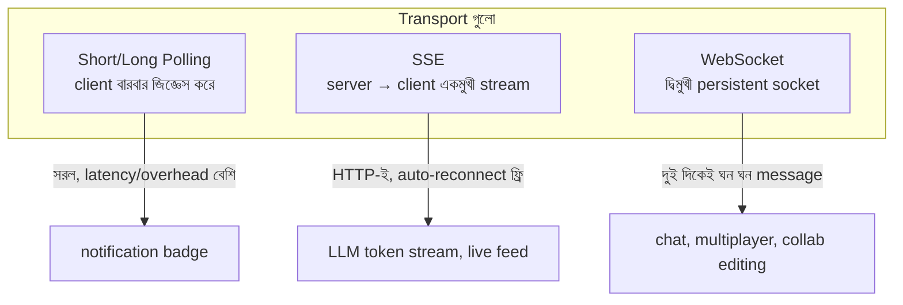

# Day 21 — Real-Time Streaming Transport বাছাই (WebSocket / SSE / Polling)

## 🎯 সমস্যা

Browser-কে server থেকে live update দিতে হবে — chat message, নোটিফিকেশন, stock price, LLM-এর token stream। HTTP-র স্বাভাবিক ছন্দ হলো "client জিজ্ঞেস করে, server উত্তর দেয়" — server নিজে থেকে কিছু বলতে পারে না। এই ফাঁক পূরণের ৩–৪টা পথ আছে, আর ভুল পথ বাছলে হয় অকারণ জটিলতা, নয় scale-এ ধস।

## 🖼️ Options

## 💡 চারটি পথ

**1. Short polling** — client প্রতি X সেকেন্ডে GET। সরলতম; latency গড়ে X/2, আর ৯৯% request-এ "নতুন কিছু নেই"। কম-জরুরি, কম-ঘন update-এ (badge count) এখনো যুক্তিসংগত।

**2. Long polling** — server উত্তর **ধরে রাখে** যতক্ষণ না নতুন data আসে (বা timeout), তারপর client সাথে সাথে আবার জিজ্ঞেস করে। Latency প্রায় real-time, কিন্তু প্রতি message-এ নতুন request-এর overhead রয়ে যায়। WebSocket-এর fallback হিসেবে এখনো বাঁচে।

**3. SSE (Server-Sent Events)** — একটা সাধারণ HTTP response, যেটা কখনো শেষ হয় না; server তাতে event লিখতে থাকে। **একমুখী** (server→client)। সৌন্দর্য: এটা নিছক HTTP — proxy/LB/HTTP2-এর সাথে বন্ধুত্ব, browser-এ `EventSource`-এর **built-in auto-reconnect + Last-Event-ID** দিয়ে ছেঁড়া জায়গা থেকে resume। LLM-এর token streaming (ChatGPT-জাতীয় UI), live score, feed update — client-এর কিছু *বলার* না থাকলে SSE-ই সঠিক, WebSocket নয়।

**4. WebSocket** — HTTP handshake দিয়ে শুরু করে TCP-র উপর **দ্বিমুখী** persistent frame protocol। Chat, multiplayer game, collaborative editing — যেখানে client-ও ঘন ঘন পাঠায়। দাম: stateful connection-এর ভার — LB-তে sticky/connection-aware routing, নিজস্ব heartbeat (ping/pong), reconnect logic নিজে লেখা, আর server-এ লাখো open socket-এর memory/FD সীমা।

**Scale-এর আসল প্রশ্নটা transport-এর পরে আসে:** ১০টা server-এ ১০ লাখ connection ছড়িয়ে আছে; user_42-কে message দেবেন — সে কোন server-এ? সমাধান: server গুলোর পেছনে **pub/sub backbone** (Redis pub/sub, Kafka, NATS) — যে server-এই থাকুক, channel-এ subscribe করা থাকলে পাবে। SignalR-এর Redis backplane, Socket.IO-র adapter — একই ধারণা। Managed পথও আছে: Azure SignalR Service, Ably/Pusher — connection-এর ভারটাই তারা নেয়।

## ⚖️ সিদ্ধান্ত-ছক

| দরকার | বাছাই |
|--------|-------|
| Server→client stream, client চুপচাপ | **SSE** |
| দুই দিকেই ঘন ঘন, low-latency | **WebSocket** |
| কালেভদ্রে update, সরলতা সর্বোচ্চ | Polling |
| Binary data দ্বিমুখী | WebSocket (SSE text-only) |
| Infra সামলাতে চান না | Managed service (Azure SignalR, Ably) |

## ⚠️ Common Mistakes

- সব real-time = WebSocket ভাবা — একমুখী stream-এ WebSocket নেওয়া মানে reconnect/heartbeat/LB-র পুরো খরচ কিনে SSE-র ফ্রি জিনিসগুলো ফেলে দেওয়া।
- Reconnect-এ হারানো message-এর কথা না ভাবা — sequence/Last-Event-ID + ছোট replay buffer না রাখলে ছেঁড়া সংযোগে data হারায়।
- Proxy/LB-র idle timeout ভুলে যাওয়া — ৬০ সেকেন্ড চুপ থাকলে অনেক LB সংযোগ কাটে; heartbeat/keepalive পাঠান।
- Auth ভাবা শুধু connect-এর সময় — দীর্ঘজীবী connection-এ token expire হয়; re-auth কৌশল লাগবে।

## 🎤 Interview Tip

প্রথম প্রশ্নটাই হোক: **"Data flow কি একমুখী না দ্বিমুখী?"** — একমুখী হলে SSE বলে interviewer-কে চমকে দিন (সবাই WebSocket বলে)। তারপর যোগ করুন: "transport যেটাই হোক, multi-server-এ routing-এর জন্য pub/sub backbone লাগবে" — এই দ্বিতীয় স্তরটাই system design।
