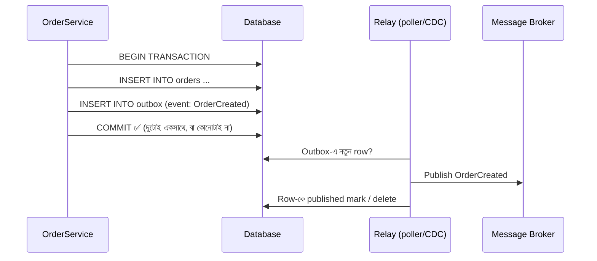

# Day 22 — Service-এর মধ্যে Reliable Messaging (Outbox Pattern)

## 🎯 সমস্যা

Order save করলেন DB-তে, তারপর `OrderCreated` event publish করলেন queue-তে — দুটো **আলাদা system-এ দুটো আলাদা write**। মাঝখানে crash হলে? দুই রকম বিপদ: DB-তে order আছে কিন্তু event যায়নি (downstream কেউ জানলই না), অথবা event গেল কিন্তু DB transaction rollback হলো (ভূতুড়ে order-এর খবর ছড়াল)। DB আর message broker-কে এক transaction-এ বাঁধা যায় না (distributed transaction-এর যন্ত্রণা, Day 10) — তাহলে **atomicity আসবে কোথা থেকে?**

## 🖼️ Outbox Pattern

## 💡 মূল ধারণা

**Transactional Outbox** — চালাকিটা সহজ: event-টাকেও **DB-তেই** লিখুন, business data-র **একই local transaction-এ**, একটা `outbox` টেবিলে। DB transaction atomic — তাই "order আছে অথচ event নেই" অসম্ভব হয়ে গেল। তারপর একটা আলাদা **relay** process outbox থেকে পড়ে broker-এ publish করে।

**Relay-র দুই রূপ:**
1. **Polling publisher** — কয়েকশ ms পরপর `SELECT ... WHERE published = false ORDER BY id` → publish → mark। সরল, সব DB-তে চলে; দাম: polling-এর সামান্য latency আর DB-তে টোকাটুকি।
2. **CDC (Change Data Capture)** — Debezium-জাতীয় tool DB-র WAL/binlog পড়ে outbox insert গুলোকে stream করে Kafka-তে। Latency কম, DB-তে চাপ নেই; দাম: আরেকটা infra চালানো।

**যে সত্যটা মেনে নিতে হবে: guarantee হলো at-least-once।** Relay publish করল, কিন্তু "published" mark করার আগে মরল — restart-এর পর আবার publish। তাই **consumer-কে idempotent হতেই হবে** (event ID দিয়ে dedupe — Day 04/11-এর সেই একই অস্ত্র)। Outbox + idempotent consumer = কার্যত exactly-once effect।

**Ordering:** outbox-এ sequence/id ক্রমে publish করুন, আর broker-এ পাঠানোর সময় সঠিক partition key দিন (Day 07) — নাহলে DB-তে ক্রম রেখে লাভ নেই।

**উল্টো দিকের ভাইটাও চিনে রাখুন — Inbox pattern:** consumer পাওয়া event আগে নিজের `inbox` টেবিলে লেখে (unique event-ID constraint-সহ), তারপর process করে — dedupe আর processing-এর atomicity এক জায়গায়।

**"Listen to yourself" ভুল:** অনেকে ভাবে "আগে publish করি, তারপর নিজের event শুনে DB-তে লিখব" — এতে সমস্যা ঘোরে মাত্র, যায় না (publish সফল কিন্তু পরে নিজের processing fail?)। Outbox-ই সোজা রাস্তা।

## ⚖️ কখন কী

| পরিস্থিতি | পথ |
|-----------|-----|
| DB + event, consistency জরুরি | Outbox — প্রায় default |
| Latency চরম sensitive, Kafka ecosystem | Outbox + CDC (Debezium) |
| ছোট system, সরলতা আগে | Outbox + polling |
| Event হারালেও চলে (analytics ping) | সরাসরি publish, outbox-এর দরকার নেই |

## ⚠️ Common Mistakes

- Outbox টেবিল অনন্তকাল বাড়তে দেওয়া — published row মুছুন/archive করুন, নাহতে polling query-ই একদিন ডোবাবে।
- Relay একটাই instance, পড়ে গেলে event জমে — relay-র health monitor + outbox lag-এর alert রাখুন।
- Consumer idempotent না করে "exactly-once আছে" ভাবা — নেই; at-least-once + dedupe-ই বাস্তবতা।
- Payload-এ পুরো object সেই মুহূর্তের snapshot না রেখে "গিয়ে DB থেকে পড়ে নিও" — ততক্ষণে data বদলে গেলে event-এর অর্থই বদলায়।

## 🎤 Interview Tip

সমস্যাটার নাম ধরে ডাকুন — **"এটা dual-write problem; সমাধান transactional outbox।"** তারপর এক নিঃশ্বাসে: local transaction-এ event সহ commit → relay (polling বা CDC) → at-least-once → তাই consumer-এ idempotency। এই শৃঙ্খলটা পুরো বলতে পারা মানেই microservices messaging আপনার হাতের জিনিস।
