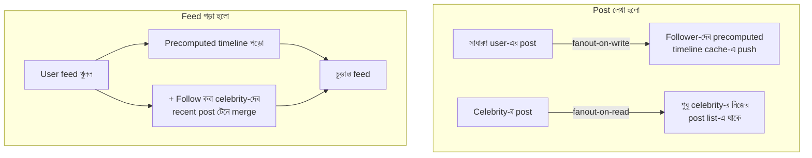

# Day 23 — Celebrity Account-এর Feed Fanout

## 🎯 সমস্যা

Social feed বানানোর মূল প্রশ্ন: user-এর timeline কখন তৈরি হবে — **লেখার সময়** নাকি **পড়ার সময়?** সাধারণ user-এর জন্য যেটাই চলুক, celebrity এসে হিসাব ভেঙে দেয়: ৫ কোটি follower-ওয়ালা কেউ একটা post করল — লেখার সময় বানাতে গেলে ৫ কোটি timeline-এ ঢোকাতে হবে (এক post-এ কয়েক ঘণ্টার কাজ!), আর পড়ার সময় বানাতে গেলে প্রতিটা feed load-এ হাজার following-এর post টেনে merge করতে হবে।

## 🖼️ Hybrid Fanout

## 💡 দুই মডেল ও তাদের সংকর

**1. Fanout-on-write (push)** — post হওয়া মাত্র প্রতিটা follower-এর **precomputed timeline**-এ (সাধারণত Redis list/sorted set) entry ঢুকিয়ে দেওয়া। পড়া = এক লাফে নিজের ready timeline পড়া — অতি দ্রুত, আর মানুষ লেখে কম পড়ে বেশি বলে হিসাবটা পোষায়। **ভাঙে celebrity-তে:** এক post × ৫ কোটি write = write amplification-এর বিস্ফোরণ, hot spot (Day 16), আর ততক্ষণে post টা edit/delete হলে ৫ কোটি জায়গায় সংশোধন!

**2. Fanout-on-read (pull)** — কারো timeline আগে থেকে বানানো নেই; feed খুললে তার সব following-এর recent post query করে merge-sort। Write সস্তা, **read মহার্ঘ** — প্রতি feed load-এ শত শত lookup; active user-দের জন্য টেকে না।

**3. Hybrid (বাস্তব জগতের উত্তর)** — follower সংখ্যার threshold টানুন (ধরুন ১০–৫০ হাজার):
- **সাধারণ user** → push: follower-দের timeline-এ ঢুকে যায়।
- **Celebrity** → pull: কারো timeline-এ push হয় না; শুধু celebrity-র নিজের post-list-এ থাকে।
- **পড়ার সময়:** নিজের precomputed timeline + follow-করা celebrity-দের সাম্প্রতিক post — এই দুই stream **merge** করে feed। Celebrity মুষ্টিমেয় বলে merge-এর দিকটা ছোট থাকে; আর তাদের post এমনিতেই এত-পঠিত যে cache-এ গরম হয়ে বসে থাকে।

**সাথে আরও কয়েকটা বাস্তব কৌশল:**
- **নিষ্ক্রিয় user-দের push বাদ** — ৬ মাস আসে না এমন follower-এর timeline বানিয়ে লাভ কী? ফিরে এলে pull দিয়ে বানিয়ে নিন। Fanout-এর কাজ অনেক কমে।
- **Fanout কাজটা queue-তে** — post-এর API call-এ ৫০ হাজার write নয়; event → worker-রা ধীরে-সুস্থে fanout করবে (কয়েক সেকেন্ডের feed-delay সবাই মেনে নেয়)।
- **Timeline cache-এ পুরো post নয়, শুধু ID** রাখুন (post_id + timestamp) — content এক জায়গায়, edit/delete সহজ; render-এর সময় ID→content batch lookup (N+1 নয়, Day 02!)।
- Ranking/ML-sorted feed হলেও কাঠামো একই — candidate সংগ্রহ (push+pull) → তারপর ranker।

## ⚖️ কখন কোনটা

| পরিস্থিতি | মডেল |
|-----------|-------|
| Follower বিতরণ মোটামুটি সমান, active user বেশি | Push |
| Read বিরল, write ঘন | Pull |
| Follower-এ long tail + কিছু দানব (বাস্তব social network) | **Hybrid** |
| Group chat/ছোট audience | Push-ই যথেষ্ট |

## ⚠️ Common Mistakes

- Threshold-টা স্থির সত্য ভাবা — এটা tuning knob; write খরচ বনাম read latency মেপে নাড়াতে হয়।
- Unfollow/block-এর কথা ভুলে যাওয়া — precomputed timeline-এ ঢুকে থাকা post unfollow-এর পরেও দেখাবে; read-time filter লাগে।
- Celebrity-র post edit হলে কী হবে ভাবা হয়নি — ID-only timeline এই কারণেই জরুরি।

## 🎤 Interview Tip

এই প্রশ্নটা আসলে একটা নীতির পরীক্ষা: **"Precompute বনাম compute-on-demand-এর টানাপোড়েন, আর skewed distribution-এ এক নিয়ম সবার জন্য খাটে না।"** Hybrid বলার পর inactive-user optimization আর ID-only timeline যোগ করুন — এই দুটো ছোট কথাই আপনাকে "পড়ে এসেছে" থেকে "বানিয়েছে" স্তরে তোলে।
