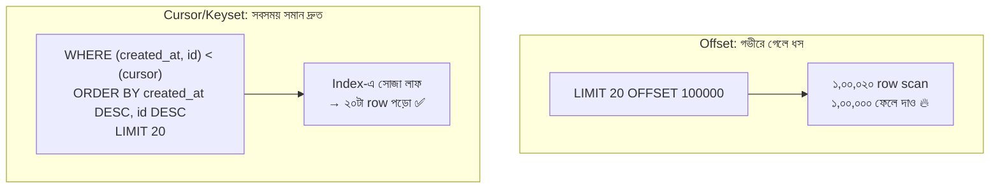

# Day 24 — বড় Result Set-এ Efficient Pagination

## 🎯 সমস্যা

`LIMIT 20 OFFSET 100000` — দেখতে নিরীহ, ভেতরে বিপর্যয়: DB-কে **১,০০,০২০টা row পড়ে ১,০০,০০০টা ফেলে দিতে হয়**। Page যত গভীর, query তত ধীর — শেষ page গুলো timeout। উপরন্তু page ওল্টানোর ফাঁকে নতুন row ঢুকলে জিনিস **সরে যায়**: একই item দুই page-এ, বা কোনো item কারো চোখেই পড়ল না। Infinite-scroll feed-এ এ দুটোই মারাত্মক।

## 🖼️ Offset vs Cursor



## 💡 মূল ধারণা

**Cursor/Keyset pagination** — "page নম্বর" নয়, **"শেষ যেটা দেখেছি তার পরেরগুলো দাও"**। শেষ row-এর sort-value গুলোই cursor:

```sql
-- প্রথম page
SELECT * FROM posts ORDER BY created_at DESC, id DESC LIMIT 20;
-- পরের page: শেষ row ছিল (t0, id0)
SELECT * FROM posts
WHERE (created_at, id) < (:t0, :id0)
ORDER BY created_at DESC, id DESC LIMIT 20;
```

- `(created_at, id)`-এর **composite index** থাকলে DB সোজা সেই বিন্দুতে লাফিয়ে ২০টা পড়ে — গভীরতা যা-ই হোক, খরচ একই (O(page size))।
- **Tie-breaker বাধ্যতামূলক:** `created_at` একা unique না — একই timestamp-এ একাধিক row থাকলে row হারাবেন/দুইবার পাবেন। তাই সবসময় unique কিছু (id) জুড়ে দিন; row-value তুলনা `(a,b) < (x,y)` Postgres-এ সরাসরি চলে, SQL Server-এ `OR`-এ ভেঙে লিখতে হয়।
- **নতুন data ঢুকলেও স্থিরতা:** cursor একটা নির্দিষ্ট বিন্দুর সাপেক্ষে — উপরে যত post-ই আসুক, "এই বিন্দুর পরেরগুলো" বদলায় না। Feed-এর duplicate/স্কিপ সমস্যা শেষ।
- **API-তে cursor-টা opaque রাখুন** — ভেতরের value গুলো (base64-encoded) token বানিয়ে দিন `next_cursor` হিসেবে; client শুধু ফেরত পাঠাবে। ভেতরের কাঠামো বদলানোর স্বাধীনতা থাকল। (Slack, Stripe, GitHub API — সবাই এটাই করে।)

**Offset তবে কি আবর্জনা?** না — এর একটা জিনিস cursor পারে না: **নির্দিষ্ট page-এ লাফ** ("Page 47-এ যাও") আর মোট page count। Admin panel, ছোট টেবিল, অগভীর pagination — offset-ই সহজ ও যথেষ্ট। সমস্যা কেবল বড় টেবিলের গভীর page-এ।

**মাঝামাঝি টোটকা (offset রাখতেই হলে):** deferred join — আগে সরু index-only scan-এ শুধু id বের করুন offset-সহ, তারপর সেই ২০টা id-তে join করে পুরো row আনুন; ফেলে-দেওয়া কাজটা সরু index-এ হয় বলে অনেক সস্তা।

**"মোট কত ফলাফল?"** — `COUNT(*)` বড় টেবিলে নিজেই একটা দানব query। পথ: approximate count (Postgres-এর planner estimate), "10,000+" বলে ক্ষান্ত দেওয়া, বা count-টাই বাদ (infinite scroll-এ কেউ মোট সংখ্যা চায় না)।

## ⚖️ কখন কোনটা

| পরিস্থিতি | পদ্ধতি |
|-----------|--------|
| Infinite scroll, feed, বড় list API | **Cursor/keyset** |
| Admin টেবিল, page-নম্বরে লাফ দরকার | Offset (+ deferred join যদি গভীর হয়) |
| Export/full scan | Keyset দিয়েই batch-এ হাঁটুন |
| Search result (relevance-sorted) | Search engine-এর নিজস্ব cursor (যেমন `search_after`) |

## ⚠️ Common Mistakes

- Cursor-এর sort column-এ index নেই — তাহলে keyset-ও ধীর; index-ই আসল ইঞ্জিন।
- Mutable column দিয়ে sort (যেমন `updated_at`) — row নিজেই cursor-এর ওপারে-এপারে লাফায়; immutable/মোটামুটি-স্থির column নিন।
- Client-কে raw `last_id` দিয়ে "id দিয়ে filter করো" বলা — sort order বদলালেই ভাঙবে; opaque cursor দিন।
- দুই দিকে হাঁটার কথা ভুলে যাওয়া — "previous page" লাগলে cursor-এ দিকনির্দেশ রাখুন বা দুই প্রান্তের token দিন।

## 🎤 Interview Tip

এক লাইনে মর্ম: **"Offset মানে ফেলে-দেওয়া কাজ কিনছেন — page যত গভীর, দাম তত; keyset মানে index-এ সোজা লাফ, খরচ সবসময় এক page-এর।"** সাথে tie-breaker column আর opaque cursor-এর কথা বললে বোঝা যায় আপনি এটা production-এ করেছেন, ব্লগে পড়েননি।
