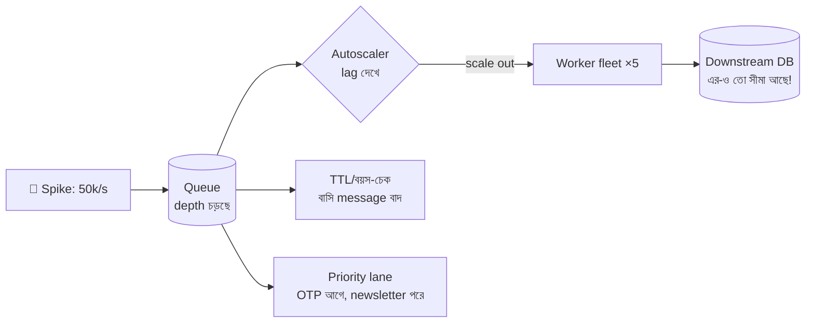

# Day 25 — Traffic Spike-এ Queue Backpressure

## 🎯 সমস্যা

Day 17-এ ছিল *স্থায়ীভাবে* ধীর consumer; আজ ভিন্ন রোগ — **হঠাৎ ঢেউ**। Flash sale, viral মুহূর্ত, টিভি বিজ্ঞাপন: স্বাভাবিক ২ হাজার/সেকেন্ড হুট করে ৫০ হাজার। Queue তো "শক শোষণ" করার জন্যই — কিন্তু ঢেউটা কত বড়, কতক্ষণের, আর জমে-থাকা কাজের **বয়স** যখন মিনিট থেকে ঘণ্টায় চড়ে — তখন প্রশ্নগুলো বদলে যায়: OTP-টা ২ ঘণ্টা পরে delivered হয়ে লাভ কী?

## 🖼️ Spike-এর জীবনচক্র

## 💡 কৌশলগুলো

**1. Queue-কে শক শোষণ করতে দিন — কিন্তু বাজেটসহ।** ক্ষণস্থায়ী spike-এ queue-র গভীরতা বাড়বে, তারপর নামবে — এটাই স্বাভাবিক, ঘাবড়ানোর কিছু নেই। ঘাবড়ানোর মাপকাঠি ঠিক করুন আগেই: **oldest-message-age** (depth নয়!) আপনার SLA ছাড়াচ্ছে কি না। ১০ লাখ জমা কিন্তু ৩০ সেকেন্ডে খালি হবে — ঠিক আছে; ১০ হাজার জমা কিন্তু প্রতিটা ২০ মিনিট বাসি — বিপদ।

**2. Lag-based autoscaling — আগে থেকে বানানো।** Spike-এর দিনে হাতে scale করা মানে হেরে যাওয়া। Queue depth/consumer lag-এ KEDA (Kubernetes), SQS-depth-ভিত্তিক scaling — আর **max সীমা** দিন, কারণ worker ৫ গুণ হলে তার পেছনের DB-তেও ৫ গুণ ঝাঁপ (Day 13-এর connection অঙ্ক মনে আছে?)। Consumer scale করা সহজ; **downstream-এর ছাদটাই আসল সীমা** — worker-এ concurrency limit রাখুন যেন spike-টা queue থেকে সোজা DB-তে চালান না হয়ে যায়।

**3. Message-এর মেয়াদ (TTL) — বাসি কাজ করবেন না।** OTP, "driver arriving" push, live-score update — নির্দিষ্ট বয়সের পরে এদের process করা অর্থহীন, বরং ক্ষতিকর (২ ঘণ্টা পরে OTP পেয়ে user বিভ্রান্ত)। Message-এ deadline/timestamp দিন; consumer বাসি পেলে **skip করে metric গুনুন**। এটা load shedding-এর সবচেয়ে ভদ্র রূপ — যে কাজের দাম শূন্য হয়ে গেছে, সেটাই ফেলছেন।

**4. Priority আলাদা করুন — এক লাইনে সবাই নয়।** Spike-এ সবচেয়ে বড় অন্যায়: payment confirmation দাঁড়িয়ে আছে marketing email-এর পেছনে। **আলাদা queue + আলাদা worker pool** per priority class (এক queue-র ভেতরে "priority field" প্রায় কাজ করে না — মাথার সামনেরটা আগে বের হবেই)। Critical lane-এর নিজস্ব capacity reserve থাকুক।

**5. ঢোকার মুখেই ভদ্রতা — producer side।** সবই কি queue-তে ঢুকতে দেবেন? Client-এর retry-তে backoff+jitter, ঢোকার মুখে rate limit (Day 03), আর ইচ্ছাকৃত ঢেউ (৫ কোটি user-কে push notification) নিজেই **ছড়িয়ে পাঠান** (jittered rollout) — নিজের বানানো spike-এর চেয়ে লজ্জার কিছু নেই।

**6. পরের অঙ্কটা আগেই করুন:** spike-এ সর্বোচ্চ ingest × স্থায়িত্ব = জমবে কত; আপনার scaled fleet-এর drain rate = খালি হতে লাগবে কতক্ষণ। এই দুটো সংখ্যা জানা থাকলে incident-এর রাতে সিদ্ধান্ত নিতে হয় না — আগেই নেওয়া থাকে।

## ⚖️ Spike-এ কোন message-এর কী গতি

| Message | নীতি |
|---------|------|
| Payment, order | কখনো ফেলা না — priority lane + durable |
| OTP, real-time push | TTL — বাসি হলে বাদ |
| Email/newsletter | পেছনের lane, দেরি মেনে নেওয়া |
| Analytics event | Sample/aggregate — spike-এ সবচেয়ে আগে ছাঁটাই |

## ⚠️ Common Mistakes

- Depth-এ alert, age-এ নয় — depth ব্যস্ততার মাপ, age-ই ব্যথার মাপ।
- Autoscaling আছে কিন্তু downstream সীমাহীন — spike শুধু queue থেকে DB-তে স্থানান্তরিত হলো; ধসটা এক ধাপ পেছাল মাত্র।
- Visibility timeout ভুলে যাওয়া (SQS) — spike-এ ধীর processing > visibility timeout হলে message আবার দৃশ্যমান → duplicate-এর বন্যা; timeout বাড়ান বা heartbeat দিন। (আর consumer idempotent তো বটেই — Day 11।)
- DLQ উপচে পড়া নীরবে — spike-এ fail-ও বাড়ে; DLQ-র depth-এও চোখ রাখুন।

## 🎤 Interview Tip

কাঠামো দিন তিন সময়ে: **"Spike-এর আগে (lag-based autoscaling + priority lane তৈরি), spike-এর সময় (queue শোষণ করুক, TTL-এ বাসি ছাঁটাই, downstream-এ concurrency ঢাল), spike-এর পরে (drain-time-এর অঙ্ক, DLQ পরিষ্কার)।"** আর সোনার বাক্যটা: **"Queue depth নয়, oldest-message-age-ই আসল SLI"** — এইটা বললে চোখ চকচক করবে।
