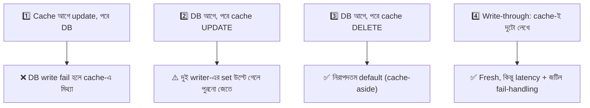

# Day 26 — Write-Path Cache Consistency

## 🎯 সমস্যা

Day 08-এ ছিল সামগ্রিক ছবি (cache-aside + delete + TTL); আজ ক্যামেরা শুধু **write path**-এ। Data বদলানোর মুহূর্তে দুটো store-এ (DB + cache) হাত দিতে হয় — এবং সেই দুই হাতের **মাঝখানে** ঘটে যত অনর্থ: কোনটা আগে? একটার পরে অন্যটার আগে crash হলে? দুটো writer একসাথে এলে কে জেতে? Write-heavy আর consistency-স্পর্শকাতর জায়গায় (দাম, stock, balance) এই সূক্ষ্মতাগুলোই আসল design।

## 🖼️ ক্রমের ৪ সম্ভাবনা

## 💡 Write path-এর সিদ্ধান্তগুলো

**1. Update নয়, delete — কারণটা এবার গভীরে।** দুই concurrent write: A লিখল দাম=১০০, B লিখল দাম=১২০। DB-তে B পরে commit করল (সঠিক শেষ মান ১২০)। কিন্তু cache-set-এর network ভাগ্যে B-রটা আগে পৌঁছল, A-রটা পরে — cache-এ রইল ১০০, **TTL পর্যন্ত ভুল দাম**। Delete-এ এই race নেই: দুজনেই মুছল, পরের reader fresh আনবে। Update-এর লোভ (পরের read-এ miss হবে না) তখনই করবেন যখন...

**2. ...Version দিয়ে লড়াই মেটাতে পারবেন — versioned write / CAS।** প্রতিটা value-র সাথে version/timestamp (DB row-version-ই সবচেয়ে ভালো)। Cache-এ set করার সময় **compare-and-set**: "তোমার কাছে যেটা আছে তার version আমারটার চেয়ে ছোট হলেই কেবল বসাও" (Redis-এ Lua script-এ)। এবার পুরনো write আর নতুনকে মুছতে পারে না — update করেও নিরাপদ। দাম: প্রতি entity-তে version বহন আর Lua-র জটিলতা।

**3. "DB লিখলাম, delete করার আগেই মরলাম" — অসমাপ্ত জোড়ার সমস্যা।** এটা চেনা রোগ — Day 22-এর **dual-write**! সমাধানও সেখানকার: cache invalidation-কে best-effort না রেখে **CDC/outbox পথে** পাঠান — DB commit হয়েছে মানেই invalidation event বেরোবে (Debezium → invalidator consumer)। App-code-এর ভুলে-যাওয়া, crash, ভিন্ন ভিন্ন service-এর লেখা — সব ক্ষেত্রে এক পাহারাদার। Cache-consistency-র সবচেয়ে টেকসই রূপ এটাই।

**4. Write-through / write-behind — cache-কেই দরজা বানানো।** সব write cache-এর ভেতর দিয়ে: write-through সঙ্গে সঙ্গে DB-তে (fresh cache, বাড়তি latency), write-behind পরে batch-এ (দ্রুত, কিন্তু cache মরলে লেখা হারায় — counter/like-এ চলে, টাকায় নয়)। এদের আসল শর্তটা প্রায়ই উহ্য থাকে: **সব writer-কে এই দরজা দিয়েই ঢুকতে হবে** — পাশ দিয়ে কেউ সরাসরি DB-তে লিখলে (পুরনো cron, অন্য টিমের service, হাতে চালানো SQL!) পুরো মডেল ভাঙল। Microservices-এ এই শৃঙ্খলা রাখা কঠিন বলেই cache-aside-এর রাজত্ব।

**5. Delayed double delete — বহু-ব্যবহৃত টোটকা।** Day 08-এর সেই সূক্ষ্ম race-টার (reader পুরনো মান হাতে নিয়ে বসে আছে, writer-এর delete-এর *পরে* সেটা cache-এ বসাবে) জন্য: DB write + delete-এর **কিছুক্ষণ পরে** (শ'খানেক ms — এক read-এর আয়ু) **আরেকবার delete**, async-এ। নিখুঁত নয়, সস্তায় জানালাটা প্রায় বন্ধ করে।

## ⚖️ কখন কোন write path

| পরিস্থিতি | পথ |
|-----------|-----|
| সাধারণ ক্ষেত্র | DB write → cache **delete** (+TTL সবসময়) |
| Read-heavy, miss-এর ঝড় পোষায় না | Versioned update (CAS) বা delete-এর বদলে refresh |
| বহু writer/service, শৃঙ্খলায় ভরসা নেই | CDC-driven invalidation |
| Write-ঝড়, ক্ষয়ক্ষতি সহনীয় (counter) | Write-behind |
| এক service-ই একমাত্র দরজা | Write-through বিবেচ্য |

## ⚠️ Common Mistakes

- Delete-কে transaction-এর **ভেতরে** রাখা — cache call ধীর হলে DB transaction ধরে বসে থাকে; delete হোক commit-এর *পরে* (আর তার fail সামলাক CDC/retry)।
- এক entity-র cache বহু রূপে (single item, list-এ, aggregation-এ) — write-এ শুধু single key মুছলেন, list-cache রয়ে গেল বাসি; **কোন write কোন কোন key নষ্ট করে** — এই ম্যাপটাই আসল কাজ, আর এটা জটিল হয়ে গেলে বুঝবেন cache granularity ভুল।
- TTL তুলে দেওয়া "কারণ invalidation তো নিখুঁত" — নয়; TTL-ই শেষ বিমা (Day 08-এর মন্ত্র)।

## 🎤 Interview Tip

সিঁড়িটা এভাবে বলুন: **"Default: DB-then-delete + TTL; race-এর জানালা ছোট করতে delayed double delete; update লাগলেই version/CAS; আর সত্যিকার দৃঢ়তা চাইলে invalidation-কে CDC-তে তুলে দিই — কারণ cache invalidation আসলে একটা dual-write problem।"** শেষ বাক্যটা — দুই টপিকের এই জোড়াটা দেখাতে পারা — interview-তে সবচেয়ে দামি মুহূর্ত।
