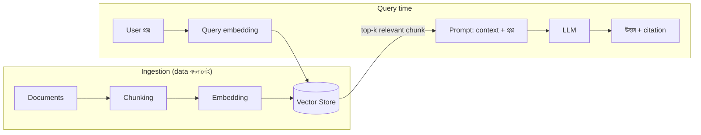

# Day 27 — LLM-এর উত্তর Up-to-Date রাখা (RAG)

## 🎯 সমস্যা

LLM-এর জ্ঞান জমাট বাঁধা তার training cutoff-এ — গতকালের policy বদল, আজ সকালের দাম, আপনার কোম্পানির internal ডকুমেন্ট — কিছুই সে জানে না। অথচ support bot-কে জানতে হবে *আজকের* refund policy। জিজ্ঞেস করলে সে জানে-না বলবে না — **আত্মবিশ্বাসে বানিয়ে বলবে** (hallucination)। প্রশ্ন: মডেলের ভেতরে ঢুকে জ্ঞান বদলাবেন, নাকি বাইরে থেকে জ্ঞান খাওয়াবেন?

## 🖼️ RAG Pipeline

## 💡 তিনটি পথ ও কেন RAG-ই default

**1. Fine-tuning** — নতুন data-য় মডেলকে আবার train করা। ভুল ধারণা: এটা "জ্ঞান ঢোকানোর" যন্ত্র। বাস্তবে fine-tuning শেখায় **আচরণ/ভঙ্গি/format** (আপনার brand-voice, নির্দিষ্ট output কাঠামো, domain-এর ভাষা) — নির্ভরযোগ্য fact-recall নয়। আর প্রতিবার data বদলালে re-train? খরচ, দেরি, আর পুরনো তথ্য **মোছার** কোনো উপায় নেই।

**2. পুরোটা context-এ ঠেলে দেওয়া** — ছোট, মোটামুটি স্থির knowledge base (কয়েকশ পাতার নিচে) হলে সবচেয়ে সৎ সমাধান: পুরোটাই প্রতি call-এ prompt-এ দিন (prompt caching-এ খরচও নামে)। Retrieval-এর ভুলই নেই। ভাঙে scale-এ — লাখো ডকুমেন্টে অসম্ভব, আর বিশাল context-এ মডেলের মনোযোগও ছড়িয়ে যায়।

**3. RAG (Retrieval-Augmented Generation)** — জ্ঞান থাকুক **বাইরে**, প্রশ্ন এলে প্রাসঙ্গিক টুকরোগুলো খুঁজে prompt-এ জুড়ে দিন। Freshness সমস্যার মূল উত্তর, কারণ:
- **Update = document re-index** (মিনিট), re-train নয় (দিন/সপ্তাহ)
- **Delete সম্ভব** — ভুল/মেয়াদোত্তীর্ণ ডকুমেন্ট index থেকে সরালেই গেল; fine-tuned ওজন থেকে জ্ঞান তোলা যায় না
- **Citation** — উত্তরের পাশে উৎস দেখানো যায় → hallucination ধরা পড়ে, আস্থা বাড়ে
- **Access control** — retrieval-এর সময়েই user-ভেদে filter (HR-এর ডকুমেন্ট সবাই পাবে না) — মডেলের ভেতরে ঢোকা জ্ঞানে এই দরজা নেই

**RAG-এর freshness-ও নিজে নিজে হয় না — ingestion pipeline-টাই আসল কাজ:**
- **কে জানাবে data বদলেছে?** সবচেয়ে ভালো: source-এর event/webhook/CDC → শুধু বদলানো ডকুমেন্ট re-embed (Day 22-এর চেনা বন্ধুরা!)। নিদেনপক্ষে নিয়মিত crawl + content-hash তুলনা — hash না বদলালে embed খরচ নেই।
- **Chunk-এ metadata রাখুন:** `updated_at`, version, source URL — উত্তরে "কোন তারিখের তথ্য" বলা যায়, আর একই ডকুমেন্টের দুই version এলে নতুনটা জেতানো যায়।
- **Stale-এর দুই উৎস:** index-এ পুরনো কপি রয়ে যাওয়া (re-index-এ পুরনো chunk **মুছতে** ভুলবেন না — শুধু নতুন যোগ করলে দুটোই retrieval-এ আসবে!), আর ডকুমেন্ট নিজেই পুরনো (এর দায় content-টিমের, তবে `updated_at`-এ recency-boost দিয়ে সাহায্য করা যায়)।

**সত্যিকার real-time data-র জন্য RAG-ও নয় — tool calling।** "এখন dollar rate কত", "আমার order-এর status" — এগুলো index-এ বাসি হয়ে থাকা উচিতই না; মডেলকে **API/DB-তে হাত** দিন (function calling), query-র মুহূর্তে টাটকা মান আসবে। পরিণত system-এ তিনটাই থাকে: RAG (ডকুমেন্ট-জ্ঞান) + tools (live data) + fine-tune (ভঙ্গি, লাগলে)।

## ⚖️ কখন কোনটা

| জ্ঞানের ধরন | পথ |
|--------------|-----|
| ডকুমেন্ট, policy, KB — মাঝে মাঝে বদলায় | RAG |
| সেকেন্ডে-বদলানো মান (দাম, status, stock) | Tool calling |
| ভঙ্গি, format, domain-ভাষা | Fine-tuning |
| ছোট স্থির corpus | পুরোটা context-এ + prompt caching |

## ⚠️ Common Mistakes

- "উত্তর ভুল আসছে" → সোজা fine-tune-এর দিকে দৌড় — আগে retrieval debug করুন; RAG-এর ৮০% ব্যর্থতা retrieval-এ (ভুল chunk আসছে), generation-এ নয়।
- Re-index-এ পুরনো chunk রয়ে যাওয়া — document-ID ধরে delete-then-insert, নাহলে version-যুদ্ধ।
- Index-lag-এর SLA না থাকা — "data বদলের কত মিনিটের মধ্যে bot টা জানবে" — এই সংখ্যাটা business-এর সাথে ঠিক করুন, নাহলে অভিযোগ আসবেই।
- সব প্রশ্নে retrieval — greeting/সাধারণ কথায় খোঁজাখুঁজি অপচয়; একটা হালকা router রাখুন।

## 🎤 Interview Tip

এক লাইনে ভাগটা: **"Fine-tuning শেখায় কীভাবে বলতে হয়, RAG দেয় কী বলতে হবে, আর tool calling দেয় এই-মুহূর্তের সত্য।"** তারপর জোর দিন ingestion pipeline-এ — "RAG fresh থাকে না, fresh **রাখতে হয়**: CDC/webhook-চালিত re-index, content-hash, আর পুরনো chunk মোছা" — এটা বললে বোঝা যায় আপনি demo নয়, production RAG চালিয়েছেন।
