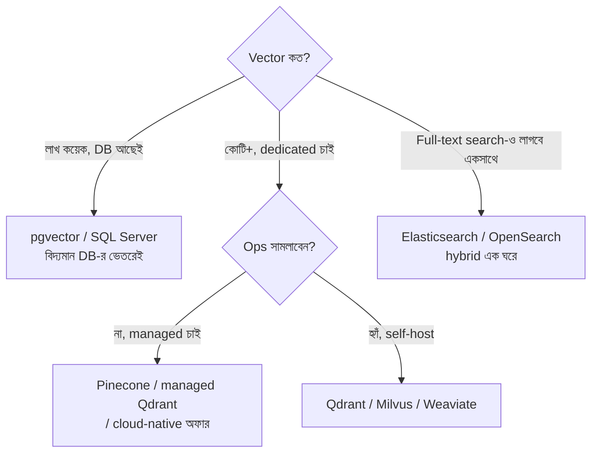

# Day 28 — Semantic Search-এর জন্য Vector Store বাছাই

## 🎯 সমস্যা

RAG/semantic search-এ embedding তো বানালেন — এখন কোটি কোটি high-dimensional vector-এর মধ্যে "সবচেয়ে কাছেরগুলো" খুঁজতে হবে মিলিসেকেন্ডে। Exact nearest-neighbor খোঁজা মানে সবগুলোর সাথে তুলনা — O(n), অসম্ভব। তাই **ANN (Approximate Nearest Neighbor)** index লাগে। আর বাজারে দোকান অগুনতি: pgvector, Pinecone, Qdrant, Weaviate, Milvus, Elasticsearch, Redis... কোনটা কখন?

## 🖼️ সিদ্ধান্তের মানচিত্র

## 💡 বাছাইয়ের আসল মাপকাঠিগুলো

**1. সবচেয়ে আগের প্রশ্ন: আলাদা দোকান লাগবেই কি?** Postgres থাকলে **pgvector** দিয়ে কয়েক লাখ (ভালো টিউনিংয়ে কোটিও) vector আরামসে চলে — HNSW index-সহ। লাভটা বিশাল: **এক DB-তেই সব** — vector-এর পাশে relational filter, join, transaction, backup — নতুন infra, নতুন sync pipeline, নতুন failure mode কিছুই না। অকাল-অপটিমাইজেশনের ক্লাসিক রূপ হলো ১০ হাজার ডকুমেন্টের জন্য dedicated vector DB পোষা।

**2. Metadata filtering — demo আর production-এর ফারাক।** বাস্তব query কখনোই শুধু "কাছের vector" নয় — "**এই tenant-এর**, **এই ভাষার**, **এই তারিখের পরের** কাছের vector"। এখানে দোকানে-দোকানে বিরাট তফাত: filter টা ANN খোঁজার **ভেতরে** চলে (pre-filtering — Qdrant এ জিনিসে বিখ্যাত), নাকি আগে vector খুঁজে **পরে ছাঁকা** হয় (post-filtering — কড়া filter-এ top-k ছেঁকে প্রায় শূন্য ফলাফল!)। আপনার filter selectivity বেশি হলে এই এক প্রশ্নেই বাছাই ঠিক হয়ে যায়। Multi-tenant হলে সাথে জিজ্ঞেস করুন: tenant-isolation কীভাবে — namespace/collection-প্রতি, নাকি filter-এ?

**3. Hybrid search — vector একা যথেষ্ট না।** Embedding ধরতে পারে ভাব, কিন্তু হারিয়ে ফেলে **হুবহু জিনিস**: product code "FZS-V2", error code, নাম, সংখ্যা। Production search-এ প্রায় সবসময় লাগে **vector + keyword (BM25) একসাথে**, ফলাফল জোড়া লাগে RRF-জাতীয় fusion-এ। কোন দোকানে এটা built-in (Elasticsearch/OpenSearch-এর ঘরের জিনিস, Qdrant/Weaviate-ও পারে) আর কোথায় নিজে দুই জায়গায় খুঁজে merge করতে হবে — আগেই দেখুন।

**4. Index-এর অর্থনীতি: HNSW = RAM-এর ব্যবসা।** প্রধান ANN index **HNSW** — দ্রুত আর নিখুঁত-ঘেঁষা, কিন্তু পুরোটা মূলত memory-তে থাকে; কোটি-কোটি vector মানে শত-শত GB RAM-এর বিল। কমানোর পথ: **quantization** (vector-কে সংকুচিত করা — int8/binary, সামান্য recall-এর বিনিময়ে ৪–৩২ গুণ ছোট), বা disk-ভিত্তিক index (IVF-ঘরানা, DiskANN)। আর মনে রাখুন সবটাই **approximate** — recall@k মাপুন নিজের data-য়; ৯৫% recall মানে ২০টার ১টা সেরা ফলাফল এমনিই হারাচ্ছেন।

**5. Freshness আর delete** — Day 27-এর দাবিগুলো দোকানকেও পূরণ করতে হবে: লেখার কত পরে searchable (কিছু engine-এ index-refresh lag), delete/update সস্তা কি না (কিছু index-এ delete মানে দাগ রেখে যাওয়া, মাঝে মাঝে rebuild)। ঘন-ঘন-বদলানো corpus-এ এটা চুপচাপ মুখ্য মাপকাঠি হয়ে ওঠে।

## ⚖️ সারসংক্ষেপ-ছক

| পরিস্থিতি | ঝোঁক |
|-----------|------|
| Postgres আছে, লাখ-খানেক vector | pgvector — শুরু এখানেই |
| Ops টিম নেই, দ্রুত scale | Managed (Pinecone-জাতীয়) |
| কড়া metadata filter, multi-tenant | Pre-filtering-এ শক্তিশালী engine (Qdrant-ঘরানা) |
| Keyword+vector hybrid ভারী চাহিদা | Elasticsearch/OpenSearch |
| বিশাল scale, নিজস্ব প্লাটফর্ম টিম | Milvus-জাতীয় self-host |

## ⚠️ Common Mistakes

- Benchmark-এর QPS দেখে বাছাই — ও-সংখ্যা filter-ছাড়া, আপনার data-ছাড়া; **নিজের ডকুমেন্ট + নিজের filter-এ recall@k আর latency** মাপাই একমাত্র সত্য।
- Embedding model বদলের কথা না ভাবা — নতুন model মানে **সব** vector আবার বানানো (পুরনো-নতুন embedding তুলনীয় নয়); re-embed pipeline-টা প্রথম দিনেই নকশায় রাখুন (এ গল্পের বাকিটা Day 54-এ)।
- Vector store-কে source of truth বানানো — আসল ডকুমেন্ট থাকুক নিজের DB/storage-এ; vector store হোক derived, পুনর্নির্মাণযোগ্য।
- Chunking-এর দায় দোকানের ঘাড়ে — retrieval-মান ৮০% নির্ভর করে chunk-কৌশলে; দোকান বদলে chunking-এর রোগ সারে না।

## 🎤 Interview Tip

উত্তর শুরু করুন উল্টো দিক থেকে: **"আগে দেখব pgvector-এই চলে কি না — dedicated vector DB একটা নতুন distributed system পোষার সিদ্ধান্ত।"** তারপর তিনটা production-মাপকাঠি: **filtered search কেমন, hybrid আছে কি, আর RAM/quantization-এর অঙ্ক।** "কোন brand সেরা" নয় — কোন প্রশ্নে brand বাছতে হয়, সেটা জানাই এখানে seniority।
