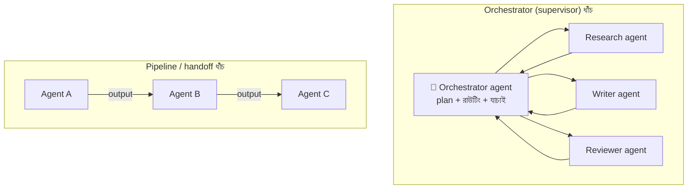

# Day 29 — Multi-Agent Workflow Coordination

## 🎯 সমস্যা

একটা কাজ একাধিক LLM agent-এ ভাগ হয়েছে — একজন research করে, একজন লেখে, একজন review করে, একজন tool চালায়। এখন সেই পুরনো distributed-systems প্রশ্নগুলোই নতুন পোশাকে: কে কাকে কখন ডাকবে? মাঝপথে একজন fail/hallucinate করলে? দু'জন একই কাজ করে ফেললে? আর সবচেয়ে বড়টা — LLM call **non-deterministic আর ধীর আর দামি**; সাধারণ microservice orchestration-এর চেয়ে ভুলের ধরনই আলাদা।

## 🖼️ দুই ধাঁচ

## 💡 মূল ধারণাগুলো

**1. প্রথম প্রশ্ন: আদৌ multi-agent লাগবে তো?** Agent বাড়ানো মানে জটিলতা, latency আর টাকার গুণন — আর প্রতিটা agent-সীমানায় context হারায় (এক agent যা জানে, অন্যে জানে না)। একটা ভালো agent + কয়েকটা tool প্রায়ই ৩টা agent-এর জালকে হারিয়ে দেয়। Multi-agent-এর সত্যিকার কারণ দুটো: **কাজটা সত্যিই ভিন্ন দক্ষতা/context-এ ভাগ হয়** (research আলাদা corpus-এ, writing আলাদা style-এ), বা **parallel চালিয়ে সময় বাঁচে** (৫টা উৎসে একসাথে খোঁজা)।

**2. ধাঁচ বাছাই — চেনা ছক, নতুন নাম (Day 10-এর সাথে মেলান):**
- **Pipeline/handoff** — সরল রেখা: A-র output B-র input। Deterministic ধাপ, সহজ debug। Branching নেই বললেই চলে।
- **Orchestrator-worker (supervisor)** — এক agent পরিকল্পনা করে, কাজ বণ্টন করে, ফলাফল যাচাই-জোড়া দেয়। জটিল/গতিময় কাজের জন্য; দাম — orchestrator-ই bottleneck আর তার prompt-ই system-এর সংবিধান।
- **Peer-to-peer/blackboard** (সবাই shared জায়গায় লেখে-পড়ে, কেউ প্রধান নয়) — গবেষণায় মোহনীয়, production-এ debug-দুঃস্বপ্ন; এড়িয়ে চলাই বুদ্ধিমানের।

মোদ্দা নিয়ম Day 10-এরই প্রতিধ্বনি: **flow যত জটিল, তত orchestration-এর দিকে** — কারণ "এখন কী অবস্থায় আছি" এক জায়গায় দেখা যায়।

**3. State-কে LLM-এর স্মৃতিতে রাখবেন না — বাইরে রাখুন।** Agent-দের মধ্যে যা চলাচল করে (plan, মাঝের ফলাফল, সিদ্ধান্ত) তা থাকুক **durable store-এ** (DB/workflow engine-এর state) — কারণ: (ক) crash-এর পরে মাঝখান থেকে resume, শুরু থেকে নয় (LLM re-run মানে টাকা আর *ভিন্ন* উত্তর!); (খ) audit — কে কেন কী সিদ্ধান্ত নিল দেখা যায়; (গ) দুই agent-এর একই কাজ ধরা পড়ে। Temporal/Durable Functions-জাতীয় **durable execution engine** এখানে স্বাভাবিক জুটি — LLM call গুলো retry-যোগ্য activity, workflow state তাদের ঘাড়ে।

**4. সীমানায় চুক্তি (contract) কড়া করুন।** Agent-এ agent-এ মুক্তগদ্য চালাচালি মানে নীরব ভাঙন — মাঝের একজন format একটু বদলালেই পরেরজন বিভ্রান্ত। প্রতিটা handoff-এ **structured output** (schema-validated JSON — বিস্তারিত Day 46-এ) + যাচাই; ভাঙলে সেখানেই retry, পরের ধাপে বিষ ছড়ানোর আগে।

**5. ব্যর্থতার নীতি আগে লিখুন।** LLM-এর fail তিন রকম: error (retry-যোগ্য), জঞ্জাল output (validate → re-prompt, সীমিত বার), আর **আত্মবিশ্বাসী ভুল** (সবচেয়ে বিপজ্জনক — ধরতে লাগে reviewer-agent/নিয়মভিত্তিক চেক/মানুষ)। প্রতি ধাপে বাজেট দিন: সর্বোচ্চ retry, সর্বোচ্চ token, সর্বোচ্চ সময় — নাহলে দুই agent একে-অপরকে "আরেকবার দেখো" বলতে বলতে অনন্ত লুপে টাকা পোড়াবে। Loop-guard (ধাপ-গণনা/ব্যয়-সীমা) orchestration-এর অংশ, ঐচ্ছিক নয়।

**6. Observability প্রথম দিন থেকে** — প্রতিটা agent-call-এর trace (input, output, token, সময়, খরচ) জোড়া লাগুক এক workflow-ID-তে; নাহলে "উত্তরটা খারাপ কেন" প্রশ্নের সামনে আপনি অন্ধ। (গভীরে Day 58-এ।)

## ⚖️ কখন কোন ধাঁচ

| পরিস্থিতি | ধাঁচ |
|-----------|------|
| ধাপগুলো স্থির, রৈখিক | Pipeline |
| Plan গতিময়, ধাপ কাজভেদে বদলায় | Orchestrator-worker |
| স্বাধীন sub-task, সময় বাঁচাতে | Parallel fan-out + যাচাই-জোড়া (Day 55) |
| "Agent-রা নিজেরা আলাপ করে ঠিক করুক" | 🚩 আগে সন্দেহ করুন — প্রায়ই design-এর অনুপস্থিতি |

## ⚠️ Common Mistakes

- Agent-সংখ্যা দিয়ে বুদ্ধিমত্তা মাপা — প্রতিটা বাড়তি agent-সীমানা মানে context-ক্ষয় + খরচ + এক নতুন failure mode।
- Workflow state prompt-এর ভেতরে বয়ে বেড়ানো — লম্বা কাজে context উপচে পড়ে, resume অসম্ভব; state বাইরে, prompt-এ শুধু দরকারি টুকরো।
- Idempotency ভুলে যাওয়া — orchestrator retry করলে worker-এর side-effect (email গেল, টাকা কাটল!) দুইবার; tool-call গুলোতে Day 04-এর সেই key।
- Demo-তে ৩ agent-এর নাচ দেখে production-এ নামানো — production-এর প্রশ্ন ভিন্ন: p99 latency, খরচ/request, আর ভুলের blast radius।

## 🎤 Interview Tip

শুরুতেই ভিত কাঁপিয়ে দিন: **"Multi-agent আসলে distributed systems — orchestration, state, idempotency, backpressure সব পুরনো প্রশ্ন; নতুন শুধু এটা যে worker গুলো non-deterministic আর প্রতি call-এ টাকা পোড়ে।"** তারপর নিজের নকশা: orchestrator + durable state + structured handoff + বাজেট-সীমা। "কম agent-ই ভালো design" — এই সংযমটুকু দেখানোই আজকের বাজারে সবচেয়ে বিরল গুণ।
