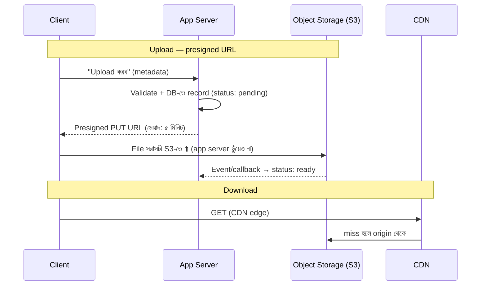

# Day 30 — File Storage Backend বাছাই

## 🎯 সমস্যা

User-রা file upload করবে — profile ছবি, PDF invoice, ভিডিও। রাখবেন কোথায়? DB-র BLOB column-এ? Server-এর disk-এ? S3-জাতীয় object storage-এ? ভুল বাছাইয়ের দাম নীরবে বাড়ে: DB backup ফুলে টেরাবাইট, server বদলালে file উধাও, কিংবা download traffic-এ app server-এর দম বন্ধ। আর file storage মানেই সঙ্গের প্রশ্নগুলো — upload path, permission, CDN, delete।

## 🖼️ Upload/Download-এর সঠিক পথ

## 💡 তিন প্রার্থী ও রায়

**1. Database BLOB** — লোভটা বোধগম্য: এক জায়গায় সব, transaction-এ file+metadata একসাথে, আলাদা কিছু পোষা নেই। কিন্তু দাম চড়া: DB-র storage সবচেয়ে দামি storage; backup/restore/replication-এ প্রতিটা ছবি বয়ে বেড়ানো; বড় read-এ buffer pool দখল — আসল query-রা ভোগে। **সীমিত জায়গা আছে এর:** ছোট (কিছু KB), transaction-জড়িত, কম-সংখ্যক জিনিস — যেমন signature-thumbnail। এর বাইরে না।

**2. Local/server disk** — সরলতম, আর trap-ও সরলতম: server ২টা হলেই "কোন server-এ file টা?" — sticky session-এর জোড়াতালি, তারপর NFS-এর যন্ত্রণা। Autoscaling/container জগতে instance ক্ষণস্থায়ী — disk-ও তাই। একমাত্র বৈধ ব্যবহার: **temporary scratch** (processing-এর মাঝপথ), যা হারালে ক্ষতি নেই।

**3. Object storage (S3/Azure Blob/GCS/MinIO) — default উত্তর।** কার্যত অসীম, সস্তা, ১১-নাইন durability, HTTP-native। **DB-তে থাকবে metadata + key/path; object store-এ থাকবে bytes** — এই ভাগটাই মূল নকশা। সাথে যা যা ঠিক করতে হয়:

- **Presigned URL — upload/download দুটোতেই app server-কে পাইপ বানাবেন না।** App শুধু অনুমতি যাচাই করে সীমিত-মেয়াদের signed URL দেয়; ভারী bytes client↔S3 সরাসরি। App server-এর bandwidth/memory বাঁচে, বড় file-এও timeout নেই। Upload-এ content-type/size-এর শর্ত signed URL-এই বেঁধে দিন।
- **দুই-ধাপ commit-এর ফাঁক:** presigned URL দিলেন, client upload করলই না — DB-তে এতিম "pending" record; বা উল্টো, upload হলো কিন্তু আপনার confirm-call পৌঁছাল না — S3-তে এতিম object। প্রতিকার: S3-র event notification দিয়ে status ঠিক করা + নিয়মিত reconciliation sweep (pending-বাসি record আর record-ছাড়া object দুটোই ঝাড়ু)।
- **Key নকশা:** ব্যবহারকারী-দেওয়া filename কখনো key নয় (সংঘর্ষ, path-traversal, PII) — UUID/hash-ভিত্তিক key, আসল নাম metadata-য়। Multi-tenant হলে prefix-এ tenant: `tenant_42/uuid` — per-tenant policy/মোছা সহজ।
- **Download-এ CDN** — public/আধা-public file-এ object storage-এর সামনে CDN (খরচ আর latency দুটোই নামে); private file-এ সীমিত-মেয়াদ presigned GET, আর মেয়াদটাই আপনার access-revocation।
- **Lifecycle** — পুরনো file স্বয়ংক্রিয় সস্তা tier-এ (IA/Glacier-ঘরানা), soft-delete/versioning ভুল-মোছার বিমা, আর "user মুছল" মানে সত্যি মোছার pipeline (GDPR-জাতীয় দাবি এখানেই এসে পড়ে)।

## ⚖️ সারছক

| জিনিস | কোথায় |
|--------|--------|
| ছবি, ভিডিও, PDF, backup — মোটামুটি সবকিছু | Object storage + DB-তে metadata |
| কয়েক-KB, transaction-বাঁধা artifact | DB BLOB (ব্যতিক্রম হিসেবে) |
| Processing-এর অস্থায়ী মাঝপথ | Local disk/scratch |
| POSIX semantics দাবি করা legacy app | Managed file share (EFS/Azure Files) — শেষ উপায় |

## ⚠️ Common Mistakes

- App server দিয়ে file stream করা "কারণ auth লাগবে" — auth থাকুক URL-signing-এ; bytes-এর রাস্তা আলাদা।
- Metadata আর object-এর মধ্যে truth-এর মালিক ঠিক না করা — নিয়ম করুন: **DB-ই truth**, object store তার অনুগামী; reconciliation সেই নিয়মেই চলবে।
- Multipart upload উপেক্ষা — শ'খানেক MB পেরোলে single PUT ভঙ্গুর; SDK-র multipart + resume ব্যবহার করুন।
- Bucket-নীতি ঢিলে রেখে "পরে দেখব" — public-bucket দুর্ঘটনা এই শিল্পের সবচেয়ে ক্লিশে data-leak; শুরু থেকেই block-public + least-privilege।

## 🎤 Interview Tip

মন্ত্রটা ছোট: **"Bytes object store-এ, truth DB-তে, রাস্তা presigned URL-এ, গতি CDN-এ।"** তারপর এতিম-object/এতিম-record-এর reconciliation-এর কথা তুলুন — upload-এর সুখের পথ সবাই আঁকে; ফাঁকগুলো কে সেলাই করবে, সেটা বলাই পার্থক্য গড়ে।
