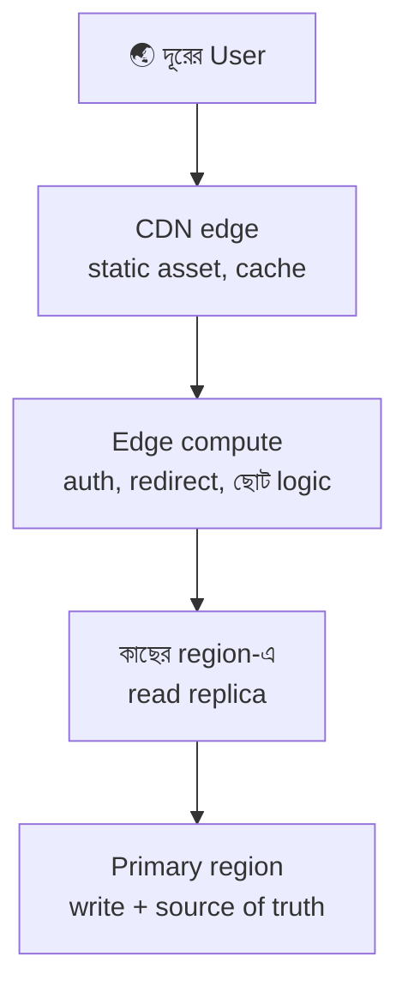

# Day 31 — Cross-Region Latency কমানো

## 🎯 সমস্যা

Server বসানো Virginia-য়, user বসে ঢাকা-সিডনি-সাও পাওলোতে। আলোর গতিরও সীমা আছে: ঢাকা↔Virginia round-trip-ই ~২০০ms+, আর একটা পাতা মানে অনেকগুলো round-trip (TLS handshake, API call, asset)। ফলাফল: দূরের user-দের কাছে app "ভারী" লাগে — কোড যত optimize-ই করুন। প্রশ্নটা তাই: **কোন জিনিসটা user-এর কাছে নেওয়া যায়, আর কোনটা নেওয়ার দাম consistency-তে দিতে হয়?**

## 🖼️ স্তরে স্তরে কাছে আনা

## 💡 সিঁড়িটা সস্তা-থেকে-দামি

**1. আগে round-trip-ই কমান — region ছোঁয়ার আগে।** TLS 1.3 (+0-RTT), connection reuse/HTTP2-3 (Day 36), আর সবচেয়ে বড়: **API নকশা** — এক পাতায় ৬টা sequential call মানে ৬×২০০ms; aggregate endpoint/BFF (Day 01) দিয়ে ১টা করুন। দূরত্ব না কমিয়েও latency অর্ধেক হয় প্রায়ই।

**2. Static ও cache-যোগ্য জিনিস → CDN।** ছবি, JS, ভিডিও তো বটেই — **cache-যোগ্য API response-ও** (public product data, config) edge-এ TTL-সহ। এটা সমাধানের সবচেয়ে সস্তা ৮০%।

**3. ছোট logic → edge compute।** Auth-token যাচাই, redirect, A/B bucket, personalization-এর হালকা অংশ — CDN-এর edge function-এ (Cloudflare Workers-ঘরানা)। দাম কম, কিন্তু সীমা মনে রাখুন: edge-এ **state নেই** — DB লাগলেই আবার সেই দূরত্ব।

**4. Read → কাছের region-এ replica।** Cross-region read replica: ঢাকার user পড়ে সিঙ্গাপুর replica থেকে। দাম চেনা — **replication lag + read-your-writes** (Day 19-এর পুরো অস্ত্রাগার এখানেই লাগবে, lag-টা এবার শুধু বড়: দশ-শ' ms)। Read-heavy app-এ এইটুকুতেই বেশিরভাগ গল্প শেষ।

**5. Write-ও কাছে চাই? — এবার দাম চড়া।** দুটো পথ:
- **Region-pinning / geo-partitioning** — user-এর data তার **home region**-এ থাকে (EU user-এর সব EU-তে); নিজের data-য় সব দ্রুত, অন্য region-এর data ছুঁলে ধীর। Data-residency আইনের (GDPR-ঘরানা) সাথেও মেলে। বেশিরভাগ বাস্তব ক্ষেত্রে এটাই সঠিক উত্তর, কারণ মানুষ মূলত নিজের data-ই ছোঁয়।
- **Multi-master/active-active** — সব region-এ write; এবার দুই region-এ **একই জিনিসে concurrent write-এর conflict** অনিবার্য — resolve করবে কে? (LWW-র নীরব data-হারানো, নাকি CRDT — Day 37, নাকি per-key single-writer?) সাথে global unique constraint কার্যত অসম্ভব। এ পথে যাওয়ার আগে দু'বার নয়, দশবার ভাবুন; managed গ্লোবাল DB-গুলোও (Spanner/Cosmos-ঘরানা) trade-off-টা লুকোয় না — either latency, either consistency।

**6. আর জিজ্ঞেস করুন: আসলেই কি সবটা লাগবে?** প্রায়ই "global low-latency" দাবির পেছনে থাকে কয়েকটা মাত্র hot path (login, feed-এর প্রথম পাতা)। শুধু সেগুলো edge/replica-তে তুলুন — পুরো system globally-distributed করা এক মহাযজ্ঞ, যার দায় চিরকালের।

## ⚖️ কোন data কোথায়

| Data | জায়গা |
|------|-------|
| Static asset | CDN — বিনা দ্বিধায় |
| Public/আধা-stale read | CDN/edge cache (TTL) |
| User-নিজস্ব data | Home-region pinning |
| Global-consistent counter/uniqueness | এক region-এ রাখুন, মেনে নিন latency |
| Session/হালকা state | Edge KV/replicated cache |

## ⚠️ Common Mistakes

- "Multi-region = দুই region-এ deploy করে দিলাম" — DB এক region-এ রেখে app দুই region-এ ছড়ালে দূরের app-region-টা প্রতি query-তে সাগর পাড়ি দেয় — আগের চেয়েও ধীর হতে পারে!
- Failover আর latency গুলিয়ে ফেলা — DR-এর জন্য passive region আর latency-র জন্য active edge/replica — দুটো ভিন্ন সমস্যা, ভিন্ন নকশা।
- Lag-কে গোপন রাখা — cross-region replica-র lag dashboard-এ প্রথম সারিতে থাকুক; নাহলে "মাঝে মাঝে পুরনো data" bug-এর ভূত তাড়াতে জীবন যাবে।

## 🎤 Interview Tip

সিঁড়িটাই উত্তর: **"আগে round-trip কমাই, তারপর static→CDN, logic→edge, read→replica, আর write-এ গেলে geo-partitioning আগে, multi-master একদম শেষে — কারণ প্রতিটা ধাপে consistency-র দাম বাড়ে।"** সাথে ছুড়ে দিন: "আলোর গতি optimize হয় না — তাই হয় data সরাও, নয় round-trip কমাও; তৃতীয় রাস্তা নেই।"
