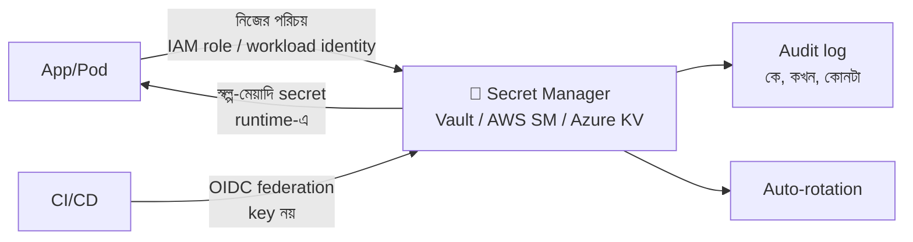

# Day 32 — Secrets ও Credentials ম্যানেজমেন্ট

## 🎯 সমস্যা

DB password, API key, signing key — এগুলো রাখবেন কোথায়? ইতিহাসের সবচেয়ে ক্লিশে দুর্ঘটনা: **git-এ password commit** — আর git ভোলে না; ৩ বছর আগের commit-এ পড়ে-থাকা key আজও চাবি। এর পরের স্তরের রোগগুলোও চেনা: env-var-এ রেখে নিশ্চিন্ত (crash dump/log-এ ফাঁস), সবাই এক shared admin credential (কে কী করল জানার উপায় নেই), আর "rotate করব করব" করে ৪ বছর একই key।

## 🖼️ পরিণত ব্যবস্থা

## 💡 নীতিগুলো, ধাপে ধাপে

**1. Secret কোড/repo/image থেকে সম্পূর্ণ আলাদা।** Config আর secret এক জিনিস না — config repo-তে থাকতে পারে, secret কখনোই না (এমনকি private repo-তেও — repo চুরি/ভুল-fork/laptop হারানো, পথ অনেক)। Docker image-এও না — image registry-তে বসে থাকা layer-এ password মানে আরেকটা git-ইতিহাস। ঢুকবে **runtime-এ**, বাইরে থেকে।

**2. Env-var — চলনসই সর্বনিম্ন, লক্ষ্য নয়।** `.env` local-এ, deployment-এ platform-injected env — ছোট দলে শুরু এভাবেই হয়, ঠিক আছে। কিন্তু সীমা জানুন: env সব child-process পায়, crash-report/debug-endpoint-এ ফাঁস হয়, rotate মানে redeploy, আর কে পড়ল তার হিসাব নেই। বড় হলে →

**3. Secret manager — একক সিন্দুক।** Vault / AWS Secrets Manager / Azure Key Vault-ঘরানা: encrypted-at-rest, **access-এর audit log**, ভার্সনিং, আর rotation-এর যন্ত্র। App গুলো startup-এ (বা lazy) টেনে নেয়, memory-তে রাখে, disk-এ কখনো লেখে না।

**4. আসল প্রশ্নটা এখানে — সিন্দুকের চাবি কোথায়?** Secret manager-এ ঢুকতেও তো credential লাগে — এই "secret zero" সমস্যার সমাধান: **পরিচয়-ভিত্তিক প্রবেশ, key-ভিত্তিক নয়।** Cloud-এ VM/pod-এর নিজস্ব পরিচয় আছে — IAM role, managed identity, Kubernetes workload identity — platform নিজে প্রমাণ করে "এই process টা সত্যিই OrderService"; কোথাও কোনো লেখা-থাকা password নেই। CI/CD-তেও একই নীতি: GitHub Actions↔cloud **OIDC federation** — pipeline-এ long-lived cloud key রাখার যুগ শেষ।

**5. Static secret-কেই প্রশ্ন করুন — dynamic/স্বল্পায়ু credential।** সবচেয়ে ভালো secret সেটা যেটা ফাঁস হলেও কাজ করে না: Vault-এর dynamic DB credential (প্রতি app-instance-এর জন্য তৈরি-হওয়া, ঘণ্টা-মেয়াদি user), STS-এর অস্থায়ী token। ফাঁসের জানালা সঙ্কুচিত, আর rotate-এর প্রশ্নই বিলুপ্ত — মেয়াদই ফুরিয়ে যায়।

**6. Rotation — দুর্ঘটনার আগেই মহড়া।** যেটা static রইল (third-party API key), তার জন্য: নিয়মিত rotation + **দুই-key overlap** (নতুন চালু, পুরনোটা কিছুদিন বৈধ — zero-downtime বদল, Day 14-এর expand-contract-এরই আত্মীয়)। আর **ফাঁস হলে কী** — সেই runbook আগে লেখা থাকুক: কোথায় revoke, কী কী redeploy, blast radius কত। প্রথমবার এটা ভাবার সময় incident-এর রাত না হোক।

**7. ধরার জাল:** pre-commit/CI-তে secret-scanner (gitleaks-ঘরানা, GitHub-এর push protection) — ভুল commit **ঢোকার আগেই** আটকাক; ঢুকে গেলে নিয়ম একটাই — **rotate first**, history-পরিষ্কার পরে (কপি ততক্ষণে কোথায় কোথায়, জানার উপায় নেই)।

## ⚖️ পরিণতির সিঁড়ি

| স্তর | অবস্থা |
|------|--------|
| 🔴 | Repo/image-এ secret |
| 🟡 | Env-var, হাতে-বসানো, rotation নেই |
| 🟢 | Secret manager + audit + নিয়মিত rotation |
| 🌟 | Workload identity + dynamic স্বল্পায়ু credential — লিখে-রাখা secret প্রায় শূন্য |

## ⚠️ Common Mistakes

- Log-এ secret — connection string exception-message-এ, request-log-এ Authorization header; log-pipeline-এ masking রাখুন, আর "log-ও একটা secret-store" — এই চোখে দেখুন।
- সব service এক মহা-credential-এ — per-service, least-privilege; একটার ফাঁসে যেন সবটা না যায়।
- Kubernetes Secret-কে "encrypted" ভাবা — default-এ base64 মাত্র; etcd-encryption + RBAC + বাহ্যিক secret-store-এর সংযোগ (CSI driver-ঘরানা) লাগে।
- Rotation-কে "ঝুঁকি" ভেবে এড়ানো — rotate করতে ভয় পাওয়া মানেই নকশায় গলদ; ভয়টাই সংকেত যে overlap-ব্যবস্থা নেই।

## 🎤 Interview Tip

স্তরগুলো এক নিঃশ্বাসে: **"Repo থেকে বের করো → সিন্দুকে ঢোকাও → সিন্দুকের চাবি পরিচয়-ভিত্তিক করো → পারলে secret-টাকেই স্বল্পায়ু বানাও।"** শেষে মোক্ষম কথাটা: **"শ্রেষ্ঠ secret management হলো secret-এর সংখ্যাই কমানো — যে credential নেই, সেটা ফাঁসও হয় না।"**
