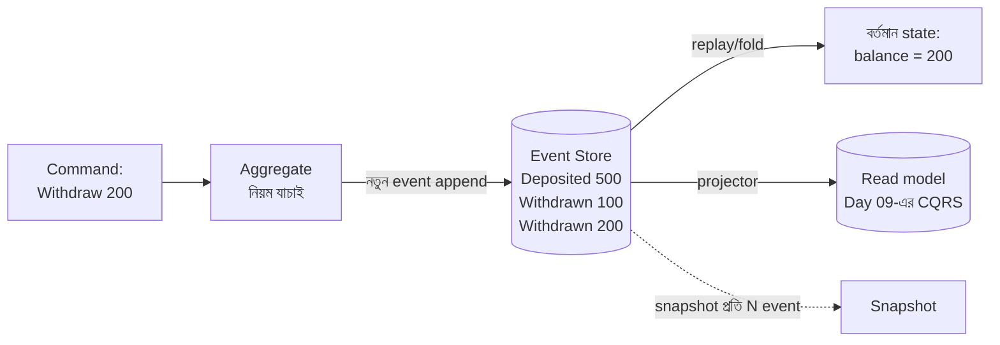

# Day 33 — Event Sourcing দিয়ে State Reconstruction

## 🎯 সমস্যা

সাধারণ CRUD-এ টেবিলে থাকে **শেষ অবস্থা** — balance এখন ৫০০ টাকা। কিন্তু "৫০০ **কেন**? কোন কোন লেনদেনে?" — UPDATE-এর ইতিহাস মুছে গেছে। Audit-এর দাবি, "গত মঙ্গলবার account-টা কী অবস্থায় ছিল" জানার দরকার, কিংবা bug-এ নষ্ট-হওয়া state ঠিক করা — শেষ-অবস্থা-only মডেলে এসব হয় আন্দাজ, নয় অসম্ভব। Accounting-এর খাতা কিন্তু কখনো এ ভুল করে না: সেখানে entry **মোছা হয় না, শুধু যোগ হয়**।

## 🖼️ মডেলটা

## 💡 মূল ধারণা

**Event sourcing** — truth হলো **ঘটনার log**, state নয়। প্রতিটা পরিবর্তন একটা অপরিবর্তনীয় (immutable) event হিসেবে **append** হয়: `MoneyDeposited`, `MoneyWithdrawn`। বর্তমান state = শুরু থেকে সব event **replay/fold** করার ফল। UPDATE/DELETE বলে কিছু নেই — ভুল শোধরাতেও নতুন event (`DepositCorrected`), ঠিক যেমন হিসাবরক্ষক ভুল entry কেটে **নতুন সংশোধনী entry** লেখে।

**যা যা ফ্রি-তে পাওয়া যায়:**
- **নিখুঁত audit trail** — কে, কখন, কী করল — এটা bolt-on নয়, এটাই storage।
- **Time travel** — "মঙ্গলবারের state" = মঙ্গলবার পর্যন্ত event replay।
- **Retroactive fix** — projector-এ bug ছিল? ঠিক করে **পুরো read model আবার বানান** replay দিয়ে — data হারায়নি, ব্যাখ্যাটাই শুধু ভুল ছিল।
- **নতুন প্রশ্নের উত্তর অতীত থেকে** — ৬ মাস পরে নতুন analytics দরকার? পুরনো event-এ নতুন projector চালান — জন্ম থেকেই data ছিল।

**খরচের খাতাটাও সমান লম্বা:**
- **Replay-এর ভার → snapshot।** লাখ event-ওয়ালা aggregate প্রতিবার শুরু থেকে fold? না — প্রতি N event-এ state-এর **snapshot**, load = শেষ snapshot + পরের event গুলো।
- **Concurrency → optimistic version।** দুই command একই aggregate-এ: append-এর সময় "expected version" মেলাও — না মিললে conflict, আবার পড়ে আবার চেষ্টা (Day 39-এ এ অস্ত্র আবার আসবে)।
- **Event-এর schema-ও বুড়ো হয়** — ৩ বছরের পুরনো `OrderPlaced`-এ নতুন field নেই; লাগবে versioning/upcaster (পুরনো event পড়ার সময় নতুন রূপে অনুবাদ)। Event অমর, তাই এই দায়ও অমর।
- **GDPR-জাতীয় "মুছে ফেলো" বনাম অমোছা log** — সমাধান crypto-shredding-ঘরানা: ব্যক্তির data event-এ encrypted, "মোছা" মানে চাবিটা ফেলা।
- **Query — সরাসরি event-এ নয়।** "নামে খোঁজো" জাতীয় প্রশ্নের জন্য projection/read model লাগবেই — event sourcing কার্যত **CQRS-কে টেনে আনে** (Day 09); দুটো আলাদা সিদ্ধান্ত, কিন্তু সংসার একসাথে।

**কোথায় মানায়, কোথায় নয়:** টাকা/লেনদেন, order-lifecycle, নিয়ন্ত্রক-চাপে-থাকা domain, জটিল state machine — ইতিহাসটাই যেখানে সম্পদ। উল্টোদিকে user-profile/settings-জাতীয় "শেষ মানটাই সব" data-য় এটা শুধুই ভার। আর মাঝামাঝি একটা সৎ বিকল্প ভুলবেন না: সাধারণ CRUD + **audit/history টেবিল** (কিংবা CDC-log) — ৮০% audit-চাহিদা এতেই মেটে, ২০% খরচে।

## ⚖️ সিদ্ধান্ত-ছক

| দরকার | পথ |
|--------|-----|
| আইনগত-মানের audit, time-travel, retroactive rebuild | Event sourcing |
| শুধু "কে কী বদলাল" — মোটামুটি | CRUD + audit টেবিল/CDC |
| শেষ মানটাই একমাত্র সত্য | সাধারণ CRUD |
| Event sourcing নিলে | সাথে CQRS + snapshot + upcaster — পুরো প্যাকেজ ধরেই বাজেট করুন |

## ⚠️ Common Mistakes

- পুরো system জুড়ে event sourcing — এটা aggregate/module-স্তরের সিদ্ধান্ত (Day 09-এর সেই একই কথা); ledger event-sourced, profile-টেবিল CRUD — সহাবস্থানই স্বাভাবিক।
- Event-কে "UI-র জন্য message" ভাবা — event হলো **ডোমেইনের ঘটনা** (অতীত কাল, ব্যবসার ভাষায়: `OrderPlaced`), UI-র dto নয়; ভুল granularity-তে event কাটলে ৩ বছর পরে replay-ই অর্থহীন।
- Snapshot-কে truth বানিয়ে ফেলা — snapshot নিছক cache; সন্দেহ হলে ফেলে দিয়ে replay — এই মানসিকতা না থাকলে মডেলের মূল সুবিধাই গেল।
- "Log আছেই তো Kafka-তে" — broker-এর retention-ওয়ালা topic event **store** নয়; store মানে aggregate-ধরে পড়া, version-চেক, চিরস্থায়ীত্ব।

## 🎤 Interview Tip

এক লাইনে সংজ্ঞা দিন হিসাবের খাতা দিয়ে: **"State store করি না, লেনদেন store করি — state হলো লেনদেনের যোগফল; ব্যাংকের খাতা হাজার বছর ধরে event-sourced।"** তারপর সততা দেখান: **"দাম হলো snapshot, event-versioning, আর CQRS-এর পুরো সংসার — তাই এটা নিই কেবল সেই aggregate-এ, যার ইতিহাস নিজেই টাকা দামের।"**
