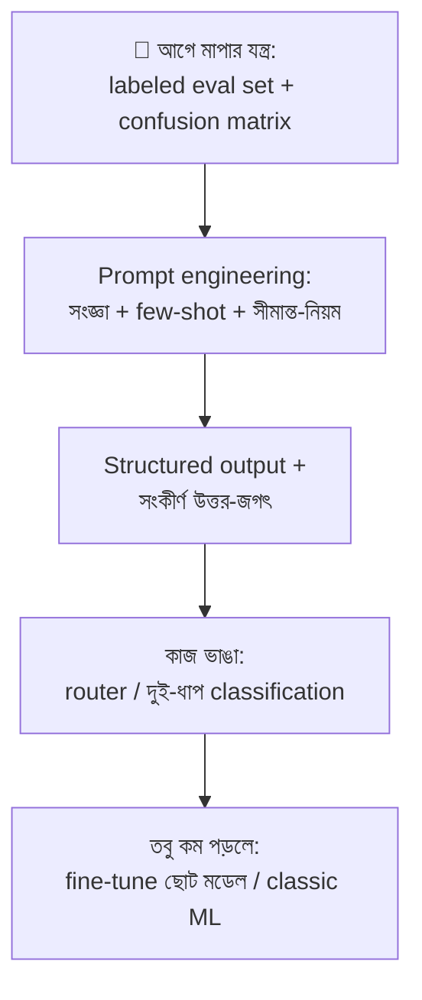

# Day 34 — LLM Classification Accuracy বাড়ানো

## 🎯 সমস্যা

Support ticket-কে category-তে ভাগ, রিভিউর sentiment, content moderation — LLM-কে classifier বানিয়েছেন, accuracy আটকে ৮২%-এ। এখন কী? "Prompt-এ আরও জোর দিয়ে লিখি PLEASE BE ACCURATE"? এই সমস্যার আসল উত্তর engineering-শৃঙ্খলায় — আর প্রথম ধাপটা মডেল ছোঁয়ার আগেই।

## 🖼️ উন্নতির সিঁড়ি

## 💡 ধাপে ধাপে

**1. মাপার যন্ত্র আগে — নাহলে সবটাই অনুভূতি।** কয়েকশ' **হাতে-label-করা** উদাহরণের eval set (বাস্তব বিতরণে — সহজ ৯০% + কঠিন ধার-ঘেঁষা ১০% নয়, বরং উল্টোটা বেশি দামি)। প্রতিটা বদলের পরে একই set-এ চালান, **confusion matrix** দেখুন: ভুলগুলো কি ছড়ানো, নাকি নির্দিষ্ট দুটো class-এ গুঁতোগুঁতি? এই এক ছবিই বলে দেবে পরের কাজ কোথায়। আর মাপকাঠি ব্যবসার ভাষায়: moderation-এ false negative-এর দাম false positive-এর বহুগুণ — accuracy নয়, class-প্রতি precision/recall দেখুন।

**2. Prompt-এ যা সত্যিই কাজ করে:**
- **Class-এর সংজ্ঞা লিখুন, নাম নয়** — "Billing" আর "Account" — মানুষও গুলিয়ে ফেলে; প্রতিটার এক-দু'লাইনের সংজ্ঞা + **কখন এটা নয়** (negative-সংজ্ঞা সীমান্তের ভুল কাটে সবচেয়ে বেশি)।
- **Few-shot — ধার-ঘেঁষা উদাহরণ দিয়ে** — সহজ উদাহরণ মডেল এমনিই পারে; confusion matrix-এ যে জোড়া গুঁতোগুঁতি করছে, **সেই জোড়ার** ২–৩টা কঠিন উদাহরণ সঠিক label-সহ দিন। Eval set-এর ভুলগুলোই few-shot-এর খনি (তবে eval-এর উদাহরণ prompt-এ ঢোকালে সে উদাহরণ eval থেকে বাদ — নিজের প্রশ্নপত্র ফাঁস করবেন না)।
- **"Unclear/Other" রাখুন** — জোর করে কোনো-একটা-class-এ ঠেলা মানে সীমান্তের সব ক্ষেত্রে এলোমেলো ভুল; "অনিশ্চিত" নিজেই একটা দামি উত্তর — সেগুলো মানুষের কাছে যাক।
- **আগে যুক্তি, পরে রায়** — এক লাইনের সংক্ষিপ্ত reasoning চেয়ে তারপর label — কঠিন ক্ষেত্রে লক্ষণীয় উন্নতি; সাথে খরচ/latency-ও বাড়ে, eval-এ মেপে সিদ্ধান্ত।

**3. উত্তরের জগৎটাই বেঁধে দিন।** মুক্ত-গদ্যের বদলে **structured output** (enum-বাঁধা JSON — Day 46): "Billing_Issue"-এর জায়গায় "billing issue", "Billing", "BILLING_ISSUES" — এই নীরব বিশৃঙ্খলাই অনেক "inaccuracy"-র আসল চেহারা। Schema-তে enum দিলে বানান-বিভ্রাট শূন্য।

**4. কাজটা ভাঙুন — ২০টা class এক লাফে নয়।** Class অনেক হলে দুই-ধাপ: আগে মোটা দাগে (৪–৫টা পরিবার), তারপর পরিবারের ভেতরে সূক্ষ্ম ভাগ — প্রতিটা ধাপে মডেলের সামনে ছোট, স্পষ্ট মেনু। একই যুক্তিতে: এক প্রম্পটে "category + sentiment + urgency" তিন কাজ চাপাবেন না — আলাদা call বা অন্তত আলাদা field, নাহলে এক কাজের ভুল অন্যটায় চুঁইয়ে পড়ে।

**5. Confidence আর মানুষ-ফাঁক।** LLM-এর মুখের "আমি 95% নিশ্চিত" মেনে নেবেন না — calibration সন্দেহজনক। কার্যকর বিকল্প: "unclear" route, দুই-মডেল/দুই-প্রম্পট ভোটাভুটি (অমিল = মানুষের কাছে), বা eval-এ দেখা দুর্বল class-এর সবটাই review-lane-এ। **Human-in-the-loop escape hatch নকশারই অংশ** — আর সেই মানুষের রায়গুলো জমিয়েই পরের few-shot/fine-tune-এর সোনা।

**6. তবু কম পড়লে — সিঁড়ির শেষ ধাপ।** হাজার-খানেক labeled উদাহরণ জমলে **ছোট মডেল fine-tune** (সস্তা, দ্রুত, স্থির আচরণ — Day 27-এর সেই কথাই: fine-tune শেখায় আচরণ, আর classification তো বিশুদ্ধ আচরণই)। আর যদি input সরল, লক্ষ লক্ষ call, আর label-data প্রচুর — সৎ প্রশ্নটা করুন: **classic ML classifier** (embedding + logistic regression-ঘরানা) হয়তো ১০০ গুণ সস্তায় সমান নম্বর তোলে; LLM থাকুক কঠিন/দুর্লভ-data অংশে।

## ⚖️ কোন রোগে কোন ওষুধ

| Confusion matrix যা বলছে | ওষুধ |
|--------------------------|------|
| দুটো নির্দিষ্ট class-এ গুঁতোগুঁতি | সংজ্ঞা ধারালো + সেই জোড়ার few-shot |
| ভুল ছড়ানো, output-ও এলোমেলো | Structured output + enum, কাজ ভাঙা |
| সীমান্ত-কেসে এলোমেলো | "Unclear" class + human lane |
| সব ঠিক, কিন্তু খরচ/latency চড়া | ছোট মডেল fine-tune / classic ML |

## ⚠️ Common Mistakes

- Eval ছাড়া prompt নাড়াচাড়া — আজ ৩টা ঠিক হলো, কাল ৫টা ভাঙল — টেরও পেলেন না; regression-suite ছাড়া prompt বদল মানে চোখ বেঁধে refactor।
- Temperature ভুলে যাওয়া — classification-এ temperature 0/নিম্ন; বৈচিত্র্য এখানে গুণ নয়, রোগ।
- Class-imbalance উপেক্ষা — ৯৫% "general" ticket-এ সব "general" বললেই accuracy 95%! Minority class-এর recall আলাদা করে দেখুন।
- Production-এর বিতরণ-বদল (drift) না দেখা — নতুন পণ্য, নতুন শব্দভাণ্ডার — গত মাসের eval-নম্বর চিরসত্য নয়; production-নমুনা নিয়মিত label করে eval তাজা রাখুন।

## 🎤 Interview Tip

শুরুই করুন এভাবে: **"Prompt ছোঁয়ার আগে eval set আর confusion matrix — নাহলে আমরা অনুমানে চিকিৎসা করছি।"** তারপর সিঁড়ি: সংজ্ঞা→few-shot→enum-বাঁধা output→কাজ ভাঙা→human lane→fine-tune। শেষের সততাটুকু সবচেয়ে দামি: **"আর যদি দেখি classic ML-ই যথেষ্ট — LLM-টা তখন ভুল যন্ত্র; ভালো engineer যন্ত্রের প্রেমে পড়ে না।"**
