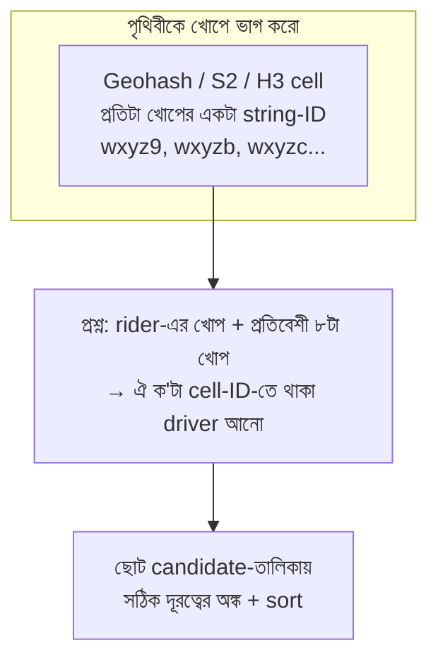

# Day 35 — Geospatial "Nearby Drivers" at Scale

## 🎯 সমস্যা

Rider app খুলল — "৩ কিমির মধ্যে কোন কোন driver?" Naive পথ: সব driver-এর (lat, lng) টেবিলে, প্রতি প্রশ্নে সবার সাথে দূরত্বের অঙ্ক — লাখ driver × হাজারো concurrent প্রশ্ন = মৃত্যু। সাধারণ B-tree index-ও বাঁচায় না: সে এক-মাত্রার যন্ত্র — lat-এ index করলে সরু এক ফালি পাবেন, কিন্তু "দুই মাত্রায় কাছের" প্রশ্নটা তার ভাষারই বাইরে। আর মোচড়টা হলো: driver-রা **নড়ে** — প্রতি ৩–৪ সেকেন্ডে লাখো location-update।

## 🖼️ Grid-ভাবনা

## 💡 মূল ধারণা

**কৌশলের মর্ম: দুই মাত্রাকে এক মাত্রায় নামাও।** পৃথিবীকে খোপে (cell) ভাগ করুন, প্রতিটা খোপের একটা ID — এবার "কাছে খোঁজা" হয়ে গেল "এই ক'টা cell-ID-র সদস্য কারা" — যেটা সাধারণ index/hash চোখ বুজে পারে।

- **Geohash** — lat/lng interleave করে base32 string; সৌন্দর্য: **prefix = এলাকা** (`wxyz9…` সবাই কাছাকাছি), তাই prefix-match-এই এলাকা-খোঁজা। দুর্বলতা: খোপের ধারে দুই পড়শি ভিন্ন hash পেতে পারে — তাই সবসময় **নিজের + ৮ প্রতিবেশী cell** খোঁজা নিয়ম।
- **S2 / H3** — একই দর্শনের পরিণত রূপ; H3-র ষড়ভুজ খোপে প্রতিবেশী-দূরত্ব সুষম (ride-sharing দুনিয়ার প্রিয়), S2-র hierarchical cell-এ এলাকা-cover নিখুঁত। ধারণা এক: **cell-ID-ই index-key**।
- **Precision-এর নব:** খোপ বড় (ছোট precision) = কম cell, বেশি বাজে-candidate; খোপ ছোট = নিখুঁত, কিন্তু বড় radius-এ অনেক cell ঘাঁটা। শহরের ঘনত্বে ৫–৬-অক্ষরের geohash (কিমি-ঘরানার খোপ) দিয়ে শুরু, radius-অনুযায়ী adaptive।

**চলমান-data-র রূপায়ণ — এখানেই আসল প্রকৌশল:**
- **গরম স্তর in-memory:** Redis-এ cell-প্রতি set (`drivers:wxyz9` → member-রা), driver-এর প্রতিটা ping-এ পুরনো cell থেকে remove + নতুনে add + TTL (ping বন্ধ = নিজে-নিজে অদৃশ্য — মরা driver তালিকায় ভাসে না)। Redis-এর নিজস্ব `GEOADD`/`GEOSEARCH`-ও ভেতরে geohash-ই — ছোট-মাঝারি scale-এ সোজা এটাই নিন।
- **Update-ঝড় কমান:** driver না-নড়লে বা একই cell-এ থাকলে index-লেখা কেন? Client-side threshold (৫০ মিটার না সরলে পাঠিও না) + cell-বদল হলেই কেবল index-write — লেখা এক মাত্রা নেমে যায়।
- **Postgres/PostGIS-এর জায়গা:** সত্যিকার জ্যামিতি (polygon-এ ঢুকেছে কি? জটিল zone?) আর **স্থির/কম-নড়া data** (দোকান, রেস্তোরাঁ) — GiST index-এ চমৎকার। কিন্তু সেকেন্ডে-লাখো-update-এর জীবন্ত অবস্থান তাকে দিয়ে ঠেলা অবিচার — জীবন্তটা Redis/memory-তে, স্থায়ী ইতিহাসটা DB-তে।
- **Shard-ও ভূগোলেই:** শহর/region-ধরে ভাগ (Day 05-এর directory-ঘরানা) — ঢাকার প্রশ্ন ঢাকার shard-এ; দুই শহরের driver তো একে-অপরের candidate-ই না। Hot-city সমস্যা রয়ে যায় (Day 16-এর চেনা ভূত) — বড় শহর আরও ভাঙুন cell-cluster-এ।

**শেষ ধাপ ভুলবেন না:** cell-থেকে-আসা candidate-রা **আনুমানিক** — এর ওপর সঠিক haversine-দূরত্ব + ব্যবসার ছাঁকনি (driver ফাঁকা তো? গাড়ির ধরন?) + sort। আর "nearby" এক জিনিস, "ETA-সবচেয়ে-কম" আরেক — নদীর ওপারের driver সরলরেখায় কাছে, রাস্তায় ২০ মিনিট; পরিণত system শেষ-ranking-এ road-ETA আনে।

## ⚖️ কখন কী

| পরিস্থিতি | পথ |
|-----------|-----|
| লাখো চলমান বস্তু, radius-খোঁজা | Cell-index (geohash/H3) + Redis-ঘরানার memory স্তর |
| স্থির জায়গা, জটিল জ্যামিতি | PostGIS + GiST |
| ছোট scale, দ্রুত শুরু | Redis GEO command — ব্যস |
| বিশাল, বহু-শহর | Geo-shard + প্রতি shard-এ ওপরের স্তরগুলো |

## ⚠️ Common Mistakes

- Boundary ভুলে যাওয়া — শুধু নিজের cell খুঁজে "কাছে কেউ নেই!" — অথচ ৫০ মিটার দূরের driver পাশের cell-এ; ৮-প্রতিবেশী নিয়মটা ঐচ্ছিক নয়।
- প্রতিটা GPS-ping DB-তে INSERT — Day 12-এর high-ingest দুঃস্বপ্ন নিজ হাতে বানানো; জীবন্ত-অবস্থান ≠ অবস্থান-ইতিহাস, দুটোর storage আলাদা।
- TTL-হীন উপস্থিতি — app-বন্ধ-করা driver ঘণ্টাখানেক "available" ভেসে থাকা মানে rider-এর ব্যর্থ request-এর স্রোত।
- সরলরেখার দূরত্বেই চূড়ান্ত রায় — candidate-বাছায় ঠিক আছে, চূড়ান্ত assignment-এ ETA/রাস্তা না আনলে বাস্তবে বাজে match।

## 🎤 Interview Tip

সমস্যার নামকরণ দিয়ে শুরু: **"এটা দুই-মাত্রার প্রশ্ন, আর B-tree এক-মাত্রার যন্ত্র — তাই আগে মাত্রা নামাই: পৃথিবীকে cell-এ ভাগ, cell-ID-ই key।"** তারপর স্তর: memory-তে জীবন্ত অবস্থান (TTL-সহ), ৮-প্রতিবেশী খোঁজা, candidate-এ সঠিক অঙ্ক, geo-shard। শেষে এক চিমটি বাস্তবতা — "nearby নয়, আসল প্রশ্ন lowest-ETA" — এটাই ride-sharing বোঝা লোকের স্বাক্ষর।
