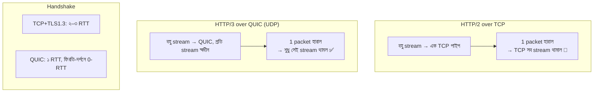

# Day 36 — Edge-এ HTTP/3 vs HTTP/2

## 🎯 সমস্যা

HTTP/2 এসেছিল HTTP/1.1-এর "৬টা connection-এ লাইন" সমস্যা মেটাতে — এক TCP connection-এ বহু stream (multiplexing)। কিন্তু সমস্যাটা এক তলা নিচে নেমে গেল: **TCP নিজেই এক লাইনের রাস্তা**। একটা packet হারালে TCP পরেরগুলোও আটকে রাখে — যদিও সেগুলো *অন্য* stream-এর, যাদের হারানো packet-টার সাথে সম্পর্কই নেই। এটাই **TCP-স্তরের head-of-line (HoL) blocking** — খারাপ নেটওয়ার্কে (mobile! ঠিক আপনার user-রা!) HTTP/2-র multiplexing-এর সুবিধা উল্টে বিষ হয়ে যায়: সব ডিম এক ঝুড়িতে, ঝুড়ি কাঁপলে সব কাঁপে।

## 🖼️ তফাতটা কোথায়

## 💡 মূল ধারণা

**HTTP/3 = HTTP over QUIC**, আর QUIC হলো UDP-র ওপরে user-space-এ নতুন করে বানানো transport — TCP-র দায়িত্বগুলো (নির্ভরযোগ্যতা, congestion control) + TLS 1.3 একদেহে। যা যা বদলাল:

- **Stream-স্তরের স্বাধীনতা** — loss-recovery প্রতি stream-এ আলাদা; এক ছবির packet হারালে CSS আটকায় না। *এটিই* মূল কারণ, বাকি সব বোনাস।
- **Handshake সস্তা** — transport আর TLS-এর করমর্দন একসাথে: নতুন সংযোগে ১ RTT (TCP+TLS-এর ২–৩-এর জায়গায়); চেনা server-এ **0-RTT** — প্রথম request-ই handshake-এর সাথে। ঢাকা→মার্কিন origin-এর ২০০ms RTT-তে প্রতিটা বাঁচানো RTT-ই টাকার অঙ্ক (Day 31-এর সেই হিসাব)।
- **Connection migration** — সংযোগের পরিচয় IP-port নয়, connection-ID; ফোন Wi-Fi→মোবাইল-ডেটায় লাফালে TCP-তে সংযোগ মরে-নতুন-করে-জন্মায়, QUIC-এ **একই সংযোগ চলতেই থাকে**। Mobile-ভারী user-base-এ চুপচাপ বিশাল জয়।

**তাহলে সবখানে HTTP/3? — এখানেই "edge" শব্দটার মানে।** বাস্তব স্থাপত্য প্রায় সবসময়:

> **User ↔ Edge/CDN: HTTP/3** (এখানেই loss, দূরত্ব, নেটওয়ার্ক-লাফ — HTTP/3-র সব গুণের মঞ্চ)
> **Edge ↔ Origin: HTTP/2 (বা 1.1) রাখলেই চলে** — datacenter-পথ স্থির, loss-শূন্যপ্রায়, সংযোগ দীর্ঘজীবী ও reused — HoL-blocking-এর মঞ্চই নেই; এখানে HTTP/3-র লাভ প্রান্তিক।

CDN-গুলো (Cloudflare/CloudFront-ঘরানা) এই split-টা এক সুইচে দেয় — origin-এ হাত না দিয়েই user-দিকটা HTTP/3। **এ কারণেই ব্যবহারিক উত্তরটা প্রায়ই: "edge-এ চালু করে দিন, মাপুন" — খরচ প্রায় শূন্য।**

**সতর্কতার তালিকাটাও জানুন:**
- **UDP-র পথে কাঁটা** — কিছু কর্পোরেট firewall/পুরনো middlebox UDP/443 আটকায়; তাই **TCP-fallback (Alt-Svc negotiation) বাধ্যতামূলক** — browser আগে চেনা পথে ঢুকে তারপর HTTP/3-তে ওঠে; আপনার HTTP/2 path মরতে দেবেন না।
- **CPU-খরচ বেশি** — QUIC user-space-এ, TCP-র kernel-অপ্টিমাইজেশনের দশকগুলো পায়নি; server-side CPU per-byte বেশি — CDN-কে দিয়ে করানোর আরেকটা কারণ।
- **0-RTT-র কাঁটা: replay** — 0-RTT-তে পাঠানো প্রথম request আক্রমণকারী replay করতে পারে; নিয়ম: 0-RTT-তে কেবল **idempotent** request (GET) — POST/টাকা-পয়সা নৈব নৈব চ (Day 04-এর idempotency এখানে transport-স্তরেও তাড়া করে!)।
- **Loadbalancer/observability** — L4 LB-কে UDP + connection-ID বুঝতে হবে; packet-capture-নির্ভর পুরনো debug-অভ্যাসও বদলায় (সব encrypted, এমনকি header-ও)।

## ⚖️ কখন কী

| পরিস্থিতি | ঝোঁক |
|-----------|------|
| Mobile-ভারী, দূর-দেশি user, lossy network | Edge-এ HTTP/3 — সবচেয়ে বড় জয় এখানেই |
| Edge↔origin, datacenter-অভ্যন্তর | HTTP/2-ই থাক; gRPC-জগৎও এখানে h2-তেই সুখী |
| কর্পোরেট/UDP-বৈরী পরিবেশ ভারী | HTTP/3 + মজবুত TCP-fallback, adoption-metric দেখুন |
| Latency-সংবেদী প্রথম-দর্শন (landing page) | HTTP/3-র 1-RTT/0-RTT-র আসল মঞ্চ |

## ⚠️ Common Mistakes

- "HTTP/3 চালু করলাম, সব দ্রুত হবে" — ভালো নেটওয়ার্কের desktop-user-এ তফাত প্রায় অদৃশ্য; জয়টা p95/p99-এ, খারাপ-নেটওয়ার্ক অংশে — median দেখে হতাশ হবেন না, tail দেখুন।
- Fallback-পথ পরীক্ষা না করা — UDP-blocked user-রা নীরবে HTTP/2-তে; সেই পথ ভাঙা থাকলে তারা পুরো ভাঙা।
- HTTP/2-র server push-জাতীয় মৃত জিনিস নিয়ে নকশা — push কার্যত পরিত্যক্ত; আজকের অস্ত্র 103 Early Hints/preload।
- সংখ্যাহীন সিদ্ধান্ত — চালুর আগে-পরে RUM-এ (real user monitoring) TTFB/LCP তুলনা করুন, region-ভাগে — নাহলে এটা fashion, engineering নয়।

## 🎤 Interview Tip

এক বাক্যে মর্ম: **"HTTP/2 লাইনটা সরিয়েছিল application-স্তর থেকে, TCP-তে লুকিয়ে ছিল; HTTP/3/QUIC সেটাই তুলে দিল — per-stream loss-recovery, সস্তা handshake, connection-migration।"** তারপর স্থাপত্য-জ্ঞান দেখান: **"তাই চালু করি edge-এ — user-দিকের নোংরা নেটওয়ার্কেই এর মঞ্চ; edge-origin পথ h2-তেই ভালো।"** আর 0-RTT-replay-এর এক লাইন — transport-প্রশ্নে security-চিন্তা আনা লোক কমই আসে।
