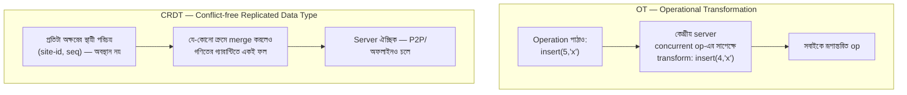

# Day 37 — Collaborative Editing-এ Multi-Writer Conflict (CRDT/OT)

## 🎯 সমস্যা

দু'জন একই ডকুমেন্টে একসাথে লিখছে — অফলাইনেও। A লিখল ৫ নম্বর অক্ষরের পরে "x", B **একই মুহূর্তে** মুছল ৩ নম্বর অক্ষর — এখন A-র "৫ নম্বর অবস্থান"-এর মানেই বদলে গেছে! সরল "last write wins" এখানে মানে **একজনের লেখা নীরবে উধাও**। Lock দিয়ে ঘিরবেন? তাহলে "collaborative"-ই রইল না — আর অফলাইন-সম্পাদনায় lock ধরবেন কার কাছে? দরকার এমন নকশা যেখানে **সবাই স্বাধীনে লিখবে, তবু সবার পর্দা শেষমেশ একই ডকুমেন্টে মিলবে** (convergence)।

## 🖼️ দুই ঘরানা

## 💡 মূল ধারণা

**সমস্যার শিকড়: অবস্থান (index) অস্থির।** Concurrent সম্পাদনায় "৫ নম্বর জায়গা" বলে স্থায়ী কিছু নেই। দুই ঘরানা দুইভাবে এর মোকাবিলা করে:

**1. OT (Operational Transformation)** — operation গুলোকেই **রূপান্তর** করা: B-র delete(3) আগে বসেছে জেনে A-র insert(5)-কে server বানিয়ে দেয় insert(4)। Google Docs-ঘরানার পথ। শক্তি: বহু বছরের পোড়-খাওয়া, text-এ মেমরি-সাশ্রয়ী। দুর্বলতা: transform-ফাংশনগুলোর শুদ্ধতা **কুখ্যাত রকমের কঠিন** (op-জোড়ার প্রতিটা সংমিশ্রণ), আর কার্যত **কেন্দ্রীয় server-এর ক্রম-নির্ধারণ** লাগে — সেই server-ই একক সত্য, একক জট।

**2. CRDT** — data structure-টাই এমনভাবে গড়া যে merge **যেকোনো ক্রমে, যতবারই** করুন, ফল এক (গণিতের ভাষায় merge টা commutative-associative-idempotent)। Text-এর কৌশল: প্রতিটা অক্ষরের **জন্মগত স্থায়ী ID** (কে-কখন-বানাল), "delete" মানে মোছা নয় — **tombstone** (চিহ্ন দিয়ে অদৃশ্য); অবস্থান-নির্ভরতাই বিলুপ্ত। শক্তি: server ঐচ্ছিক — **অফলাইন-first, P2P, edge — সবখানে খাপ খায়**; আজকের বাস্তবায়ন (Yjs/Automerge-ঘরানা) production-পরিণত ও দ্রুত। দুর্বলতা: metadata/tombstone-এর **ওজন** (ডকুমেন্ট ইতিহাস বয়ে বেড়ায় — periodic compaction লাগে), আর...

**3. ...যে সত্যটা দুই ঘরানাই এড়াতে পারে না: convergence ≠ intention।** CRDT/OT কথা দেয় সবাই **একই** ফল দেখবে — ফলটা **মনমতো** হবে, তা নয়। দু'জন একই বাক্য দু'দিকে ঘষামাজা করলে merge-ফল ব্যাকরণে-শুদ্ধ জগাখিচুড়ি হতেই পারে। সূক্ষ্ম-দানার সম্পাদনায় (অক্ষর-স্তর) এটা কম চোখে পড়ে; মোটা-দানায় (পুরো field/প্যারা এক ইউনিট) বেশি। এ কারণেই **granularity-ই আসল নকশা-সিদ্ধান্ত**।

**4. আর জিজ্ঞেস করুন: আপনার আদৌ কতটা লাগবে?** পুরো Google-Docs-অভিজ্ঞতা সবার দরকার নেই:
- **Field-স্তরের ফর্ম** (দু'জন একই record-এর ভিন্ন ঘর) → per-field last-writer-wins + version-দেখানো — যথেষ্ট, বিনা-নাটকে।
- **"Merge নয়, জানাও"** → optimistic locking: version-mismatch হলে দ্বিতীয়জনকে diff দেখিয়ে মানুষকেই মেলাতে দিন (Day 44-এ এই সুতো আবার) — অনেক ব্যবসায়িক app-এ এটাই সৎ উত্তর।
- **শুধু presence/cursor/চ্যাট-ঘরানা** → নিছক pub/sub (Day 21), conflict-তত্ত্বের দরকারই নেই।
- সত্যিকার **সহ-সম্পাদনা text/canvas** → তবেই CRDT (আজকের default ঝোঁক) বা OT — এবং প্রায় নিশ্চিতভাবে নিজে না বানিয়ে পরিণত লাইব্রেরি।

**5. সংযোগের কাঠামো তবু লাগবে:** CRDT server-হীন *চলতে পারে* মানেই চালাবেন তা নয় — বাস্তবে একটা relay/sync-server-ই থাকে (Day 21-এর WebSocket + pub/sub): ডকুমেন্ট-রুম, উপস্থিতি, ইতিহাস-সংরক্ষণ, অনুমতি — এসব তো CRDT-র গণিতের বাইরের সংসার।

## ⚖️ সিদ্ধান্ত-ছক

| পরিস্থিতি | পথ |
|-----------|-----|
| Field-ভিত্তিক ব্যবসায়িক ফর্ম | Per-field LWW / optimistic lock |
| Conflict বিরল, ভুল-merge অগ্রহণযোগ্য | Version-চেক + মানুষের হাতে merge |
| সত্যিকার live text/whiteboard সহ-সম্পাদনা | CRDT-লাইব্রেরি (আজকের default) |
| দশক-পুরনো কেন্দ্রীয় ecosystem, text-only | OT-ও সসম্মানে বাঁচে |
| অফলাইন-first / local-first app | CRDT — এ মঞ্চ তারই |

## ⚠️ Common Mistakes

- নিজে CRDT/OT বানানো — এ ক্ষেত্র শুদ্ধতা-প্রমাণের জগৎ; চাকা নয়, এ জিনিস উড়োজাহাজ — কিনে নিন (লাইব্রেরি)।
- Tombstone/ইতিহাস অসীম বাড়তে দেওয়া — বছর-পুরনো ডকুমেন্ট খুলতে ৩০ সেকেন্ড; snapshot+compaction নকশারই অংশ (Day 33-এর snapshot-শিক্ষার প্রতিধ্বনি)।
- "CRDT আছে, তাই consistency-চিন্তা শেষ" — convergence পেলেন, কিন্তু অনুমতি, ইতিহাস, "কে কী লিখল" (attribution), আর ব্যবসায়িক-বৈধতা (দু'জনের merge-ফল কি বৈধ অবস্থা?) — সব আপনার ঘাড়েই।
- সব data-কে এক ঝুড়িতে — ডকুমেন্ট-দেহ CRDT-তে, কিন্তু "title/share-list"-এর মতো জিনিস সাধারণ DB+version-এ — মিশিয়ে ফেললে দুটোরই ক্ষতি।

## 🎤 Interview Tip

শুরুতেই সমস্যাকে নাম দিন: **"Multi-writer-এ আসল শত্রু index-নির্ভরতা আর নীরব overwrite; সমাধান-পরিবার দুটো — op-রূপান্তর (OT, কেন্দ্রীয় ক্রম) আর merge-নিরাপদ কাঠামো (CRDT, ক্রম-নিরপেক্ষ)।"** তারপর সংযম: **"তবে আগে জিজ্ঞেস করব granularity — field-স্তরের app-এ CRDT আনা মশা মারতে কামান।"** আর শেষ পেরেক: **"Convergence গণিত দেয়, intention দেয় না — সেটুকু product-নকশার কাজ।"**
