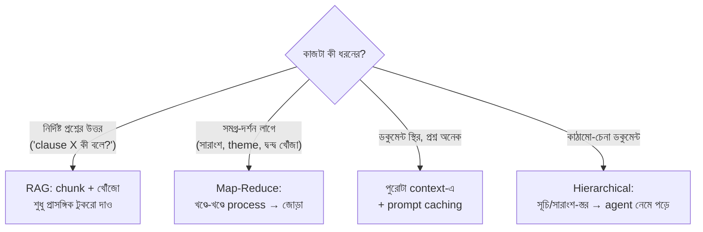

# Day 38 — বড় Document LLM-এ ফিট করানো

## 🎯 সমস্যা

৮০০ পাতার চুক্তিপত্র/নীতিমালা/codebase — আর মডেলের context window-র একটা ছাদ আছে। ধরুন ঢুকেও গেল — তিনটা নতুন রোগ: **খরচ** (প্রতি প্রশ্নে পুরো বইয়ের token-বিল), **latency**, আর **মনোযোগ-ক্ষয়** — বিশাল context-এর মাঝের অংশে মডেলের নজর দুর্বল ("lost in the middle" ঘরানার আচরণ): জিনিস *ঢোকানো* আর মডেলের সেটা *ব্যবহার করা* এক কথা নয়। প্রশ্ন তাই আসলে: **পুরোটা দেওয়া, না দরকারিটুকু বাছা — আর বাছবে কে?**

## 🖼️ কৌশলের মানচিত্র

## 💡 কৌশলগুলো

**1. প্রশ্ন-উত্তর ঘরানার কাজ → RAG (Day 27-এর মূল মঞ্চ)।** পুরো ডকুমেন্ট লাগে না — লাগে সঠিক ৩–৫টা অনুচ্ছেদ। Chunk করুন, embed করুন, প্রশ্নের কাছেরগুলো তুলে দিন। এখানে আসল কারিগরি **chunking-এ**:
- **কাঠামো মেনে কাটুন, দৈর্ঘ্য মেনে নয়** — ধারা/অনুচ্ছেদ/heading-সীমায়; মাঝ-বাক্যে কাটা chunk মানে অর্থহীন টুকরো।
- **প্রতিবেশ-প্রসঙ্গ জুড়ে দিন** — chunk-এর গায়ে তার ঠিকানা (কোন অধ্যায়ের, কোন ধারার) — "উপরোক্ত শর্তাবলী" জাতীয় বাক্য ঠিকানা-ছাড়া অন্ধ; retrieval-এ পাওয়া chunk-এর **আশপাশও** টেনে দেওয়া (parent/window expansion) সস্তায় বড় উন্নতি।
- **টেবিল/সংখ্যার আলাদা যত্ন** — টেবিল ভেঙে গেলে সর্বনাশ; টেবিলকে অখণ্ড ইউনিট রাখুন।

**2. সমগ্র-দর্শনের কাজ → Map-Reduce।** "পুরো চুক্তির ঝুঁকি-সারাংশ" — retrieval দিয়ে হয় না, কারণ *সবটাই* প্রাসঙ্গিক। ভাঙুন: প্রতি খণ্ডে একই প্রশ্ন (map: "এ অংশের ঝুঁকি?"), তারপর ফলগুলো জুড়ে চূড়ান্ত সংশ্লেষ (reduce)। খেয়াল রাখুন: **খণ্ড-সীমার তথ্য-ক্ষয়** (দুই খণ্ডে ভাগ-হওয়া যুক্তি) — overlap দিন; আর reduce-ধাপও উপচালে **স্তরে-স্তরে** (খণ্ড→অধ্যায়-সারাংশ→বই-সারাংশ)। দুর্বলতা মেনেই নিন: map-reduce সারাংশ বিশদ হারায় — সূক্ষ্ম প্রশ্নের জন্য এর পাশে RAG-পথও রাখুন।

**3. ডকুমেন্ট স্থির + প্রশ্ন বারবার → পুরোটাই দিন, cache-সহ।** আজকের বড়-context মডেল + **prompt caching**-এ "পুরো ডকুমেন্ট প্রতিবার" আর আগের মতো দামি নয় — ডকুমেন্ট-অংশ cache-এ, বদলায় শুধু প্রশ্ন। Retrieval-ভুলের ঝুঁকিই শূন্য। শর্ত: ডকুমেন্ট window-তে ধরে, আর প্রশ্ন-প্রবাহ ঘন (cache-এর দাম উশুল হয়)। এটাই Day 27-এর "ছোট স্থির corpus" নীতির ডকুমেন্ট-রূপ।

**4. কাঠামো-চেনা বড় জিনিস → hierarchical/agentic পথ।** আগে এক দফায় বানান **সূচি-স্তর** (প্রতি অংশের এক-অনুচ্ছেদ সারাংশ + ঠিকানা); প্রশ্ন এলে মডেল/agent সূচি দেখে **নিজে ঠিক করে কোন অংশে নামবে**, সেটুকুই টেনে পড়ে (tool-call: `read_section(id)` — Day 48-এর চেনা ছক)। মানুষ যেভাবে বই ঘাঁটে, ঠিক সেভাবে। Codebase/আইনি-দলিল/technical-স্পেকে এ পথ প্রায়ই RAG-এর চেয়ে ধারালো — কারণ বাছাইটা semantic-দূরত্বে নয়, **যুক্তিতে**।

**5. যেটা করবেন না: অন্ধ truncation।** "প্রথম N token নিয়ে বাকিটা ছাঁটো" — নীরবতম ব্যর্থতা: মডেল জানেই না কী হারাল, আত্মবিশ্বাসে অসম্পূর্ণ উত্তর দেবে। ছাঁটতেই হলে জানিয়ে ছাঁটুন (prompt-এ: "এটি আংশিক") আর গুরুত্ব-ক্রমে বাছুন, ক্রম-ক্রমে নয়।

## ⚖️ সিদ্ধান্ত-ছক

| কাজ | পথ |
|-----|-----|
| নির্দিষ্ট-তথ্য প্রশ্ন, বিশাল corpus | RAG (chunk-শৃঙ্খলাসহ) |
| সারাংশ/theme/সমগ্র-বিশ্লেষণ | Map-reduce (স্তরে-স্তরে) |
| এক ডকুমেন্ট, বহু প্রশ্ন, window-তে ধরে | Full-context + prompt caching |
| কাঠামোবদ্ধ বিশাল জিনিস, জটিল যুক্তি-প্রশ্ন | Hierarchical + agentic navigation |
| মিশ্র বাস্তবতা (প্রায় সবসময়) | সূচি-স্তর + RAG + দরকারে full-section টানা — সংকর |

## ⚠️ Common Mistakes

- এক কৌশলে সব প্রশ্ন — "সারাংশ দাও"-তে RAG (টুকরো দেখে বই বিচার!) আর "ধারা 14.2 কী বলে"-তে map-reduce (নির্দিষ্টতা গলে যায়) — কাজ-অনুযায়ী route করুন, দরকারে ছোট এক classifier/router (Day 34)।
- Chunk-size-কে জাদু-সংখ্যা ভাবা — সঠিক উত্তর ডকুমেন্ট-কাঠামোয়; ৫১২-না-১০২৪ বিতর্কের আগে "ধারা-সীমায় কাটছি তো?" প্রশ্নটা।
- মূল্যায়নহীন pipeline — Day 34-এর শিক্ষা এখানেও: প্রশ্ন-উত্তর জোড়ার eval set না থাকলে chunking/কৌশল-বদল সবই অনুভূতি।
- Citation বাদ দেওয়া — বড়-ডকুমেন্ট উত্তরে "কোন অংশ থেকে" (পাতা/ধারা-নম্বর) দেখানো আস্থার মেরুদণ্ড; RAG/hierarchical দুই পথেই ঠিকানা বহন করুন।

## 🎤 Interview Tip

প্রথম বাক্যেই কাজ-ভাগ: **"প্রশ্নটা needle-খোঁজা না সমগ্র-দর্শন? প্রথমটায় retrieval, দ্বিতীয়টায় map-reduce, আর ডকুমেন্ট স্থির-ছোট হলে cache-সহ পুরোটাই — ভুল জোড়া লাগানোই এ ক্ষেত্রের এক নম্বর ভুল।"** তারপর গভীরতার ছাপ: **"আর window-তে ধরা মানেই বোঝা নয় — মাঝের অংশে মনোযোগ-ক্ষয় বাস্তব; তাই বড়-context থাকলেও দরকারিটুকু সামনে আনার কারিগরি মরে না।"**
