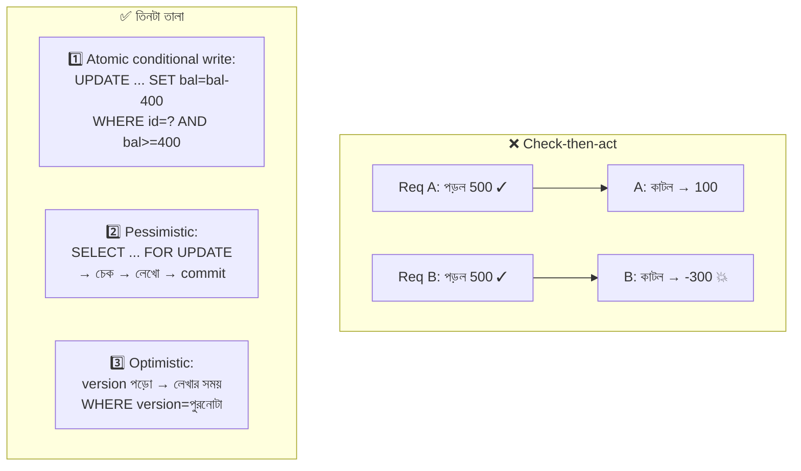

# Day 39 — Concurrent Balance Overspend ঠেকানো

## 🎯 সমস্যা

Wallet-এ ৫০০ টাকা। **একই মুহূর্তে** দুটো request — দুটোই ৪০০ টাকা খরচের। দুটোই পড়ল: "balance ৫০০ ≥ ৪০০, ঠিক আছে" — দুটোই কাটল — balance এখন **−৩০০**। এটাই ক্লাসিক **check-then-act race**: চেক আর কাজের মাঝের ফাঁকে পৃথিবী বদলে গেছে। Application-কোডে `if (balance >= amount)` যত সুন্দরই দেখাক — **দুই process-এর মাঝে if-statement কোনো পাহারাদার নয়**। (Day 04-এর duplicate-payment ছিল *একই* request দু'বার; আজ *দুটো ভিন্ন* বৈধ request-এর রেস — জোড়া-সমস্যা, ভিন্ন ওষুধ।)

## 🖼️ রেস আর তার তিন তালা



## 💡 তিনটা তালা, আর কখন কোনটা

**1. Atomic conditional write — সবচেয়ে ছোট, প্রায়ই সবচেয়ে ভালো।**
```sql
UPDATE wallets SET balance = balance - 400
WHERE user_id = ? AND balance >= 400;
```
চেক আর কাটা **এক statement-এ** — DB-র row-lock নিজেই ক্রম বেঁধে দেয়; affected-rows = 0 মানে টাকা নেই, ব্যবসায়িক প্রত্যাখ্যান। কোনো আলাদা SELECT নেই, রেসের জানালাই নেই। শর্ত: সিদ্ধান্তটা এক-শর্তে ধরা যায় (যা balance-জাতীয় জিনিসে প্রায় সবসময় সত্য)। NoSQL-জগতেও একই ছাঁচ: DynamoDB-র conditional write, MongoDB-র findAndModify-with-condition।

**2. Pessimistic lock — জটিল যাচাই থাকলে।** `SELECT ... FOR UPDATE`-এ row-টা ধরে (অন্য transaction-রা দাঁড়িয়ে), তারপর যত খুশি জটিল হিসাব (দৈনিক-সীমা, ঝুঁকি-নিয়ম, একাধিক টেবিল), শেষে লেখো-commit। নিশ্চিত, সরল যুক্তি; দাম — **hot row-এ লাইন**: এক জনপ্রিয় wallet-এ সব দাঁড়িয়ে (সেই Day 16-এর hot-key গন্ধ), আর একাধিক row ধরলে **deadlock**-ঝুঁকি (প্রতিকার: সবসময় একই ক্রমে lock ধরুন, যেমন id-ক্রমে)। Lock-এর আয়ু ছোট রাখুন — lock ধরে বাইরের API ডাকা মহাপাপ।

**3. Optimistic concurrency — সংঘর্ষ বিরল হলে।** পড়ার সময় `version` টুকে নিন; লেখার সময়:
```sql
UPDATE wallets SET balance = ?, version = version + 1
WHERE user_id = ? AND version = ?;
```
Affected-rows = 0 → কেউ মাঝে বদলেছে → আবার পড়ুন-হিসাব-লিখুন (সীমিত retry)। কোনো অপেক্ষা নেই — contention কম হলে দ্রুততম; contention বেশি হলে retry-ঝড়ে উল্টো ক্ষতি। (Day 33-এর event-store version-চেক, Day 44-এর sync — একই পরিবারের মুখ।)

**স্তরটা মনে রাখুন: এসবই DB-স্তরের সত্য।** App-স্তরের in-memory lock (C#-এর `lock`) এক process-এ সীমাবদ্ধ — ৩টা instance-এ অর্থহীন; distributed lock (Day 06) নেওয়া *যায়*, কিন্তু balance-এর ক্ষেত্রে DB-র নিজের তালাগুলো থাকতে বাইরের তালা আনা মানে বাড়তি জটিলতা + সেই fencing-চিন্তা। **টাকার শেষ পাহারাদার সবসময় DB-র atomicity।**

**আর নকশার এক ধাপ ওপরে — ledger-চিন্তা।** Balance-কে একটা ঘরে-বসা সংখ্যা না রেখে **append-only লেনদেন-খাতা** (Day 33!) + derived balance রাখলে: প্রতিটা খরচ একটা INSERT (idempotency-key-সহ — Day 04), balance হয় জমার-যোগফল — আর "overspend-চেক" হয় insert-এর শর্তে/সংরক্ষিত-হিসাবের conditional-update-এ। Audit ফ্রি, দ্বন্দ্ব-বিশ্লেষণ ফ্রি। উচ্চ-contention একক-wallet-এ (জনপ্রিয় merchant-এর আয়-খাতা) আরও এক ধাপ: **এক writer-এ ক্রমবদ্ধ করা** — সেই wallet-এর সব খরচ এক queue-partition দিয়ে (Day 07) এক consumer-এ — রেসটাই স্থাপত্য থেকে বিলুপ্ত; দাম: latency আর সেই partition-এর throughput-ছাদ।

## ⚖️ সিদ্ধান্ত-ছক

| পরিস্থিতি | তালা |
|-----------|------|
| সরল শর্ত (balance ≥ x) | Atomic conditional write — default |
| বহু-নিয়মের যাচাই, contention সহনীয় | Pessimistic (`FOR UPDATE`) |
| সংঘর্ষ বিরল, throughput চাই | Optimistic + version |
| এক entity-তে চরম contention | Single-writer/queue-ক্রম বা sharded sub-balance (সাবধানে) |
| Audit/নিয়ন্ত্রক-চাপ | Ledger-মডেল — ওপরের যে-কোনোটার সাথে |

## ⚠️ Common Mistakes

- Read-replica থেকে balance পড়ে সিদ্ধান্ত — lag-এ বাসি সংখ্যা (Day 19); **টাকার চেক সবসময় primary-তে, লেখারই transaction-এ।**
- Isolation-level-এ অন্ধ ভরসা — "READ COMMITTED আছে তো" — সে শুধু বলে *পড়াটা* committed; check-then-act-এর ফাঁক সে বোজায় না; ফাঁক বোজে ওপরের তিন তালায় (বা SERIALIZABLE-এর দামে)।
- Retry আছে, idempotency নেই — optimistic-retry বা timeout-retry-তে একই খরচ দু'বার ঢোকার দরজা খোলা; Day 04-এর key এখানে বাধ্যতামূলক সঙ্গী।
- Negative-balance-কে শুধু UI-তে আটকানো — শেষ রক্ষা DB-constraint (`CHECK (balance >= 0)`) — বাগ থাকলেও খাতা মিথ্যা হবে না।

## 🎤 Interview Tip

রোগের নাম দিয়ে শুরু: **"এটা check-then-act race — if-statement দুই request-এর মাঝে কিছুই পাহারা দেয় না; পাহারা দিতে পারে কেবল atomic কিছু।"** তারপর তিন তালা এক নিঃশ্বাসে (conditional-write → pessimistic → optimistic, contention-অনুযায়ী), আর শেষে ledger-চিন্তা ছুঁয়ে দিন — "টাকা মানেই আসলে append-only খাতা" — এই এক বাক্যে fintech-পরিপক্বতা ফুটে ওঠে।
