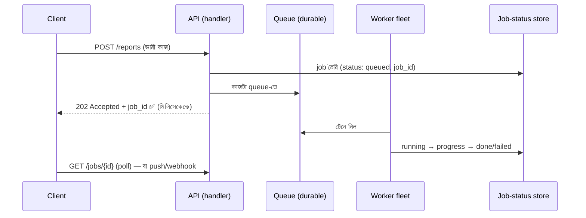

# Day 40 — Main Thread থেকে ভারী কাজ সরানো

## 🎯 সমস্যা

Request এলো: "ভিডিওটা upload হলো, এবার transcode করো / ১০ হাজার row-র report বানাও / ৫০০ জনকে email দাও।" Handler-এর ভেতরেই করলেন — request ৪০ সেকেন্ড ঝুলে রইল, ততক্ষণে: user-এর timeout, LB-র timeout, thread/event-loop আটকা (Node-এ তো এক লাইনের CPU-কাজই পুরো event loop-এর মৃত্যু — *সব* user স্থবির), আর deploy/restart হলে আধা-করা কাজটা **বাতাসে মিলিয়ে গেল**। মূল নীতিটা সরল: **request-এর আয়ু ছোট, কাজের আয়ু বড় — দুটোকে এক দড়িতে বাঁধা যাবে না।**

## 🖼️ ছাঁচটা

## 💡 সিদ্ধান্তগুলো, স্তরে স্তরে

**1. "Fire-and-forget in-process" — লোভনীয় ফাঁদ।** `Task.Run(...)` / `asyncio.create_task(...)` করে response দিয়ে দিলেন — দেখতে offload, আসলে তিনটে গর্ত: process মরলে/deploy হলে কাজ **উধাও** (কোথাও লেখা নেই যে কাজটা ছিল!), backpressure নেই (ঢল নামলে memory-তে জমে OOM — Day 17-এর পাঠ), আর retry/পর্যবেক্ষণ কিছুই নেই। ছোট, হারালে-ক্ষতি-নেই কাজে (log-enrich) চলে; **ব্যবসায়িক কাজে কখনো নয়।** (.NET-এর `IHostedService`+in-memory channel বা Node-এর `setImmediate` — একই পরিবারের একই সীমাবদ্ধতা।)

**2. আসল উত্তর: durable queue + আলাদা worker।** কাজটা **আগে টেকসই জায়গায় লিখুন** (queue/DB), তারপর 202 — এখন deploy-crash-restart যা-ই হোক, কাজ বেঁচে আছে। এই এক সিদ্ধান্তেই বাকি সুবিধার দরজা খোলে: worker আলাদা **scale** হয় (API-র CPU-প্রোফাইল আর transcode-এর CPU-প্রোফাইল ভিন্ন জাত — আলাদা fleet, আলাদা autoscaling, Day 25-এর lag-ভিত্তিক), retry-DLQ পাওয়া যায়, আর API-র p99 ভারী কাজের ছায়া থেকে মুক্ত। ছোট দলে "queue" মানেই Kafka নয় — **DB-টেবিল-ই queue** (status-কলাম + `FOR UPDATE SKIP LOCKED`-এ worker টানে) বহুদূর যায়; পরে দরকারে সত্যিকার broker।

**3. Client-কে কী দেবেন — চুক্তিটা নকশা করুন।** 202 + job_id দিলেন, তারপর? **Poll** (`GET /jobs/{id}` — সরলতম, শুরু এটাই), **push** (SSE/WebSocket-এ progress — Day 21), বা **webhook** (server-to-server ভোক্তায়)। আর ফলাফল বড় হলে (report-ফাইল) — status-এ presigned URL (Day 30)। এ পুরো গল্পের গভীর সংস্করণ Day 56-তে; আজকের মূল কথা: **async করলাম মানে UX-এর দায় শেষ নয় — বরং শুরু।**

**4. Worker-এর তিন ধর্ম:** **idempotent** (queue at-least-once দেবে — Day 04/11-এর সেই key), **timeout/visibility-সচেতন** (কাজ লম্বা হলে heartbeat/lease-renew, নাহলে "মরে গেছে" ভেবে আরেক worker-ও শুরু করবে — Day 25-এর visibility-ফাঁদ), আর **checkpoint-অভ্যাস** — ১০ হাজার email-এর ৬ হাজারে crash হলে retry যেন ৬০০১ থেকে ধরে, শূন্য থেকে নয় (progress store-এ টুকে রাখা)।

**5. Node/Python-এর বিশেষ নোট — "async" ≠ "অন্য থread"।** `async/await` I/O-অপেক্ষা ছাড়ে, কিন্তু **CPU-ভারী লুপ event loop-কে জিম্মি করে রাখে**: Node-এ worker_threads/আলাদা process, Python-এ multiprocessing/আলাদা worker-service (GIL!) — নাহলে "async করেছি তো" বলেও পুরো app এক image-resize-এ শ্বাসরুদ্ধ। .NET/JVM-এ thread-pool আছে বটে, কিন্তু request-thread-এ ভারী কাজ সেখানেও একই রোগ — pool-অনাহার।

**6. কোনটা offload করবেন — একটা সৎ থাম্ব-রুল:** ~এক সেকেন্ডের বেশি লাগতে পারে / বাইরের ধীর-সিস্টেম ছোঁয় / fail-করলে-আবার-চালানো-দরকার / user-এর তাৎক্ষণিক উত্তরে অনাবশ্যক — যেকোনো একটায় টিক পড়লেই queue-তে। উল্টোটাও সত্য: ৫০ms-এর কাজকে queue-নাটকে জড়ানো over-engineering — সব offload-ও রোগ।

## ⚖️ সিদ্ধান্ত-ছক

| কাজের চরিত্র | পথ |
|---------------|-----|
| হারালে-ক্ষতি-নেই, ক্ষুদ্র | In-process fire-and-forget (জেনে-বুঝে) |
| ব্যবসায়িক, retry-যোগ্য হওয়া চাই | Durable queue + worker — default |
| ছোট scale, infra কম | DB-as-queue (`SKIP LOCKED`) |
| বহু-ধাপ, দীর্ঘ, ব্যর্থতা-জটিল | Workflow engine-ঘরানা (Day 10/29-এর orchestration-আত্মীয়) |
| CPU-bound in Node/Python | আলাদা process/worker-service — thread-চালাকিতে হবে না |

## ⚠️ Common Mistakes

- 202 দিয়ে দিলাম, কিন্তু queue-লেখাটা response-এর *পরে* — মাঝে crash হলে user "accepted" শুনেছে, কাজ কোথাও নেই; **আগে durable-লেখা, তারপর acknowledgment** (আর DB-write+queue-write জোড়া হলে — Day 22-এর outbox!)।
- Job-status store না রাখা — user-ও অন্ধ, support-ও অন্ধ; "কাজটার কী হলো" প্রশ্নের উত্তর systemরই দেওয়ার কথা।
- এক queue-তে ৫-সেকেন্ড আর ৫-ঘণ্টার কাজ — লম্বাগুলোর পেছনে খাটোরা লাইনে (Day 25-এর priority-পাঠ); দৈর্ঘ্য/অগ্রাধিকারে আলাদা lane।
- Worker-এ graceful shutdown নেই — deploy মানেই আধা-কাজের লাশ; SIGTERM-এ চলতি কাজ শেষ/checkpoint করে তবে মরুন।

## 🎤 Interview Tip

নীতিটা এক লাইনে: **"Request-থ্রেড একটা ধার-করা জিনিস — ওখানে করি শুধু যাচাই আর টেকসই-জায়গায়-লেখা; বাকি সব worker-এর সংসার।"** তারপর চার স্তম্ভ গুনে দিন: durable queue, idempotent worker, job-status-এর চুক্তি, আলাদা scaling। আর in-process `Task.Run`-এর ফাঁদটা নিজে থেকে তুললে বোঝা যাবে — আপনি এ ভুলটা একবার করে শিখেছেন, বইয়ে পড়ে নয়।
