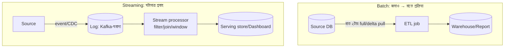

# Day 41 — Batch থেকে Real-Time Streaming-এ যাওয়া

## 🎯 সমস্যা

রাত ২টার cron: সারাদিনের data টেনে transform করে dashboard/report বানায়। ব্যবসা এখন বলছে: "কালকের সংখ্যা আজ দুপুরে চাই না — **এখনই** চাই" (fraud-সংকেত, live-inventory, real-time মেট্রিক)। Batch-কে ঘন ঘন চালিয়ে (প্রতি ৫ মিনিটে!) জোড়াতালি চলে কিছুদিন — তারপর ভাঙে: প্রতি run-এ full-scan-এর খরচ, run-গুলো একে-অপরের ঘাড়ে ওঠা, আর "শেষ run-এর পরে কী বদলাল" ঠিকঠাক ধরার যন্ত্রণা। Streaming মানে দর্শনটাই উল্টানো: **data-কে টেবিল না ভেবে ঘটনার স্রোত ভাবা।**

## 🖼️ দুই দর্শন

## 💡 রূপান্তরের পথ, ধাপে ধাপে

**1. আগে সৎ প্রশ্ন: "real-time" মানে ব্যবসার কাছে কত?** সেকেন্ড, মিনিট, না ১৫ মিনিট? উত্তরভেদে খরচ দশগুণ বদলায়। **Micro-batch** (৫–১৫ মিনিটে ছোট incremental run) বহু "real-time" দাবিকে সস্তায় মেটায় — আর আজকের ইঞ্জিনগুলোতে (Spark Structured Streaming-ঘরানা) batch↔streaming-এর কোডও প্রায় এক। সত্যিকার সেকেন্ড-স্তরের দাবি (fraud, bidding, live-ops) হলে তবেই পূর্ণ streaming-এর সংসার।

**2. উৎস থেকে ঘটনার স্রোত বানান — CDC-ই সদর দরজা।** App-কোড না ঘেঁটে DB-র change-log থেকেই স্রোত: **CDC** (Debezium-ঘরানা) প্রতিটা insert/update/delete-কে event বানিয়ে log-এ (Kafka) ঢালে — Day 22-এর সেই যন্ত্র, এবার analytics-এর কাজে। বিকল্প: app নিজে domain-event ছাড়ে (অর্থবহ, কিন্তু কোড-স্পর্শ লাগে)। যেটাই হোক, কেন্দ্রে থাকে **replayable log** — এবং এটাই migration-এর গোপন অস্ত্র: পুরনো offset থেকে replay করে নতুন pipeline-কে পুরনো data-য় যাচাই করা যায়।

**3. Stream-processing-এর তিনটা নতুন দানব** (batch-জীবনে যাদের দেখা মেলেনি):
- **Windowing** — "গত ৫ মিনিটের যোগফল" — কিন্তু ঘটনা দেরিতে পৌঁছায়! **Event-time vs processing-time** আলাদা করুন (ঘটনা *কখন ঘটল* বনাম *কখন পৌঁছাল*), late-event-এর জন্য watermark/allowed-lateness — নাহলে মোবাইল-নেটওয়ার্কে আটকে-থাকা ঘটনাগুলো ভুল window-এ বা বাতিলে।
- **State** — streaming join/aggregate মানে processor-এর পেটে state (গত ১ ঘণ্টার cart-ঘটনা) — সে state-ও crash-এ বাঁচাতে হয় (checkpoint); "stateless script" মানসিকতা এখানে অচল।
- **সঠিকতা** — at-least-once স্রোতে ডুপ্লিকেট আসবেই (Day 11-এর পুরনো বন্ধু); হয় processor-ইঞ্জিনের exactly-once ছাতা (Flink/Kafka-transactions-ঘরানা, নিজস্ব দামসহ), নয় **sink-এ idempotent-লেখা/upsert** — দ্বিতীয়টা প্রায়ই সরল ও যথেষ্ট।

**4. Migration-কৌশল: strangler, big-bang নয়** (Day 47-এর দর্শনের ডেটা-রূপ)। দুটো পরীক্ষিত ছক:
- **সমান্তরাল চালান** — batch থাকল সত্যের মাপকাঠি, পাশে streaming-pipeline একই মেট্রিক বানায়; দিনশেষে দুটো মিলিয়ে দেখুন (reconciliation) — সপ্তাহখানেক মিললে তবে switch।
- **Lambda→Kappa পথ** — শুরুতে দুই স্তর (streaming তাৎক্ষণিক-আনুমানিক + রাতের batch শুদ্ধ-সংশোধন — lambda); আস্থা জমলে batch-স্তর অবসরে, log-replay-ই recomputation-এর পথ (kappa)। বহু দল চিরকাল lambda-তেই সুখী — সেটাও বৈধ।

**5. Serving-প্রান্ত ভুলবেন না।** স্রোত প্রক্রিয়া করে ফেললেন — dashboard পড়বে কোত্থেকে? Aggregate-গুলো নামান query-বান্ধব ঘরে (Redis/OLAP-store/materialized-view — Day 09-এর read-model ভাবনা); "Kafka-থেকে-সরাসরি-dashboard" বলে বাস্তবে কিছু নেই।

## ⚖️ সিদ্ধান্ত-ছক

| দাবি | পথ |
|------|-----|
| ঘণ্টা-স্তরের সতেজতা | Batch-ই থাক — সরলতার দাম আছে |
| মিনিট-স্তর | Incremental micro-batch |
| সেকেন্ড-স্তর, ঘটনা-চালিত সিদ্ধান্ত | পূর্ণ streaming (CDC→log→processor) |
| Migration | সমান্তরাল + reconciliation, তারপর switch |

## ⚠️ Common Mistakes

- Batch-এর SQL-মানসিকতা স্রোতে টেনে আনা — "পুরো টেবিল join করব" — স্রোতে join মানে state আর window; নকশা না বদলে শুধু যন্ত্র বদলালে দুঃখ দ্বিগুণ।
- Late/out-of-order data-কে "edge case" ভাবা — মোবাইল-যুগে এটা মূল case; watermark-নীতি প্রথম দিনের সিদ্ধান্ত।
- Reconciliation ছাড়া switch — streaming-সংখ্যা আর পুরনো report না মিললে ব্যবসার আস্থা এক রাতে যায়; মিলিয়ে দেখার যন্ত্রটা pipeline-এরই অংশ।
- Backfill-এর কথা ভুলে যাওয়া — নতুন মেট্রিক লাগলে ইতিহাস কোথা থেকে? Log-retention/আর্কাইভ-স্তর (tiered storage) আগে ভাবুন — নাহলে স্রোত আছে, স্মৃতি নেই।

## 🎤 Interview Tip

শুরুতেই মাপ: **"আগে জিজ্ঞেস করব — freshness-এর SLA কত আর তার ব্যবসায়িক দাম কী; সেকেন্ড আর ১৫-মিনিটের মাঝে খরচের ফারাক দশগুণ।"** তারপর স্থাপত্য এক লাইনে: **"CDC দিয়ে DB-কে স্রোত বানাই, replayable log কেন্দ্রে, window/state/late-data-র নীতি স্পষ্ট, আর পুরনো batch-এর সাথে reconciliation চালিয়ে তবেই switch।"** Event-time vs processing-time-এর ফারাকটা নিজে থেকে তুললেই বোঝা যায় — আপনি স্রোতে সাঁতরেছেন।
