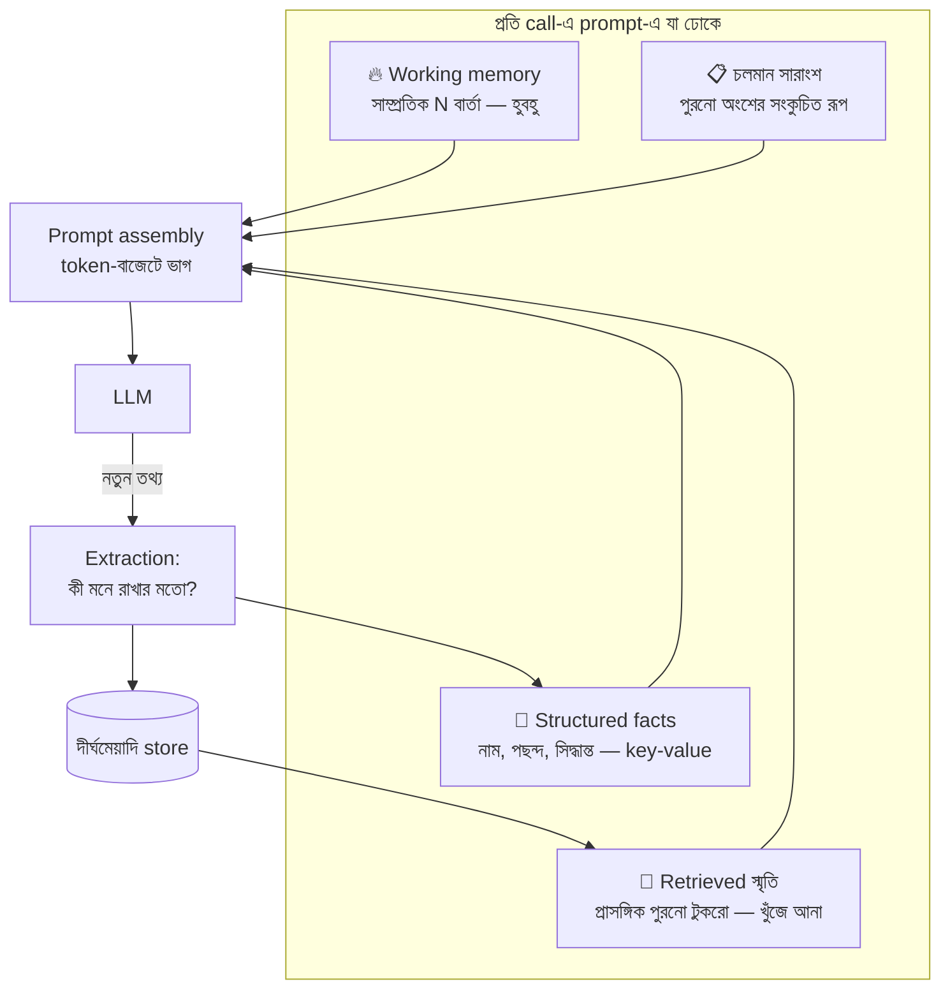

# Day 42 — AI Agent-এর Memory ডিজাইন

## 🎯 সমস্যা

LLM জন্মগতভাবে **স্মৃতিহীন** — প্রতিটা call এক ফাঁকা মাথা; "মনে রাখা" মানে আসলে **প্রতিবার prompt-এ কী কী ফিরিয়ে দেবেন, সেই engineering**। সরল পথ — পুরো কথোপকথন জমিয়ে প্রতিবার পাঠানো — তিন দিক থেকে ভাঙে: window-র ছাদ, token-বিল (প্রতি বার্তায় আগের *সব* আবার!), আর Day 38-এর সেই মনোযোগ-ক্ষয় — ৫০-বার্তার জঞ্জালে দরকারি তথ্যটা ডুবে যায়। প্রশ্নটা তাই storage-এর নয় — **বাছাইয়ের**: এই মুহূর্তের কাজে অতীতের কোন টুকরোটা আসলেই দরকার?

## 🖼️ স্মৃতির স্তরবিন্যাস

## 💡 স্তরগুলো, একে একে

**1. Working memory — সাম্প্রতিকটুকু হুবহু।** শেষ N বার্তা (বা token-বাজেট-মাফিক) অবিকৃত — চলতি আলাপের সুর, সর্বশেষ নির্দেশ, আধা-শেষ কাজ। এটুকু সস্তা ও অনিবার্য; নকশা-প্রশ্ন শুধু N-এর মাপ আর কাটার নিয়ম (বার্তা-জোড়া অক্ষত রাখুন — user-এর প্রশ্ন রেখে assistant-এর উত্তর ছাঁটলে সংলাপ খোঁড়া হয়)।

**2. Summarization — পুরনোকে সংকুচিত করা।** Window ভরে এলে পুরনো অংশকে LLM দিয়েই সারাংশে নামান ("এ পর্যন্ত: user X চায়, Y ঠিক হয়েছে, Z বাকি"), মূল বার্তা সরিয়ে সারাংশ বসান — চলমান/rolling summary। **ক্ষয়টা জানুন:** সারাংশ মানেই বাছাই — কোন খুঁটিনাটি ঝরবে তা সারাংশকারী ঠিক করছে; তাই গুরুত্বপূর্ণ জিনিস সারাংশের ভরসায় না রেখে →

**3. Structured facts — দামি তথ্যের আলাদা সিন্দুক।** "User-এর নাম, timezone, বাজেট, নেওয়া সিদ্ধান্ত, ঘোষিত পছন্দ" — এগুলো গদ্যের স্রোতে না ভাসিয়ে **স্পষ্ট key-value/schema-তে** তুলুন (আলাপ শেষে/মাঝে এক extraction-ধাপ — Day 46-এর structured output এখানেই কাজে), প্রতি call-এ prompt-এর নির্দিষ্ট কোণে বসান। সুবিধা: হারায় না, **সম্পাদনাযোগ্য** (user মত বদলালে পুরনো মান overwrite — গদ্য-স্মৃতিতে যেটা দুঃস্বপ্ন), আর user-কে দেখানো/মোছার সুযোগ (আস্থা + গোপনীয়তা)।

**4. Long-term retrieval — অতীত থেকে খুঁজে আনা।** সপ্তাহ-মাস আগের আলাপ/ঘটনা store-এ (vector-search — Day 27/28-এর RAG-যন্ত্র, স্মৃতির ওপর প্রয়োগ; সাথে সময়/সাম্প্রতিকতা-ভার আর keyword-hybrid), চলতি প্রশ্নের প্রাসঙ্গিক টুকরো টেনে prompt-এ। **এখানে দুটো স্মৃতি-বিশেষ কাঁটা:** *পুরনো-বনাম-নতুনের দ্বন্দ্ব* — দু'মাস আগে "budget ৫০ হাজার" আজ "৮০ হাজার"; retrieval দুটোই আনলে agent বিভ্রান্ত — তাই fact-জাতীয় জিনিস structured-স্তরে (সর্বশেষ মান জেতে), retrieval-স্তরে থাকুক ঘটনা/প্রসঙ্গ; আর *স্মৃতি-বিষক্রিয়া* — ভুল/পুরনো টুকরো বারবার retrieved হয়ে প্রতিটা উত্তর দূষিত করা — প্রতিকার: স্মৃতিতে timestamp+উৎস, আর মুছে-ফেলা/সংশোধনের যন্ত্র প্রথম দিনেই।

**5. লেখার নীতিটা পড়ার নীতির সমান দামি।** কী **ঢুকবে** দীর্ঘমেয়াদি স্মৃতিতে? সব-কিছু-জমাও = জঞ্জালের পাহাড় + retrieval-এ আবর্জনা + গোপনীয়তার দায়। বাছাই-নীতি: স্পষ্ট signal (user বলল "মনে রেখো"), extraction-ধাপের রায় ("এ আলাপে টেকসই তথ্য কী?"), আর কাজ-সমাপ্তির ফলাফল (agent-এর শেখা: "এ API-তে retry লাগে")। সাথে **স্মৃতিরও জীবনচক্র**: মেয়াদ/ক্ষয় (বহুদিন অ-ব্যবহৃত টুকরো পেছনে), consolidation (দশ টুকরোকে এক পরিণত সারাংশে) — নাহলে স্মৃতি-ভাণ্ডারই Day 12-ঘরানার high-ingest জঞ্জাল।

**6. Multi-agent হলে (Day 29-এর সংসারে):** কার স্মৃতি কার? — agent-নিজস্ব (নিজের কাজের শিক্ষা) আর **দল-ভাগ** (কাজের state — সেটা তো Day 29-এ durable store-এই রাখতে বলেছি) আলাদা করুন; সব agent-এর সব-দেখা মানে আবার সেই জঞ্জাল-prompt।

## ⚖️ কোন তথ্য কোন স্তরে

| তথ্য | স্তর |
|------|------|
| চলতি আলাপের শেষাংশ | Working (হুবহু) |
| আলাপের পুরনো ধারা | Rolling summary |
| নাম/পছন্দ/সিদ্ধান্ত/সীমা | Structured facts — সর্বশেষ মান জেতে |
| পুরনো ঘটনা, আগের প্রকল্পের প্রসঙ্গ | Vector-retrieval (সময়-ভারসহ) |
| Agent-এর কাজ-চলাকালীন state | Prompt-এ নয় — durable store-এ (Day 29) |

## ⚠️ Common Mistakes

- "Memory = বড় context window" — window বড় হলে জঞ্জালও বড়; বাছাই-স্তরগুলোর বিকল্প নেই, Day 38-এর "ঢোকানো ≠ ব্যবহার" এখানে দ্বিগুণ সত্য।
- সারাংশে সংখ্যা/সিদ্ধান্ত ভরসা — "প্রায় ৫০ হাজারের মতো বাজেট" হয়ে যায়; সংখ্যা-নাম-সিদ্ধান্তের ঘর structured-স্তর।
- স্মৃতি জমে, মোছে না — user-এর "ভুলে যাও" অনুরোধ, মেয়াদোত্তীর্ণ তথ্য, ভুল extraction — deletion-পথ না থাকলে আস্থাও যায়, মানও যায়।
- প্রতি বার্তায় দীর্ঘমেয়াদি-লেখা — খরচ + জঞ্জাল; লেখাটা ঘটুক আলাপ-শেষে/মাইলফলকে, ভাবনা-সহকারে।

## 🎤 Interview Tip

মূল বাক্যটা: **"LLM-এর memory একটা illusion — আসলে এটা প্রতি call-এ 'কী ফিরিয়ে দেব' তার retrieval-আর-সংকোচনের engineering; তাই নকশা করি স্তরে — হুবহু সাম্প্রতিক, সারাংশে মধ্যম, structured-এ দামি fact, আর vector-এ দূর অতীত।"** তারপর যেটা কম লোকে বলে: **"পড়ার নীতির চেয়ে লেখার নীতি কঠিন — কী মনে রাখব, কী ভুলব, আর user-কে মোছার ক্ষমতা দেব কীভাবে।"** Forgetting-কে feature বলা — এইটাই পরিণত উত্তর।
