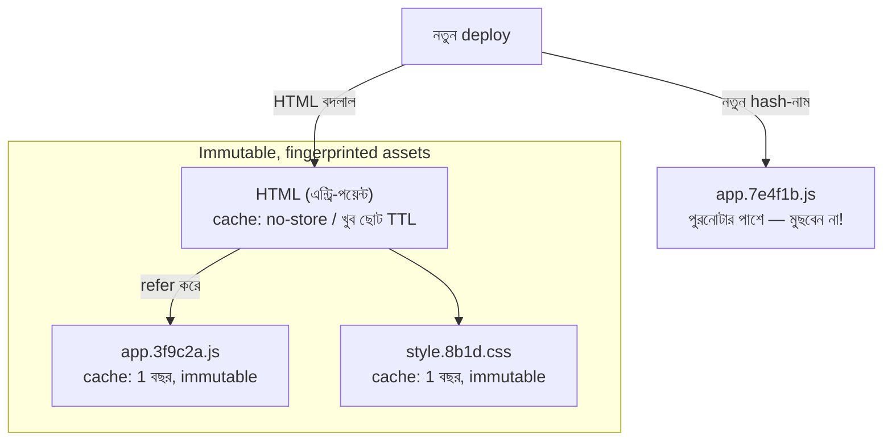

# Day 43 — Deploy-এ Reliable CDN Cache Invalidation

## 🎯 সমস্যা

নতুন version deploy করলেন — কিন্তু user-এর browser আর দুনিয়াজোড়া CDN-edge-এ বসে আছে **পুরনো** JS/CSS/HTML। ফল দু'রকম: কেউ পুরোটাই পুরনো দেখছে (বিরক্তিকর কিন্তু সুসংগত), আর ভয়ংকরটা — **মিশ্র অবস্থা**: নতুন HTML + পুরনো JS, বা নতুন JS পুরনো API-ভাষায় কথা বলছে — রহস্যময় client-error-এর বন্যা, "hard refresh দিন" support-উত্তর। "Deploy-এর পরে সব purge করে দিই" — শোনায় সমাধান, আসলে আরেক ফাঁদ।

## 🖼️ আসল সমাধান — নাম-ই বদলে দাও

## 💡 নীতিগুলো

**1. মূল কৌশল: invalidation-সমস্যাকে সমস্যাই থাকতে দেবেন না।** Asset-এর filename-এ তার content-এর **hash** (fingerprint): `app.3f9c2a.js`। Content বদলাল = নাম বদলাল = **নতুন URL** — পুরনো cache-entry অপ্রাসঙ্গিক, invalidate করারই দরকার নেই। এই asset-গুলো তাই নির্ভয়ে `Cache-Control: max-age=31536000, immutable` — এক বছর, edge-এও, browser-এও। Build-tool-রা (Vite/Webpack-ঘরানা) এটা এক config-এ দেয়। **Cache-busting-এর এই রূপে purge শব্দটাই অভিধান থেকে বাদ।**

**2. তাহলে কাঁটা কোথায়? — এন্ট্রি-পয়েন্টে।** কোনো একটা জিনিসের নাম তো স্থির থাকতেই হবে — সেটাই `index.html` (আর হয়তো manifest/service-worker)। এই স্থির-নামের জিনিসগুলোর নীতি উল্টো: **`no-store` বা খুব ছোট TTL (সেকেন্ড–মিনিট) + `stale-while-revalidate`** — HTML ছোট, প্রতিবার origin-ছোঁয়ার দামও ছোট; আর HTML-ই ঠিক করে কোন hash-নামের asset নামবে — তাই HTML fresh মানেই পুরো গাছ সুসংগত।

**3. মিশ্র-অবস্থা তবু আসবে — deploy-ক্রম আর সহাবস্থান দিয়ে সামলান:**
- **পুরনো asset মুছবেন না** — deploy মানে নতুন hash-ফাইল **পাশে** রাখা (object-storage-এ সবই তো সস্তা — Day 30); যে user-এর ট্যাবে পুরনো HTML খোলা, সে পুরনো `app.3f9c2a.js`-ই পাক — ভাঙা 404 নয়। পরিষ্কার করুন সপ্তাহ-পুরনোগুলো, lifecycle-নিয়মে।
- **ক্রম:** আগে asset-গুলো আপলোড (নতুন hash-নামে, কেউ এখনো চায় না), **তারপর** HTML switch — উল্টো করলে নতুন HTML পুরনো-storage-এ নতুন asset খুঁজে 404।
- **API-র সাথে সহাবস্থান:** পুরনো JS পুরনো API-চুক্তিতে কথা বলবে আরও ক'দিন — তাই API-বদল backward-compatible রাখুন অন্তত এক overlap-জানালা (Day 52-র versioning আর Day 14-এর expand-contract — একই পরিবার)।

**4. Purge/invalidation API — যেখানে সত্যিই লাগে।** Fingerprint-করা যায় না এমন জিনিসে: স্থির-নামের HTML নিজে (জরুরি hotfix-এ TTL-এর অপেক্ষা না করতে চাইলে), user-uploaded/CMS-content (`/products/42.json`), robots.txt-ঘরানার ফাইল। জানুন যন্ত্রটার চরিত্র: purge **eventually consistent** — শত-শত edge-এ পৌঁছাতে সেকেন্ড-মিনিট; path-ভিত্তিক আর **tag/surrogate-key-ভিত্তিক** purge (এক পণ্যের সব রূপকে এক tag-এ বেঁধে এক ডাকে মোছা — CMS-জগতে সোনার জিনিস) — দ্বিতীয়টা থাকলে নকশায় tag-ই রাখুন। আর "purge-all" হলো Day 18-এর **নিজ-হাতে-বানানো stampede**: লাখো miss একসাথে origin-এ — জরুরি অবস্থা ছাড়া নৈব চ; করতেই হলে origin-এর সামনে concurrency-ঢাল আগে।

**5. Service worker থাকলে — তৃতীয় cache-স্তর।** Browser-cache আর CDN-এর মাঝে SW-এর নিজস্ব cache + নিজস্ব জীবনচক্র (নতুন SW "waiting"-এ বসে থাকা) — deploy-নকশায় একে ভুললে "user পুরনো দেখছে অথচ CDN fresh" রহস্য; SW-এর update-নীতি (skipWaiting/প্রম্প্ট) সচেতনে বাছুন।

## ⚖️ কোন জিনিসের কী নীতি

| জিনিস | নীতি |
|--------|------|
| JS/CSS/ছবি/ফন্ট (build-asset) | Hash-নাম + ১-বছর immutable — purge অপ্রয়োজন |
| index.html / manifest | no-store বা সেকেন্ড-TTL + SWR |
| CMS/user-content | ছোট-মাঝারি TTL + tag-ভিত্তিক purge |
| API-response (cache করলে) | ছোট TTL + surrogate-key; Day 08/26-এর invalidation-শৃঙ্খলা |

## ⚠️ Common Mistakes

- HTML-কেও লম্বা TTL — তখন hash-কৌশলের সদর দরজাই বাসি; পুরো গাছ পুরনো, আর এবার purge ছাড়া মুক্তি নেই।
- Deploy-স্ক্রিপ্টে পুরনো asset মুছে ফেলা — খোলা-ট্যাব user-দের জন্য তাৎক্ষণিক 404-বৃষ্টি; সহাবস্থানই নিয়ম।
- Query-string-এ version (`app.js?v=2`) — কিছু cache-স্তর query-string উপেক্ষা/অসংগতভাবে ধরে; নামের ভেতরে hash-ই নির্ভরযোগ্য।
- Purge-কে deploy-pipeline-এর "fire-and-forget" ধাপ ভাবা — ব্যর্থ purge নীরবে বাসি-content; পাইপলাইনে purge-এর সাফল্য যাচাই + বাসি-সংস্করণ-মনিটর (deployed-hash বনাম served-hash তুলনা) রাখুন।

## 🎤 Interview Tip

এক লাইনে দর্শন: **"শ্রেষ্ঠ invalidation হলো invalidation না-লাগা — content-hash নামে asset অমর, আর সবটা ঝোলে এক nimble এন্ট্রি-পয়েন্টে।"** তারপর ক্রমটা: asset-আগে-HTML-পরে, পুরনো-পাশে-রাখা, API-overlap। শেষে purge-all-কে stampede-এর সাথে জুড়ে দিন — Day 18 চেনা লোক বলেই এ সংযোগ টানবে।
