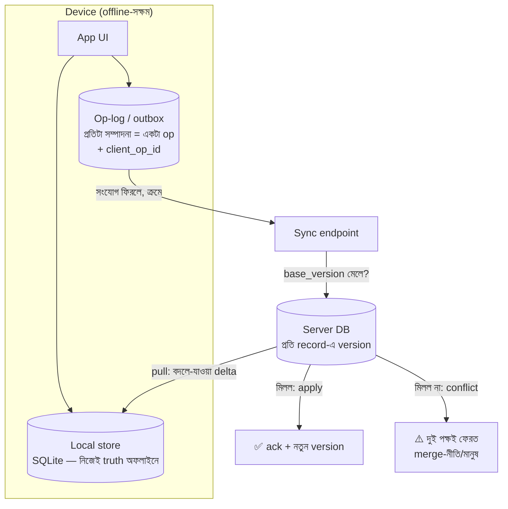

# Day 44 — Offline Edit Sync (Data Loss ছাড়া)

## 🎯 সমস্যা

Field-worker app: নেটওয়ার্ক নেই, তবু কাজ চলবে — form পূরণ, record সম্পাদনা, ছবি তোলা। সংযোগ ফিরলে সব server-এ উঠবে। শোনায় সরল, ভেতরে তিন দানব: **এক যন্ত্রের জমানো লেখা বনাম server-এ ইতিমধ্যে বদলে-যাওয়া data-র সংঘর্ষ** (দু'জন একই record ছুঁয়েছে — Day 37-এর ভূত, এবার ঘণ্টা-দিনের ব্যবধানে), **আধা-ওঠা sync** (৫০টা বদলের ২০টা উঠতেই সংযোগ গেল), আর **retry-র ডুপ্লিকেট** (upload হয়েছিল, ack আসেনি — আবার পাঠাল)। "Data loss ছাড়া" কথাটার আসল মানে: **কোনো সম্পাদনা নিঃশব্দে হারাবে না — এমনকি হেরে-যাওয়া সংঘর্ষের পক্ষটাও।**

## 🖼️ কাঠামোটা

## 💡 নকশার সিদ্ধান্তগুলো

**1. Local-first ভিত: যন্ত্রেই পূর্ণ store + operation-log।** Offline-এ app চলবে **নিজের DB-তে** (SQLite-ঘরানা) — UI কখনো নেটওয়ার্কের মুখাপেক্ষী নয়। আর প্রতিটা সম্পাদনা জমা হবে **op-log/outbox-এ** (Day 22-এর outbox-ভাবনার client-সংস্করণ): `{client_op_id, entity, base_version, পরিবর্তন, সময়}`। **State নয়, operation পাঠান** — "নতুন পুরো record" পাঠালে মাঝের অন্যের বদল মুছে যায় (blind overwrite); "phone-field-টা X করলাম" পাঠালে server বুঝতে পারে *কী* বদলাতে চেয়েছিলেন — সংঘর্ষ-শনাক্তি আর merge দুটোই সূক্ষ্ম হয়।

**2. Idempotency — retry-জগতের প্রথম আইন।** প্রতিটা op-এর **client-জন্মানো unique ID**; server processed-ID মনে রাখে (Day 04/11-এর সেই টেবিল) — আধা-ওঠা batch আবার এলে চেনা op-গুলো নীরবে ack। Sync-প্রোটোকল মানেই at-least-once — এ ছাড়া "data loss নেই" দাবির উল্টোপিঠে "data double আছে" লেখা হয়ে যায়।

**3. সংঘর্ষ-শনাক্তি: base_version।** Op-এ থাকবে "আমি record-টার **কোন version দেখে** এ বদল করেছি"; server-এ এখন version আলাদা মানেই মাঝে কেউ লিখেছে — **conflict**। এটা Day 39-এর optimistic-concurrency-ই, শুধু জানালাটা মিনিট নয়, দিন — তাই "retry করলেই মিটবে" নয়, লাগবে নীতি:
- **Field-স্তরের auto-merge** — ভিন্ন field ছুঁলে দুটোই বসান (এ কারণেই op-এ field-granularity দামি);
- **Domain-নিয়ম** — কিছু জিনিসে "সর্বশেষ পরিদর্শকের রিপোর্ট জেতে", কিছুতে "যোগফল" (counter), কিছুতে append (নোট-তালিকা);
- **একই field-এ দ্বন্দ্ব → নিঃশব্দ LWW নয়** — হেরে-যাওয়া মানটা **সংরক্ষণ করুন** (conflict-copy/ইতিহাসে) আর user-কে দেখান মেলানোর UI — "data loss ছাড়া"-র সবচেয়ে আক্ষরিক দাবি এটাই। (গণিত-নির্ভর auto-merge চাইলে CRDT — Day 37; কিন্তু ব্যবসায়িক record-এ প্রায়ই মানুষ-মীমাংসাই সৎ।)

**4. Pull-দিকটা: delta-sync + tombstone।** নামার সময় পুরো টেবিল নয় — "গত sync-এর পর কী বদলাল": server রাখে প্রতি record-এ **monotonic change-cursor** (sequence/updated-version), client বলে "cursor X-এর পর দাও" (Day 24-এর keyset-ভাবনা sync-এ)। আর **মোছা জিনিসের জন্য tombstone** — সত্যি-DELETE করলে offline-client কোনোদিন জানবেই না যে মুছেছে; soft-delete-চিহ্ন রেখে delta-য় পাঠান (নির্দিষ্ট মেয়াদ পরে সাফ — সে মেয়াদের চেয়ে পুরনো client-কে full-resync)।

**5. ক্রম আর সীমানা:** এক client-এর op-গুলো **client-ক্রমে** apply করুন (op-log-এর sequence — একই record-এ "তৈরি করো"-র আগে "সম্পাদনা" পৌঁছালে অনর্থ); সম্পর্কিত op-গুলো (parent+child তৈরি) **এক batch/transaction-এ**। আর ছবি-জাতীয় বড় জিনিস op-এ নয় — আলাদা upload (Day 30-এর presigned-পথ, resumable), op-এ শুধু reference; media-আগে-op-পরে ক্রমে।

**6. বাস্তবতার ছোট তালিকা:** sync-স্থিতি UI-তে সৎভাবে (pending/synced/conflict-ব্যাজ — user-এর আস্থা এখানেই), ব্যাটারি-বান্ধব sync-সূচি, ঘড়ি-অবিশ্বাস (client-clock দিয়ে কখনো জেতা-হারা ঠিক করবেন না — version/sequence-ই বিচারক), আর **full-resync-এর জরুরি-দরজা** — sync-state দূষিত হলে "সব ফেলে server-থেকে-নতুন" পথটা প্রথম দিনেই বানানো থাক।

## ⚖️ সিদ্ধান্ত-ছক

| প্রশ্ন | ঝোঁক |
|--------|------|
| কী পাঠাব | Op/delta (field-granularity), state-overwrite নয় |
| ডুপ্লিকেট | client_op_id + server-side dedupe — বাধ্যতামূলক |
| সংঘর্ষ | Field-merge → domain-নিয়ম → মানুষ; হেরো-পক্ষ সংরক্ষিত |
| নামার পথ | Change-cursor delta + tombstone |
| Text-সহ-সম্পাদনা ঘরানা | তখন CRDT (Day 37); form/record-জগতে version+merge-ই যথেষ্ট |

## ⚠️ Common Mistakes

- "Last write wins দিয়েই চালাই" — offline-জগতে "last" মানে "যার নেট আগে ফিরল"; ঘণ্টার কাজ নিঃশব্দে মোছার recipe।
- Op-log unbounded — মাসের অফলাইনে লাখ-op; log-compaction (একই field-এর পরপর বদল জোড়া) আর op-সংখ্যার সীমা ভাবুন।
- Schema-বদল ভুলে যাওয়া — ৩-সপ্তাহ-পুরনো app-version-এর op নতুন server-schema-য় — op-এ schema/app-version ট্যাগ + server-side upcast (Day 33-এর upcaster-আত্মীয়, Day 52-র সুরও)।
- প্রথম sync-এ পুরো ইতিহাস টানা — নতুন যন্ত্রে লাগবে snapshot-bootstrap (এখনকার অবস্থা) + সেখান থেকে delta; op-replay-জন্ম-থেকে নয়।

## 🎤 Interview Tip

মেরুদণ্ডটা চার শব্দে: **"Op-log, idempotency, version-চেক, tombstone।"** তারপর সবচেয়ে দামি বাক্য: **"'Data loss ছাড়া' মানে সংঘর্ষে হেরে-যাওয়া লেখাটাও কোথাও বাঁচবে — নিঃশব্দ LWW এ দাবির সরাসরি লঙ্ঘন।"** আর সীমারেখা টানুন: form/record-sync-এ version+merge, সহ-সম্পাদিত text-এ CRDT — এক সমস্যার দুই ওজনের যন্ত্র গুলিয়ে না ফেলাই এ টপিকে পরিপক্বতা।
