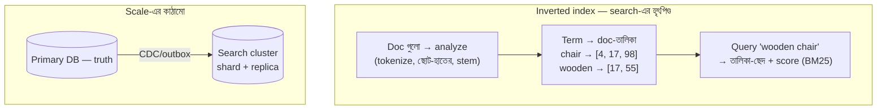

# Day 45 — Full-Text Search Scale করা

## 🎯 সমস্যা

`WHERE title LIKE '%chair%'` — ছোট টেবিলে চলে, তারপর একদিন দেখলেন: **leading wildcard মানে index অচল, full scan** — লাখ row-তে সেকেন্ড, কোটিতে মৃত্যু। আর LIKE তো "search"-ই নয়: শব্দরূপ বোঝে না (chair/chairs), প্রাসঙ্গিকতার ক্রম নেই, বানান-ভুলে অন্ধ, বহু-শব্দ প্রশ্নে অসহায়। আসল search মানে ভিন্ন এক data structure — এবং সেটাকে বড় করার নিজস্ব নিয়মকানুন।

## 🖼️ মূল যন্ত্র + বড় ছবি

## 💡 স্তরে স্তরে

**1. যন্ত্রটা বুঝুন: inverted index।** সাধারণ index যায় row→মান; inverted index উল্টো — **শব্দ→কোন কোন ডকুমেন্টে**। Query মানে শব্দগুলোর ডকুমেন্ট-তালিকার ছেদ/মিলন + **প্রাসঙ্গিকতা-score** (BM25-ঘরানা: বিরল শব্দের ওজন বেশি, ছোট ডকুমেন্টে ঘন-উপস্থিতি দামি)। আর ঢোকার মুখে **analysis-pipeline**: tokenize, lowercase, stemming (chairs→chair), স্টপ-শব্দ, ভাষাভেদে নিয়ম (বাংলা search বানালে বাংলা analyzer/token-নিয়ম — এক analyzer-সব-ভাষা চলে না)। **Search-মান ৮০% এখানেই ঠিক হয়** — cluster-আকারে নয়।

**2. প্রথম সিদ্ধান্ত: DB-র ভেতরেই, না আলাদা ইঞ্জিন?** Postgres-এর নিজস্ব full-text (tsvector/GIN) বা SQL Server-এর FTS — **এক দোকানে সব** (Day 28-এর pgvector-যুক্তির যমজ): consistency ফ্রি, sync-pipeline নেই, লাখ-দশলাখ ডকুমেন্টে দিব্যি। আলাদা ইঞ্জিনে (Elasticsearch/OpenSearch/Meilisearch/Typesense-ঘরানা) যাওয়ার সৎ কারণগুলো: উন্নত প্রাসঙ্গিকতা-টিউনিং, faceting/aggregation, typo-সহনশীলতা, ভারী query-চাপ DB থেকে সরানো, কোটি-স্তরের scale। কারণ ছাড়া যাওয়া মানে বিনা-দরকারে একটা **নতুন distributed system পোষা + sync-এর দায়** কেনা।

**3. আলাদা ইঞ্জিন মানেই sync-সমস্যা — চেনা বন্ধুরা ফিরে আসে।** Search-index হলো **derived data**: truth থাকবে primary DB-তে, index-এ পৌঁছাবে **CDC/outbox-পথে** (Day 22 — dual-write-এর ফাঁদ এখানে হুবহু: "DB-তে লিখে তারপর index-এও লিখি" = কোনো-একদিন-অমিল নিশ্চিত)। ফলাফল **eventually consistent** — লেখা-থেকে-খোঁজা-যায় ল্যাগ (index-refresh অন্তর্বর্তীসহ) মাপুন, ব্যবসাকে জানান (Day 27-এর index-lag SLA-র প্রতিধ্বনি); আর "নিজের লেখা post খুঁজে পাচ্ছি না" ঘরানার অভিযোগে Day 19-এর read-your-writes-চিন্তা এখানেও (নিজের সদ্য-লেখাটা তালিকায় হাতে-জুড়ে দেওয়া — সস্তা মলম)। **Reindex-পথ** প্রথম দিনেই: analyzer/mapping বদলালে পুরো index নতুন করে গড়তে হয় — নিয়ম: নতুন index পাশে গড়ুন → পেছনে ভরুন → **alias-switch** (শূন্য-downtime — Day 14/53-এর expand-contract-এরই search-রূপ)।

**4. Cluster-এর scale-ব্যাকরণ:** index ভাগ হয় **shard-এ** (Day 05-এর গল্প) — প্রতিটা query সব shard-এ গিয়ে ফল জোড়া লাগে (scatter-gather), তাই **shard-সংখ্যা বেশি ≠ দ্রুত**: অতি-খণ্ডনে প্রতি-shard-overhead আর জোড়ার খরচই জেতে (ছোট-অজস্র shard এ জগতের ক্লাসিক অসুখ); shard-আকার মাঝারি (দশ-GB-ঘরানা) রাখুন, **replica** বাড়িয়ে read-throughput আর সহনশীলতা। Time-series/log-ঘরানার data হলে **সময়-ভিত্তিক index** (দৈনিক/সাপ্তাহিক) + পুরনোগুলো জমাট/সস্তা-স্তরে + মেয়াদে-মোছা — Day 12-এর partition-শিক্ষার search-সংস্করণ।

**5. Query-পাশের কারিগরি:** autocomplete/prefix-এর জন্য edge-n-gram/আলাদা suggest-কাঠামো (মূল index-এ wildcard-প্রশ্ন ছুড়বেন না), typo-র জন্য fuzzy (দামি — মেপে), filter+search মিলুন (category/tenant-filter index-এর ভেতরেই — Day 28-এর pre-filtering আলাপ), pagination-এ গভীর-offset এখানেও বিষ (Day 24 — `search_after`-ঘরানার cursor), আর **তালিকা-পাতার জন্য search-ইঞ্জিনকে DB বানাবেন না** — ID আনুন ইঞ্জিন থেকে, দেহ আনুন DB/cache থেকে (Day 23-এর ID-only ভাবনা)।

**6. আর আধুনিক মোড়:** keyword-search আর semantic-search শত্রু নয় — **hybrid** (BM25 + vector, ফল জোড়া RRF-এ) আজকের production-মান (Day 28-এ বিস্তারিত); "search ভালো হচ্ছে না"-র উত্তরে আগে analyzer-আর-প্রাসঙ্গিকতা, তারপর hybrid, সবশেষে বড় cluster।

## ⚖️ সিদ্ধান্ত-ছক

| পরিস্থিতি | পথ |
|-----------|-----|
| লাখ-স্তরের ডকুমেন্ট, সাধারণ খোঁজা | DB-র নিজস্ব FTS — শুরু এখানেই |
| Faceting/typo/টিউনিং/ভারী চাপ | আলাদা ইঞ্জিন + CDC-sync |
| Log/time-series খোঁজা | সময়-ভিত্তিক index + জীবনচক্র |
| Semantic-ও চাই | Hybrid (BM25+vector) — Day 28-এর সাথে জোড়ায় |
| Search-মান খারাপ | আগে analyzer/relevance-টিউনিং — hardware পরে |

## ⚠️ Common Mistakes

- `%LIKE%`-কে index দিয়ে বাঁচানোর চেষ্টা — trigram-index (pg_trgm) কিছুদূর টানে, কিন্তু প্রাসঙ্গিকতা/ভাষাজ্ঞান দেবে না; সমস্যাটা structure-এর, না-থাকা-index-এর নয়।
- Search-ইঞ্জিনকে truth বানানো — backup/consistency/transaction — কোনোটাই তার ধর্ম নয়; সে **পুনর্নির্মাণযোগ্য derived-স্তর** (Day 28-এর একই মন্ত্র)।
- Mapping/analyzer "পরে ঠিক করব" — পরে মানেই full-reindex; অন্তত ভাষা, stemming, field-গুলোর ধরন প্রথমেই ভাবা।
- প্রাসঙ্গিকতা মাপা হয় না — Day 34-এর eval-শিক্ষা এখানেও: বাস্তব query-set + প্রত্যাশিত-ফল ছাড়া টিউনিং মানে অন্ধের ঢিল।

## 🎤 Interview Tip

শুরুটা যন্ত্র দিয়ে: **"LIKE ভাঙে কারণ সমস্যাটা algorithm-এর নয়, data-structure-এর — search মানে inverted index + analysis + BM25।"** তারপর স্থাপত্য-বিবেক: **"আগে DB-র নিজের FTS; আলাদা ইঞ্জিনে গেলে সেটা derived-store — CDC-তে ভরি, alias-এ reindex করি, আর লেখা-থেকে-খোঁজার ল্যাগটা SLA-তে লিখে রাখি।"** Scatter-gather আর অতি-sharding-এর ফাঁদ ছুঁয়ে দিলে cluster-অভিজ্ঞতার গন্ধ আসে।
