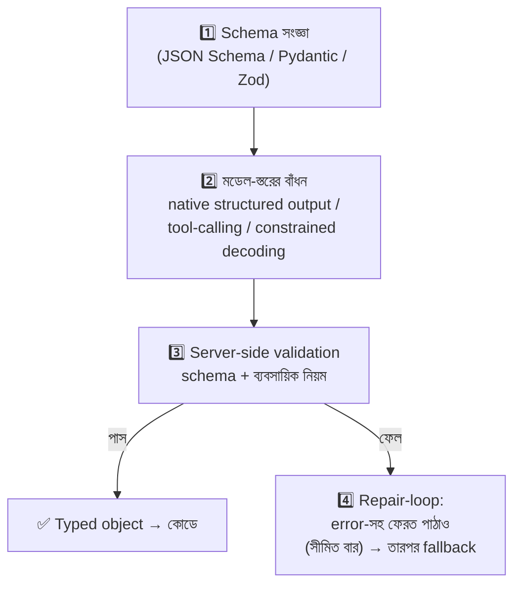

# Day 46 — LLM থেকে Structured Output আদায়

## 🎯 সমস্যা

LLM-এর উত্তর যাবে **কোডের পেটে** — DB-তে insert, API-call-এর payload, UI-render। আর মডেল দিচ্ছে: "Sure! Here's the JSON you asked for: ```json {...}" — কখনো ভূমিকা-বাক্য, কখনো markdown-বেড়া, কখনো trailing comma, কখনো এক field-এর নামই নিজের মনে বদলে ("amount"→"total")। মুক্ত-গদ্য মানুষের জন্য; **যন্ত্রে-যাওয়া output-এর চুক্তি (contract) লাগে** — নাহলে প্রতিটা call একটা সম্ভাব্য parse-ব্যর্থতা, আর pipeline-এর সবচেয়ে ভঙ্গুর জোড়।

## 🖼️ প্রতিরক্ষার স্তর



## 💡 স্তরগুলো, একে একে

**1. চুক্তিটা আগে — schema-ই সত্য।** Output-এর গঠন সংজ্ঞায়িত করুন **এক জায়গায়, যন্ত্র-পাঠ্য রূপে** (JSON Schema — Pydantic/Zod থেকে জন্মানো): field, type, **enum** (Day 34-এর শিক্ষা — উত্তরের জগৎ বাঁধা), required/optional, সীমা (amount ≥ 0)। এই schema-ই তিন কাজে লাগবে: মডেলকে দেখানো, output বাঁধা, আর validate করা — **তিন জায়গায় তিন সংজ্ঞা মানেই একদিন-অমিল।** আর schema নকশায় LLM-বান্ধবতা: field-নাম অর্থবহ (মডেল নাম দেখে অনুমান করে!), বর্ণনা/description জুড়ুন, গভীর-নেস্টিং আর অতি-লম্বা enum এড়ান — schema নিজেই এক ধরনের prompt।

**2. মডেল-স্তরের বাঁধন — অনুরোধ নয়, বাধ্যবাধকতা।** সিঁড়িটা:
- **Prompt-এ "শুধু JSON দাও"** — সবচেয়ে দুর্বল; ভিত্তি-স্তর হিসেবে থাকুক, ভরসা নয়।
- **JSON-mode** — বৈধ-JSON নিশ্চিত, কিন্তু *আপনার* schema নয় — গঠন ঠিক, field ভুল হতে পারে।
- **Tool/function-calling** — schema-টাই tool-এর signature; মডেল-provider পক্ষ argument-গুলো সেই ছাঁচে গড়ে। Extraction-কাজে ("এই email থেকে order-তথ্য বের করো") এটা স্বাভাবিক পথ — Day 29-এর agent-handoff আর Day 42-এর fact-extraction দুটোই এ যন্ত্রেই চলে।
- **Native structured output / constrained decoding** — provider-ভেদে schema-বাঁধা generation (token-স্তরেই অবৈধ পথ ছাঁটা — self-hosted জগতে grammar/outlines-ঘরানা)। যেখানে আছে, নিন — parse-ব্যর্থতা প্রায় শূন্যে নামে।

মনে রাখুন: **শক্ত বাঁধনও semantic-শুদ্ধতা দেয় না** — গঠন নিখুঁত, মান ভুল (তারিখটা আন্দাজে বসানো, enum-এর ভুল সদস্য বাছা) — তাই তৃতীয় স্তর অনিবার্য।

**3. Validation — সীমান্তের চৌকি।** মডেল যা-ই দিক, **নিজের server-এ** schema-validate (Pydantic/Zod-এ parse — এরপর কোডে চলে typed object, dict-খোঁচাখুঁচি নয়) + **ব্যবসায়িক-নিয়ম** (তারিখ ভবিষ্যতে? ID-টা DB-তে আছে? যোগফল মেলে?)। LLM-output-কে **user-input-এর মর্যাদা** দিন — বিশ্বাস নয়, যাচাই; সে prompt-injection-বাহিতও হতে পারে (extraction-করা text-এর ভেতরে "ignore previous instructions..." — validate-স্তর এসবেরও ছাঁকনি)।

**4. Repair-loop — ব্যর্থতার শিষ্টাচার।** Validation ফেল করলে ফেলে দেবেন না — **error-বার্তাসহ ফেরত পাঠান** ("এই output দিয়েছিলে, এই field-এ এই সমস্যা — শুধরে আবার দাও"): এক-দুই দফায় অধিকাংশ সারে। কিন্তু **বাজেট-সীমা** (Day 29-এর সেই নিয়ম — সর্বোচ্চ retry/token), প্রতিটা repair মানে latency+খরচ; সীমা পেরোলে সৎ fallback: কাজভেদে default-মান, human-queue (Day 34-এর lane), বা স্পষ্ট ব্যর্থতা-সংকেত উজানে। আর **temperature নামান** — structured-কাজে সৃজনশীলতা রোগ (Day 34-এর একই পাঠ)।

**5. Schema-ও বাঁচে, বুড়োও হয়।** Field যোগ/বদল মানে prompt-এর few-shot, বাঁধন-schema, validator — সব এক-সাথে সংস্করণ (Day 52-এর versioning-বোধ এখানেও); পুরনো-জমা output-এর সাথে মিল রাখতে additive-বদল আগে (নতুন field optional), ভাঙা-বদল হলে সচেতন migration। আর **eval-suite** (Day 34): schema-বদলের পরে regression — "আগের ২০টা কঠিন কেস এখনো পাস তো?"

## ⚖️ কোন কাজে কোন বাঁধন

| কাজ | পথ |
|-----|-----|
| Extraction/classification | Tool-calling বা native structured output + enum |
| Agent→agent / agent→কোড handoff | Schema-বাঁধা চুক্তি — বাধ্যতামূলক (Day 29) |
| মানুষ-পাঠ্য উত্তর + কিছু metadata | মিশ্র: গদ্য-field + structured-খোল |
| Self-hosted মডেল | Grammar/constrained decoding |
| যেটাই হোক | Server-side validate + repair-loop — সবসময় |

## ⚠️ Common Mistakes

- Regex/string-কাটাকুটি দিয়ে JSON উদ্ধার — markdown-বেড়া ছাঁটার এক-লাইন সহায়ক ঠিক আছে, কিন্তু "parse-না-হলে-regex" মূল-কৌশল হলে ভিতটাই বালিতে; বাঁধন-স্তরে উঠুন।
- Optional-এর বন্যা — সব field optional মানে মডেলকে ফাঁকি দেওয়ার সনদ; যা লাগবেই তা required + না-জানলে-null-এর স্পষ্ট নিয়ম (আর "জানি না"-কে enum-সদস্য করা — Day 34-এর Unclear-শিক্ষা)।
- Validation শুধু client-এ — চুক্তির চৌকি server-এ; client-যাচাই সুবিধা, নিরাপত্তা নয়।
- Repair-loop অসীম — দুই মডেল পরস্পরকে "আবার চেষ্টা করো" বলার অনন্ত নাচ; বাজেট আর fallback নকশারই অংশ।

## 🎤 Interview Tip

এক লাইনে দর্শন: **"LLM-output-কে API-response নয়, user-input ভাবি — তাই চুক্তি (schema) এক জায়গায়, বাঁধন মডেল-স্তরে যতটা পারা যায়, যাচাই আমার সীমান্তে, আর ব্যর্থতায় সীমিত repair-loop+fallback।"** সাথে semantic-বনাম-syntactic শুদ্ধতার ফারাকটা উচ্চারণ করুন — "বৈধ JSON আর সঠিক তথ্য এক জিনিস নয়" — এই এক বাক্যেই production-LLM-এর পোড় খাওয়া বোঝা যায়।
