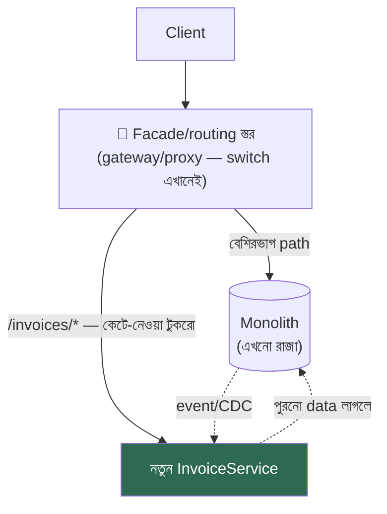

# Day 47 — Monolith-কে ধীরে ধীরে ভাঙা (Strangler Fig)

## 🎯 সমস্যা

দশ বছরের monolith: ব্যবসা চলছে এর ওপরেই, কিন্তু deploy ভীতিকর, টিমগুলো একে-অপরের পায়ে পাড়া দেয়, নতুন প্রযুক্তি ঢোকে না। "নতুন করে লিখি" — ইতিহাসের সবচেয়ে ব্যয়বহুল বাক্যগুলোর একটা: **big-bang rewrite** মানে ১৮ মাস দুই system সমান্তরালে টানা (পুরনোটায় feature থামে না!), শেষে এক রাতের মহা-switch — আর ততদিনে নতুনটাও পুরনো requirement-এর পেছনে দৌড়ে ক্লান্ত। বিকল্প দর্শন: **বট-গাছ যেভাবে পোষক-গাছকে ঘিরে বেড়ে একদিন প্রতিস্থাপন করে** — টুকরো টুকরো, প্রতিটা ধাপে production-এ, প্রতিটা ধাপে ফেরার পথ খোলা।

## 🖼️ ছকটা

## 💡 ধাপে ধাপে

**1. আগে দরজা বসান — facade/routing স্তর।** Client আর monolith-এর মাঝে এক proxy/gateway (Day 01-এর সেই জায়গা) — প্রথম দিন সে **সবই** monolith-এ পাঠায়, কিছুই বদলায় না। কিন্তু এখন আপনার হাতে **switch**: path-ধরে, header-ধরে, শতাংশ-ধরে traffic ঘোরানোর ক্ষমতা — পুরো migration-এর steering-wheel এটাই, আর প্রতিটা কাটা-টুকরো পাবে Day 14-এর পুরো অস্ত্রাগার (canary, kill-switch)।

**2. প্রথম টুকরো বাছাই — রাজনীতি আর প্রকৌশল দুটোই।** মানদণ্ড: **সীমানা পরিষ্কার** (কম জট — domain-ভাষায় নিজস্ব bounded-context), **ব্যথা আছে** (যেটা ভাঙতে চাওয়ার কারণ — scale/বদলের-গতি), কিন্তু **প্রাণঘাতী নয়** (প্রথম অস্ত্রোপচার হৃৎপিণ্ডে নয়)। প্রায়ই ভালো প্রার্থী: notification, reporting, নতুন-feature-যেটা-এমনিতেই-লিখতে-হতো (নতুন জিনিস সরাসরি নতুন ঘরে — monolith আর মোটা না হোক, এটাই strangler-এর অর্ধেক জয়)।

**3. কাটার আসল কষ্ট UI/API-তে নয় — data-তে।** Endpoint সরানো সহজ; টেবিল ভাগ করা কঠিন — monolith-এর ৪০টা জায়গা সেই টেবিলে JOIN করে বসে আছে। পথগুলো:
- **আগে কোড, পরে data** — নতুন service প্রথমে monolith-এর DB-ই পড়ুক (অন্তর্বর্তী পাপ, স্বীকৃত) — অন্তত deploy/টিম-স্বাধীনতা এলো; তারপর ধাপে ধাপে নিজস্ব store।
- **Data-হস্তান্তরে Day 53-এর expand-contract + Day 22/41-এর CDC:** নতুন store-এ backfill → দুই দিকেই sync (CDC এক-দিক, dual-write নয়!) → পড়া ঘোরাও → লেখা ঘোরাও → পুরনো টেবিল অবসরে।
- **সবচেয়ে কঠিন প্রশ্ন আগেই করুন:** এই টুকরো আর monolith-এর মাঝে transaction ছিল কি? সীমানা পেরোলেই সেটা হবে Day 10-এর saga — সে দাম দিতে রাজি না হলে **সীমানাটাই ভুল জায়গায়** — অন্য টুকরো বাছুন।

**4. সহাবস্থানের ব্যাকরণ:** monolith→service ডাক আর service→monolith ডাক দুটোই আসবে — monolith-এর ভেতরে সেই ডাকগুলোকে **এক জায়গায়** (anti-corruption layer/adapter) রাখুন, ৪০ জায়গায় ছড়ানো HTTP-call নয় — নাহলে monolith নতুন জঞ্জালে জড়াল; আর দুই ঘরের মাঝে চুক্তি স্পষ্ট (Day 52-এর versioning-বোধ)। Shared-DB-অন্তর্বর্তীকালে **মালিকানা লিখে রাখুন** — কোন টেবিল কার, কে শুধু-পড়ে — নাহলে "সাময়িক" ব্যবস্থাই স্থায়ী জট।

**5. যাচাই — বিশ্বাস নয়, তুলনা।** কাটা-টুকরোর নতুন রূপকে ছাড়ার আগে **shadow/parallel-run** (Day 14): একই request দুই ঘরে, ফল তুলনা — অমিলের তালিকা-ই আপনার bug-list (আর মাঝে মাঝে পুরনো ঘরের bug-ও ধরা পড়ে — তখন সিদ্ধান্ত: হুবহু-নকল না শুদ্ধ-আচরণ, লিখে রাখুন)। তারপর canary-শতাংশে আসল traffic।

**6. শেষ করার শৃঙ্খলা — strangler-এর কবরস্থান এড়ান।** সবচেয়ে সাধারণ ব্যর্থতা: ৭০% সরানো, ৩০% monolith-এ, দুই জগত চিরকাল — **দুইয়ের খরচ, কারোরই সুবিধা না।** প্রতিকার সাংগঠনিক: প্রতিটা টুকরোর সংজ্ঞায় "পুরনো পথ **মুছে ফেলা**" অন্তর্ভুক্ত (রাউট সরানো, মৃত কোড/টেবিল অপসারণ — Day 14-এর flag-কবরস্থানের একই পাঠ), migration-এর অগ্রগতি দৃশ্যমান মেট্রিকে (monolith-এ কত % traffic — নামছে তো?), আর নেতৃত্বের ধৈর্যের সৎ হিসাব: এ যাত্রা বছর-মাপের; মাঝপথে-পরিত্যক্ত strangler সবচেয়ে খারাপ ফলাফল।

## ⚖️ সিদ্ধান্ত-ছক

| পরিস্থিতি | ঝোঁক |
|-----------|------|
| চালু ব্যবসা, বড় পুরনো system | Strangler — default |
| ছোট app, ব্যবহারকারী-কম, দল এক | সরাসরি rewrite-ও বৈধ — নাটক কম |
| সীমানা-কাটা টুকরোয় monolith-এর সাথে transaction | সীমানা পুনর্বিবেচনা / saga-র দাম মেনে |
| Data-হস্তান্তর | Backfill + CDC-sync + ধাপে-ঘোরানো (dual-write নয়) |
| "Microservices-এ যাব" চাপ | মনে রাখুন: strangler-এর গন্তব্য modular-monolith-ও হতে পারে — ভাঙাটা লক্ষ্য নয়, সীমানাই লক্ষ্য |

## ⚠️ Common Mistakes

- Facade ছাড়া শুরু — switch-ই নেই, তাহলে ধাপে-ধাপে ঘোরাবেন কী দিয়ে?
- প্রথম টুকরো হিসেবে সবচেয়ে জটিলটা — "ওটাই তো ব্যথা!" — কিন্তু প্রথম অস্ত্রোপচারে দল শিখছে; শেখার মাশুল ছোট টুকরোয় দিন।
- Feature-freeze-এর মায়া — "migration শেষ হোক, তারপর feature" — হবে না কোনোদিন; নকশাটাই এমন হোক যে feature আর migration সহাবস্থান করে (নতুন feature নতুন ঘরে)।
- দুই ঘরে দুই সত্য — migration-কালে "কোন data কার লেখা-অধিকার" অস্পষ্ট রাখা; প্রতিটা টেবিল/entity-র এক মালিক, লিখিত।

## 🎤 Interview Tip

দর্শনটা এক বাক্যে: **"Big-bang rewrite হলো দুই বছর ধরে ঝুঁকি জমিয়ে এক রাতে খরচ করা; strangler সেই ঝুঁকিকে শত টুকরোয় ভেঙে প্রতিটাকে ফেরত-যোগ্য করে।"** তারপর ক্রম: facade→ছোট-পরিষ্কার টুকরো→data-হস্তান্তরে CDC+expand-contract→shadow-তুলনা→**পুরনো পথ মুছে ফেলা পর্যন্ত টুকরো অসমাপ্ত।** শেষের বাক্যটাই আলাদা করে — অর্ধেক-strangler-এর কবরস্থান যে দেখেছে, সে-ই ওটা বলে।
