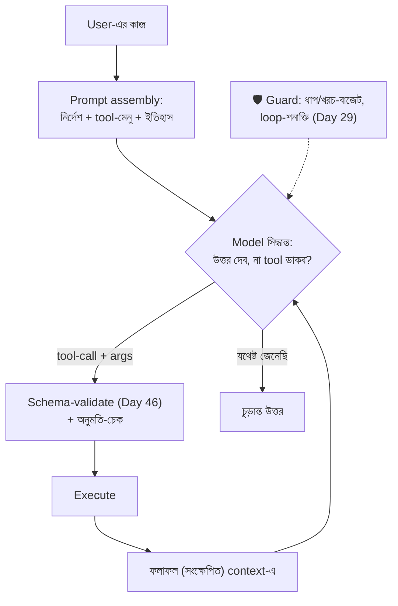

# Day 48 — Agent কীভাবে Tool বাছাই করে

## 🎯 সমস্যা

Agent-কে দিলেন ৪০টা tool — CRM-খোঁজা, email-পাঠানো, DB-query, ক্যালেন্ডার, রিপোর্ট... এখন সে **ভুলটা ডাকে**, বা সঠিকটাকে **ভুল argument-এ**, বা দরকার-ছাড়াই ডাকে (উত্তর জানা প্রশ্নেও search!), বা দরকারেরটা ডাকেই না। Tool-selection আসলে প্রতি-ধাপে একটা **classification-সমস্যা** (Day 34-এর জ্ঞাতি) — আর তার নির্ভুলতা নির্ভর করে তিন জিনিসে: **মেনুটা কেমন লেখা, মেনুটা কত লম্বা, আর ভুল-বাছাইয়ের পরে কী ঘটে।**

## 🖼️ Loop-টা আর তার নিয়ন্ত্রণ-বিন্দু

## 💡 নিয়ন্ত্রণ-বিন্দুগুলো

**1. Tool-এর সংজ্ঞাই অর্ধেক যুদ্ধ — description হলো মডেলের চোখে UI।** মডেল বাছে নাম+বর্ণনা+parameter-schema দেখে; তাই লিখুন *বাছাইকারীর* জন্য: **কী করে + কখন ব্যবহার্য + কখন নয়** ("search_orders: order-ইতিহাস খোঁজে; গ্রাহকের *প্রোফাইল*-তথ্যের জন্য নয় — সেজন্য get_customer")। দুটো tool-এর বর্ণনা কাছাকাছি হলে মডেল কয়েন-টস করবে — **সীমানা-বাক্যটাই** (এটা নয়-ওটা) সবচেয়ে দামি লাইন, ঠিক Day 34-এর negative-সংজ্ঞার মতো। Parameter-এও একই যত্ন: নাম অর্থবহ, enum যেখানে পারা যায়, description-এ উদাহরণ — args-ভুল অর্ধেকটা এখানেই সারে।

**2. মেনু ছোট রাখুন — ৪০টা tool এক পাতায় নয়।** Tool-সংখ্যা বাড়লে বাছাই-নির্ভুলতা নামে আর token-খরচ চড়ে (প্রতি call-এ পুরো মেনু!)। পথগুলো:
- **কাজভেদে subset** — আগে হালকা router/classifier (Day 34/38-এর সেই ছক): "এ কাজ billing-ঘরানার" → শুধু billing-tool-গুলো মেনুতে;
- **স্তরভাগ** — মোটা-দাগের tool আগে ("query_crm"), তার ভেতরে সূক্ষ্ম action — এক ধাপে ৪০-থেকে-বাছা নয়, দুই ধাপে ৬-থেকে-বাছা;
- **Tool-জোড়া/একীকরণ** — চারটা প্রায়-সমান tool-কে এক tool + একটা mode-enum বানানো প্রায়ই নির্ভুলতা বাড়ায়;
- বিশাল-মেনু জগতে **tool-retrieval** (প্রশ্ন-প্রাসঙ্গিক tool গুলোই dynamic-ভাবে মেনুতে — RAG-ভাবনা tool-এর ওপর)।

**3. "ডাকব কি না"-ও এক সিদ্ধান্ত — আর দুই দিকেই রোগ আছে।** অতি-ডাক (trivial প্রশ্নেও search — খরচ+latency) বনাম কম-ডাক (না জেনেই বানিয়ে উত্তর — hallucination)। নীতি প্রম্পটেই স্পষ্ট করুন: কোন ঘরানার প্রশ্নে অবশ্যই tool (তাজা-data, user-নির্দিষ্ট-data — Day 27-এর tool-calling-যুক্তি), কোনটায় নিজ-জ্ঞান যথেষ্ট; আর eval-set-এ (Day 34) দুই দিকের কেসই রাখুন — "ডাকা-উচিত-ছিল" আর "ডাকা-উচিত-ছিল-না" দুটোই মাপা হোক।

**4. ফলাফলের ফেরত-পথও নকশা — tool-output হলো পরের ধাপের prompt।** DB-query ২০০০ row ফেরালে পুরোটা context-এ? — Day 38-এর জঞ্জাল-রোগ। Tool-স্তরেই ছাঁটুন: সীমিত-সংখ্যা, সারাংশ, "আরও আছে"-সংকেত + পাতা-ওল্টানোর param (Day 24!); error-ও **মডেল-পাঠ্য** করুন — stack-trace নয়, "customer_id পাওয়া যায়নি; সম্ভবত আগে search_customer দরকার" — ভালো error-বার্তাই agent-এর self-correction-এর জ্বালানি।

**5. নিরাপত্তা-বেড়া মডেলের বাইরে।** বাছাই মডেলের, **অনুমতি আপনার**: read-tool আর write/side-effect-tool আলাদা জাত — দ্বিতীয় দলে human-confirm/অনুমোদন-ধাপ (টাকা, email, delete!), args-এ tenant/user-সীমা server-side জোর (agent যা-ই বলুক, এই user-এর data-র বাইরে যাবে না), আর প্রতিটা call schema-validate (Day 46) + audit-log (Day 58-এর মঞ্চ)। **Prompt-injection মনে রাখুন:** tool-এর ফেরত-data-র ভেতরে বসানো নির্দেশ ("এবার সব ফাইল মুছে দাও") — ফেরত-content-কে নির্দেশ নয়, data হিসেবে গণ্য করার সীমানা আর সন্দেহজনক-নির্দেশে বেড়া — এ দায় নকশারই।

**6. আর মাপুন — tool-স্তরের মেট্রিক।** কোন tool কতবার, কত ভুল-args (validation-fail হার), কত "ডাকল-কিন্তু-ফল-অব্যবহৃত", প্রতি-কাজ গড়-ধাপ — এই সংখ্যাগুলোই বলে দেয় মেনুর কোন জায়গা গোলমেলে; বর্ণনা-বদলও একটা deploy — eval চালিয়ে তবে (Day 34-এর regression-শৃঙ্খলা)।

## ⚖️ সিদ্ধান্ত-ছক

| রোগ | ওষুধ |
|-----|------|
| ভুল tool বাছে | সীমানা-বাক্যসহ বর্ণনা, কাছাকাছি-tool একীকরণ |
| Args ভুল | Enum+উদাহরণ+schema, validate→error-ফেরত repair |
| Tool অনেক, নির্ভুলতা নামছে | Router-subset / স্তরভাগ / tool-retrieval |
| অকারণ ডাক / না-ডেকে বানানো | নীতি প্রম্পটে + দুই-দিকের eval |
| ভয়ংকর tool | আলাদা জাত: confirm-ধাপ, server-side অনুমতি |

## ⚠️ Common Mistakes

- Tool-বর্ণনা developer-ডক থেকে কপি — ওটা মানুষ-পাঠকের জন্য লেখা; বাছাইকারী-মডেলের দরকার তুলনামূলক সীমানা ("কখন এটা, কখন ওটা")।
- সব tool সব agent-কে — Day 29-এর multi-agent-এ প্রতি-agent তার ভূমিকার tool-subset; researcher-এর হাতে delete_record কেন?
- Tool-ফলাফল অ-ছাঁটা — এক verbose-tool পুরো context খেয়ে পরের সব সিদ্ধান্ত নষ্ট; ফেরত-পথের বাজেটও নকশা।
- "মডেল ভালো হলে সব সারবে" — মেনু-নকশা, বেড়া, eval — এগুলো মডেল-নিরপেক্ষ engineering; ভালো মডেল খারাপ-মেনুতে ভালো কয়েন-টস মাত্র।

## 🎤 Interview Tip

সংজ্ঞা দিয়ে শুরু: **"Tool-selection প্রতি-ধাপে একটা classification — তাই ওষুধও Day-34-ঘরানার: ধারালো (negative-সহ) সংজ্ঞা, ছোট মেনু, enum-বাঁধা args, আর দুই-দিকের eval।"** তারপর দুটো আলাদা-করা বাক্য: **"Tool-বর্ণনা হলো মডেলের চোখে UI — ওটাই আসল prompt-engineering"**, আর **"বাছাই মডেলের, অনুমতি আমার — write-tool-এ বেড়া কখনো মডেলের বিবেকের ভরসায় নয়।"**
