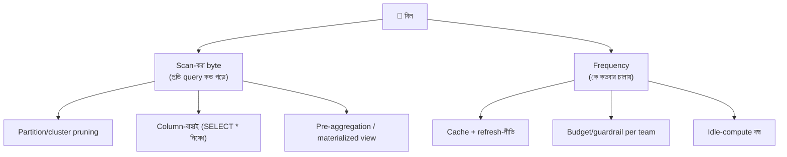

# Day 49 — Data-Warehouse Query Cost নিয়ন্ত্রণ

## 🎯 সমস্যা

Cloud-warehouse (BigQuery/Snowflake/Redshift-ঘরানা) — সৌন্দর্য: যত খুশি scan, তখনই টাকা; বিপদ: **ঠিক সেটাই।** মাস-শেষে বিল দেখে জানা গেল: এক dashboard প্রতি ৫ মিনিটে `SELECT *` চালাচ্ছে ২-টেরাবাইট টেবিলে, একজন analyst-এর WHERE-ভুলা query একাই লাখ টাকা, আর BI-tool-এর auto-refresh রাতভর ফাঁকা অফিসের জন্য রিপোর্ট বানিয়েছে। Warehouse-খরচ আসলে এক লাইনে: **টাকা = scan-করা byte × frequency** — নিয়ন্ত্রণও তাই দুই দিকেই।

## 🖼️ খরচের শারীরস্থান

## 💡 নিয়ন্ত্রণের স্তরগুলো

**1. Byte-কমানোর প্রথম অস্ত্র: partition + cluster — Day 12-র শিক্ষা, analytics-মাপে।** বড় fact-টেবিল **তারিখে partition** — "গত ৭ দিনের" query তখন ৭ দিনের খণ্ডই ছোঁয়, ৫ বছরের নয়; সাথে ঘন-ফিল্টার-হওয়া কলামে **clustering/sort-key** (tenant, region) — খণ্ডের ভেতরেও ছাঁটাই। শর্ত একটাই, আর সেটাই সবচেয়ে ভাঙে: **query-তে partition-কলামের ফিল্টার থাকতে হবে** — `WHERE DATE(ts) = ...`-জাতীয় ফাংশন-মোড়ানো ফিল্টারে pruning অচল (কলামটা কাঁচা অবস্থায় ফিল্টার করুন); দলকে এ ব্যাকরণ শেখানোও খরচ-প্রকৌশলের অংশ।

**2. Columnar-সত্য: যে কলাম চাননি, তার দামও দেবেন না — যদি না চান।** Warehouse কলাম-ভিত্তিক — `SELECT *` মানে সব কলামের byte, দরকার তিনটার হলেও। নিয়ম বানান (lint/review): production-query-তে `SELECT *` নিষিদ্ধ; আর **wide-টেবিলে JSON/blob-কলাম** সবচেয়ে বড় নীরব-খরচ — কাঁচা payload আলাদা টেবিলে, বিশ্লেষণ-কলামগুলো ছেঁকে মূল টেবিলে।

**3. একই হিসাব বারবার নয় — pre-aggregation-এর সিঁড়ি।** Dashboard-রা মূলত একই প্রশ্ন করে: দৈনিক-বিক্রি, অঞ্চল-ভাগ, funnel। কাঁচা-টেবিলে প্রতিবার নয়:
- **Materialized view / summary-টেবিল** — রাতে/ঘণ্টায় এক দফা aggregate (Day 41-এর pipeline-ফসল), dashboard পড়ে সেটাই — scan নামে হাজার-গুণ; এটা Day 09-এর read-model-দর্শনই, warehouse-পোশাকে।
- **স্তরায়ণ:** কাঁচা (raw) → পরিশোধিত (cleaned/joined) → ব্যবসা-স্তর (metrics) — নিচের স্তরে মানুষ-প্রবেশ সীমিত; analyst-রা কাজ করুক পরিশোধিত/মেট্রিক-স্তরে (dbt-ঘরানার layered-modeling এই শৃঙ্খলারই নাম)।
- **BI-cache আর refresh-নীতি** — dashboard-এর auto-refresh ৫-মিনিট সত্যিই লাগে, না দিনে-একবার যথেষ্ট (Day 41-এর সেই প্রশ্ন: freshness-এর ব্যবসায়িক দাম)? দর্শক-শূন্য সময়ে refresh বন্ধ।

**4. Frequency-পাশ: মানুষ আর যন্ত্রের বেড়া।**
- **Guardrail:** per-query byte-সীমা (সীমা-ছাড়ালে আটকাও/সতর্ক করো), team/warehouse-ভাগে বাজেট-quota, রানঅ্যাওয়ে-query-র timeout — "ভুল query চালানো যাবে, দেউলিয়া করা যাবে না।"
- **Compute-এর ঘুম:** credit-মডেলের warehouse-এ idle-কম্পিউট auto-suspend, workload-ভাগ (ETL বড়-warehouse-এ ঘণ্টাখানেক, BI ছোট-তে সারাদিন) — "সবার জন্য এক বিশাল সর্বক্ষণ-জাগা cluster" ক্লাসিক অপচয়।
- **দৃশ্যমানতা — খরচের observability:** কোন query/dashboard/টিম কত পোড়াচ্ছে — সাপ্তাহিক শীর্ষ-দশ প্রকাশ্যে; আচরণ বদলের সবচেয়ে সস্তা যন্ত্র হলো আয়না। আর **অকারণ-জিনিস মুছুন:** কেউ-দেখে-না dashboard, কেউ-পড়ে-না scheduled-report — ব্যবহার-লগ দেখে ছাঁটাই — শূন্য-দর্শকের রিপোর্ট শূন্য টাকা দামি।

**5. স্থাপত্য-স্তরের প্রশ্নটাও করুন:** সব query warehouse-এ কেন? App-এর ভেতরের "user-এর নিজের পরিসংখ্যান"-জাতীয় জিনিস (উচ্চ-frequency, ছোট-scan) warehouse-এর কাজই নয় — serving-স্তরে নামান (Day 41-এর serving-প্রান্ত: OLAP-store/Redis/summary-টেবিল); warehouse থাকুক বিশ্লেষণ-প্রশ্নের ঘর, per-request-পথের নয়।

## ⚖️ কোন রোগে কোন ওষুধ

| লক্ষণ | ওষুধ |
|--------|------|
| অল্প query-ই বিলের সিংহভাগ | শীর্ষ-দশ ধরে অস্ত্রোপচার: pruning-ব্যাকরণ, কলাম-ছাঁটাই |
| Dashboard-ঝাঁকের একই প্রশ্ন | Materialized/summary-স্তর + BI-cache |
| Analyst-দুর্ঘটনা | Byte-সীমা, quota, timeout — বেড়া |
| বিল বাড়ছে, কারণ অদৃশ্য | খরচ-observability + সাপ্তাহিক আয়না |
| App-পথের query warehouse-এ | Serving-স্তরে নামান |

## ⚠️ Common Mistakes

- খরচ-তদন্ত শুরু "সবচেয়ে ধীর query" দিয়ে — ধীর আর দামি এক নয়; **byte-scanned-ক্রমে** সাজান, সেটাই বিলের ভাষা।
- Partition করেই নিশ্চিন্ত — query-গুলো ফিল্টার-ব্যাকরণ মানছে কি না দেখা হয় না; pruning-hit-rate-ও একটা মেট্রিক।
- Materialized-view-র জঞ্জাল — বানানো হয়, মোছা হয় না; প্রতিটার মালিক+ব্যবহার-পর্যালোচনা, নাহলে সমাধানই নতুন খরচ।
- এক পরিবেশে সব — dev/experiment-query production-warehouse-এ; sample-data/আলাদা-ছোট পরিবেশে খেলা হোক।

## 🎤 Interview Tip

সূত্রটা প্রথম বাক্যে: **"Warehouse-বিল = scan-byte × frequency — তাই দুই লিভার: byte কমাই (partition-pruning, কলাম-ছাঁটাই, pre-aggregation-স্তর) আর frequency শাসন করি (cache, refresh-নীতি, quota-বেড়া, idle-ঘুম)।"** সাথে সাংগঠনিক সত্যটা: **"এটা যত না SQL-সমস্যা তত শাসন-সমস্যা — খরচের আয়না টাঙানোই অর্ধেক সমাধান।"** Byte-ক্রমে-সাজানো তদন্ত-অভ্যাসটা বললে বোঝা যায়, আপনি বিলটা সত্যিই কমিয়েছেন কোথাও।
