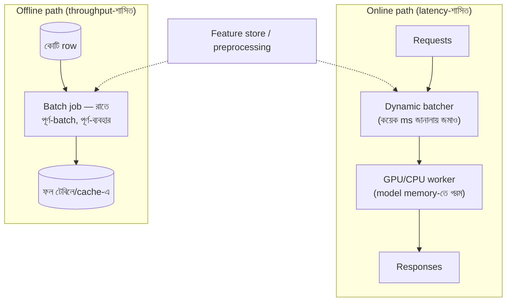

# Day 50 — High Throughput-এ ML Model Serving

## 🎯 সমস্যা

Model তো train হলো — এবার সেকেন্ডে হাজারো inference-request। প্রথম সংঘর্ষটা দর্শনের: **web-serving-এর অভ্যাস আর GPU-র অর্থনীতি উল্টো টানে।** Web-জগতে এক-request-এক-উত্তর, latency-ই ধর্ম; GPU-জগতে এক-এক-করে খাওয়ানো মানে যন্ত্রের ৯০% বসে থাকা — সে খায় **batch-এ**। আর মিশ্র বাস্তবতা: কিছু কাজ চাই ২০ms-এ (feed-ranking), কিছুতে ২ ঘণ্টাও চলে (রাতের scoring) — এক নকশায় দুই জগত ধরা যায় না।

## 🖼️ কাঠামোটা

## 💡 সিদ্ধান্তগুলো, স্তরে স্তরে

**1. প্রথম প্রশ্ন: online লাগবেই তো?** বহু "real-time ML" আসলে **আগে-থেকে-হিসাব-যোগ্য**: recommendation প্রতি-request না বানিয়ে রাতে/ঘণ্টায় সবার জন্য score করে টেবিল/cache-এ (Day 41-এর serving-স্তর, Day 49-এর pre-aggregation — একই বংশ); request-পথে থাকে শুধু **lookup** — inference-serving-এর পুরো নাটকই বাদ। Online-inference রাখুন সেখানেই যেখানে input request-মুহূর্তে জন্মায় (এই-মাত্র-লেখা query, এই-মুহূর্তের context)। মিশ্রও চলে: ভারী-embedding আগে-হিসাব, হালকা-ranker অনলাইনে।

**2. Online-পথের হৃৎপিণ্ড: dynamic batching — latency দিয়ে throughput কেনা।** কয়েক ms-এর জানালায় আসা request-গুলো জুড়ে এক batch — GPU-ব্যবহার লাফিয়ে ওঠে, প্রতি-request-এ জানালার-অপেক্ষা যোগ হয়। দুটো নব: **সর্বোচ্চ-জানালা** (যেমন ৫–১০ms) আর **সর্বোচ্চ-batch** — যেটা আগে ভরে; p99-বাজেট থেকে উল্টো-গণনায় ঠিক করুন। Serving-framework-রা (Triton/TorchServe/vLLM-ঘরানা) এটা built-in দেয় — নিজে না বানানোই বিজ্ঞতা। (LLM-serving-এ এরই বিবর্তিত রূপ **continuous batching** — চলমান-generation-এর ফাঁকে নতুন request ঢোকে; ধারণা এক: যন্ত্র খালি না থাকুক।)

**3. Model-কে ছোট-দ্রুত করা — serving-এর নিজস্ব optimization-তাক:** **quantization** (FP32→FP16/INT8 — মেমরি-গতি দুটোই, সামান্য নির্ভুলতা-দামে — Day 28-এর সেই দর্শন), **distillation** (বড়-শিক্ষকের আচরণ ছোট-ছাত্রে — online-পথে ছাত্র, কঠিন-কেসে/অফলাইনে শিক্ষক), compile/graph-optimization (ONNX/TensorRT-ঘরানা)। প্রতিটাই **নির্ভুলতা-বনাম-খরচ**-চুক্তি — eval-set-এ (Day 34-এর শৃঙ্খলা!) আগে-পরে মেপে তবে; "চোখে-দেখে-ঠিক-আছে" এখানে চলে না।

**4. Serving-স্থাপত্যের ব্যাকরণ:** model **process-memory-তে গরম** থাকবে (প্রতি-request-এ ডিস্ক-থেকে-লোড = মৃত্যু; cold-start-ই serverless-inference-এর কাঁটা) — তাই worker-রা দীর্ঘজীবী, **স্বাস্থ্য-পরীক্ষায় "model-loaded"** থাকুক readiness-এ (pod জীবিত ≠ model প্রস্তুত)। Scale-out GPU-worker যোগে; সামনে queue রাখলে Day 17/25-এর পুরো অস্ত্রাগার (bounded-buffer, ভরলে-নীতি, lag-ভিত্তিক autoscale) — আর overload-এ **নীতিভিত্তিক অবনমন**: ছোট-model-এ fallback / cache-করা-উত্তর / বাদ-দেওয়া-যায়-এমন-request shed (Day 20-এর fallback-দর্শন ML-পোশাকে)। Preprocessing/feature-fetch প্রায়ই আসল bottleneck — GPU-দোষ দেওয়ার আগে trace করুন (feature-store-lookup-এর p99-ই অনেক system-এর গল্প)।

**5. Model-ও একটা deploy-যোগ্য জিনিস — Day 14-এর সব নিয়ম খাটে:** version-করা artifact (registry), **canary/shadow** (নতুন model-এ ১% আসল-traffic / ছায়া-তুলনা — ML-এ shadow বিশেষ মধুর: নির্ভুলতা-তুলনা offline-এই), তাৎক্ষণিক rollback, আর A/B-তে **ব্যবসায়িক-মেট্রিক** পাহারা (অফলাইন-নির্ভুলতা বাড়ল অথচ conversion পড়ল — ML-জগতের নিত্য গল্প)। এবং serving-পরবর্তী সত্য: **model বুড়ো হয়** — input-বিতরণ সরে (drift — Day 54-এ এ গল্পের RAG-রূপ), prediction-বিতরণ আর ফলাফল-মেট্রিক নজরে রাখুন; retrain-pipeline serving-নকশারই সহোদর।

**6. খরচের অঙ্কটা প্রকাশ্যে:** প্রতি-হাজার-inference-খরচ = (যন্ত্র-ভাড়া ÷ throughput) — এই এক সংখ্যাই বলে দেয় batching/quantization/precompute-এর কোনটা আগে; আর "GPU-ই লাগবে তো?" — ছোট-model উচ্চ-batch-এ আধুনিক CPU-ও সস্তা জেতে অনেক ক্ষেত্রে — মাপুন, ধরে নেবেন না।

## ⚖️ সিদ্ধান্ত-ছক

| পরিস্থিতি | পথ |
|-----------|-----|
| Input আগে-জানা, ফল বাসি-সহনীয় | Precompute + lookup — serving-নাটক বাদ |
| সত্যিকার online, latency-বাজেট আছে | Dynamic-batching serving-framework |
| খরচ চেপে ধরেছে | Quantize/distill/compile — eval-পাহারায় |
| Traffic-ঢেউ | সামনে queue + degrade-নীতি + lag-autoscale |
| নতুন model ছাড়া | Registry + shadow → canary → ব্যবসা-মেট্রিক পাহারা |

## ⚠️ Common Mistakes

- Web-অভ্যাসে এক-request-এক-inference — GPU-বিল দেখে তবে batching শেখা; শুরু থেকেই serving-framework।
- p50 দেখে সুখী — batching/queue-জগতে ব্যথা p99-এ; জানালা-নব সেখান থেকেই টিউন।
- Preprocessing দুই-জায়গায় দুই-রকম — train-এ এক transform, serve-এ আরেক (**training-serving skew**) — নীরবতম নির্ভুলতা-ঘাতক; transform-কোড এক-উৎসে (feature-store/ভাগ-করা-লাইব্রেরি)।
- Model-file-কে config ভাবা — version-হীন, registry-হীন, rollback-অযোগ্য; model হলো deploy-যোগ্য artifact — পুরো শৃঙ্খলাসহ।

## 🎤 Interview Tip

সংঘর্ষটা নাম ধরে: **"Web-serving latency-র খেলা, GPU throughput-এর — মিলনবিন্দু dynamic batching: ক'ms-এর জানালা বেচে যন্ত্র-ব্যবহার কিনি, p99-বাজেট থেকে জানালা ঠিক করি।"** তারপর সিঁড়ি: precompute-পারলে-serving-ই-বাদ → batching-framework → quantize/distill (eval-পাহারায়) → queue+degrade → shadow/canary-তে ছাড়া। শেষে training-serving-skew ছুঁয়ে দিন — এ ভূত যে চেনে, সে production-ML করেছে।
